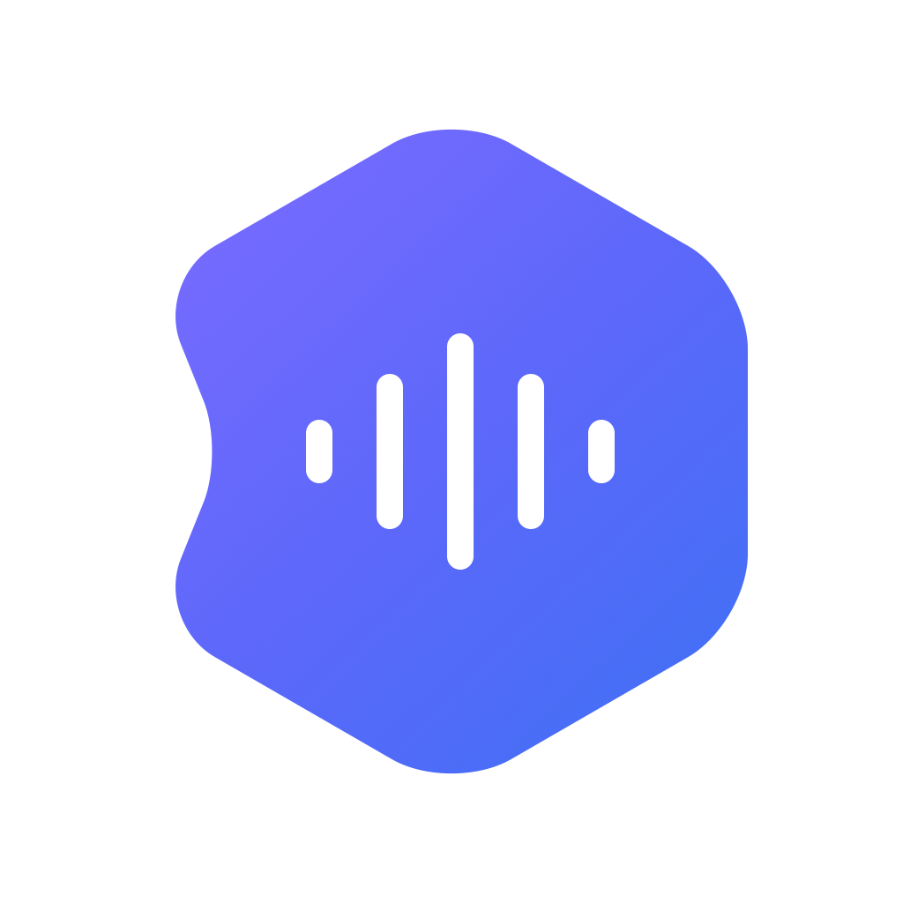

# Koedex

<p align="center">
  
</p>

[English](README.md) | [日本語](README.ja.md) | [User guide](docs/manual/en.md) | [日本語ガイド](docs/manual/ja.md)

Koedex is a system-wide voice input app for macOS. Press a hotkey (the fn
key by default) to start recording and press it again to stop: your speech is
transcribed on-device, cleaned up by AI (filler removal, self-corrections,
punctuation), and pasted at the cursor position in whatever app is
frontmost.

> **New here?** — The User guide above walks through installation, first-run
> setup, and every setting in plain language.
> This README is the developer-facing summary.

## Early access

This is an early public release, not a finished product. It's published
so that real users can try it and report problems and improvement ideas —
that feedback is what drives development from here.

- Bug reports and feature requests → [GitHub Issues](../../issues).
- Security vulnerabilities → please do **not** open a public issue; follow
  the process in [SECURITY.md](SECURITY.md) instead.

## Not affiliated with OpenAI

Koedex is an independent, community project. It is **not affiliated with,
sponsored by, or endorsed by OpenAI**. "OpenAI", "ChatGPT", and "Codex" are
trademarks of OpenAI. Koedex does not use any OpenAI logo or brand color,
and nothing here should be read as an official OpenAI product or
communication channel. See [NOTICE](NOTICE) for the full notice.

## Requirements

- macOS 26 (Tahoe) or later — Koedex depends on Apple's SpeechAnalyzer
  APIs, which are not available on earlier releases.
- Swift 6.2 or later to build from source. The Command Line Tools SDK is
  enough; a full Xcode.app install is not required.
- The [Codex CLI](https://www.npmjs.com/package/@openai/codex) (`codex`)
  on your `PATH`, authenticated with a ChatGPT subscription (i.e.
  `~/.codex/auth.json` is present and valid). Koedex launches `codex
  app-server` as a child process; it does not talk to any API directly.

## What leaves your Mac

- **Transcription is entirely on-device.** Koedex uses Apple's
  SpeechAnalyzer/SpeechTranscriber to turn your speech into text locally.
  Audio never leaves your machine for transcription. The only network
  activity here is macOS downloading the speech recognition model asset
  from Apple the first time a language is used.
- **AI cleanup and "AI command" go through your local `codex` CLI.** The
  transcribed text (not audio) is sent to `codex app-server`, which uses
  your own authenticated ChatGPT subscription to talk to OpenAI. Koedex
  starts `codex app-server` with `mcp_servers={}` and `plugins={}` and
  does not modify your `~/.codex/config.toml`.
- Everything else — settings, history, your personal dictionary, custom
  instructions — is stored locally under
  `~/Library/Application Support/Koedex/` and is never transmitted
  anywhere by Koedex itself.
- **That folder is created with owner-only permissions.** Directories are
  `0700` and files Koedex itself writes are `0600`, so on a Mac shared
  between several accounts, nobody else can read your transcripts. The
  `0700` directory is what actually keeps other accounts out — the
  `codex` CLI writes its own scratch files under
  `AICommandRuntime/` with its own umask. Files left behind by an earlier
  version are tightened in the background on every launch; that pass is
  best-effort and deliberately skips symlinks and hard-linked files so it
  cannot reach outside the folder.
- **History retention defaults to 180 days on a new install.** Entries
  older than that are pruned when the app launches, when a new entry is
  added, and when you change the setting. A retention value you have
  already saved is read back as-is — the new default only applies where
  nothing was saved. Retention is configurable per mode in Settings, and
  "unlimited" is still one of the choices.

### Known limitations

- **Koedex refuses to read a selection when macOS reports secure input is
  active.** This covers ordinary password fields in native apps and in
  Safari/Chrome.
- **It does not detect fields that merely look secret but are technically
  ordinary text fields.** One-time passcode / 2FA code boxes are the main
  example. Do not select text in a field like that and start AI command
  mode.
- **Selected text and web-search results are sent to the AI, and they can
  also influence where the AI decides to put its answer.** Always look at
  the result before relying on it.
- **When Koedex has to copy your selection to read it and the capture is then
  abandoned, the copied text stays on the clipboard.** Secure input turning on,
  the focus moving elsewhere, and the request being cancelled all do this.
  Koedex never uses the text, but it cannot put your previous clipboard
  contents back.
- **The delivery paths that go through the clipboard can lose what was on it.**
  Clipboard mode, and the support-only fallback for Mail and Google Docs in
  Chrome, replace the clipboard in order to paste; if that fails partway, your
  previous contents may be lost rather than restored. Both are off unless you
  turn them on yourself.

## Install

Time required: 15-40 minutes (mostly download and build wait time).
Your input is needed in only 3 places:

1. Entering your Mac password when a dev tool needs updating (skip this if
   you're already up to date)
2. Approving a trust dialog for the certificate (Touch ID or password, once)
3. Granting the three permission dialogs after first launch (Microphone,
   Speech Recognition, Accessibility)

### A. Let an agent do it (almost no terminal work)

Copy the prompt from [docs/agent-install-prompt.md](docs/agent-install-prompt.md)
and paste it into Claude Code or Codex CLI.

### B. Run the commands yourself

#### Choosing a work folder

Desktop and Documents are often enrolled in iCloud Drive's "Desktop &
Documents Folders" sync, and macOS refuses to code-sign anything carrying the
extended attributes that sync adds. `scripts/make_app.sh` strips those
attributes from the staging copy it builds itself, just before signing, so a
synced checkout usually still works. To be safe, use a location outside iCloud
sync such as `~/Downloads` or `~/Developer`.

If signing fails with `resource fork, Finder information, or similar detritus
not allowed`, clone again outside the synced folder. **Moving (`mv`) leaves the
extended attributes in place, so it does not fix the problem.**

#### Get the source

<!-- BEGIN KOEDEX_SOURCE_PIN_EN -->
Clone only the single point tagged `v0.1.8` from the official repository. Do not take the latest
state (`main`) — take this release and nothing else. Do not run this where a folder named `Koedex`
already exists.

```bash
git clone --branch v0.1.8 --single-branch https://github.com/GrShin5/Koedex.git Koedex \
  && cd Koedex
```

**Do not run a single script from the repository until every check below prints ✅.**
Inside the folder the clone created, paste and run the following as-is.

```bash
export GIT_TERMINAL_PROMPT=0
OFFICIAL_URL="https://github.com/GrShin5/Koedex.git"
EXPECTED_TAG="v0.1.8"
ok=1
fail() { echo "❌ $1"; ok=0; }
git rev-parse --is-inside-work-tree >/dev/null 2>&1 \
  && echo "✅ you are inside the cloned folder" || fail "you are not inside the cloned folder"
origin_url="$(git remote get-url origin 2>/dev/null)"
[ -n "$origin_url" ] && [ "${origin_url%.git}" = "${OFFICIAL_URL%.git}" ] \
  && echo "✅ origin URL matches the official URL" || fail "origin URL does not match"
head_sha="$(git rev-parse HEAD 2>/dev/null)"
tag_sha="$(git rev-parse "${EXPECTED_TAG}^{commit}" 2>/dev/null)"
[ -n "$head_sha" ] && [ "$tag_sha" = "$head_sha" ] \
  && echo "✅ local ${EXPECTED_TAG} matches HEAD" || fail "local ${EXPECTED_TAG} does not match HEAD"
remote_sha="$(git ls-remote "$OFFICIAL_URL" "refs/tags/${EXPECTED_TAG}^{}" 2>/dev/null | cut -f1)"
[ -n "$remote_sha" ] || remote_sha="$(git ls-remote "$OFFICIAL_URL" "refs/tags/${EXPECTED_TAG}" 2>/dev/null | cut -f1)"
[ -n "$remote_sha" ] && [ -n "$head_sha" ] && [ "$remote_sha" = "$head_sha" ] \
  && echo "✅ ${EXPECTED_TAG} on GitHub matches HEAD" || fail "${EXPECTED_TAG} on GitHub is unreachable or does not match HEAD"
status_out="$(git status --porcelain 2>/dev/null)"; status_rc=$?
[ "$status_rc" = 0 ] && [ -z "$status_out" ] \
  && echo "✅ working tree has no changes and no untracked files" || fail "working tree is not clean, or could not be checked"
[ "$ok" = 1 ] && echo "-> Everything matches. You can continue." \
              || echo "-> Something does not match. Stop here."
```

If even one ❌ appears, stop there. Do not switch to a different URL, a different tag, a ZIP
download, a mirror, or any other way of obtaining the source.

A tag can be moved later, so also confirm on GitHub's Releases page that `v0.1.8` is published as
an immutable release. If you have the GitHub CLI, you can confirm the same thing with:

```bash
gh release verify v0.1.8 --repo GrShin5/Koedex
```
<!-- END KOEDEX_SOURCE_PIN_EN -->

#### Preflight check

Running the following before you build checks every prerequisite at once. If
anything is missing, it prints the full list of what to do.

```bash
bash scripts/preflight.sh
```

It picks its language from your locale. To force English regardless of your
locale:

```bash
KOEDEX_LANG=en bash scripts/preflight.sh
```

```bash
# Inside the verified clone:

# Build the executable only
swift build

# Assemble dist/Koedex.app
./scripts/make_app.sh debug
```

#### If your Swift version is too old

The Command Line Tools can be installed but still be an older version. Update
with:

```bash
softwareupdate --list
sudo softwareupdate --install "<label copied from the --list output>"
```

The label changes with each release, so don't hardcode it — copy it from the
`--list` output. The download is roughly 900MB, takes 10-30 minutes, and
**requires an administrator password**.

#### Future distribution

Koedex does not currently provide a distributable binary release. When one is
prepared, it must be built from a clean clone of this official repository at
the matching release tag. Do not distribute an `.app` created from another
working copy.

#### Code-signing certificate (one-time setup)

`scripts/make_app.sh` refuses to produce an ad-hoc-signed `.app`, because
ad-hoc signatures change on every rebuild and macOS revokes your
Accessibility/Microphone/Speech Recognition permissions whenever the
signing identity changes. Instead it requires a stable, local, self-signed
"Koedex Dev" certificate.

Creating it needs OpenSSL 3. The `openssl` that ships with macOS is
LibreSSL, which won't work here. The script automatically looks for
OpenSSL 3; if it can't find one, install it with:

```bash
brew install openssl@3
```

Before your first build, create it:

```bash
bash scripts/make_signing_cert.sh
```

This generates a self-signed code-signing certificate and imports it into
your login keychain. macOS will then ask you to approve trusting it for
code signing — **this approval happens in a Keychain Access GUI dialog and
cannot be scripted or automated**; it's a deliberate macOS security gate.
The script itself finishes successfully whether or not you complete that
approval, and prints the manual steps you need if it's still pending:

```bash
security add-trusted-cert -k "$HOME/Library/Keychains/login.keychain-db" \
  "$HOME/Library/Application Support/Koedex/koedex_dev_cert.crt"
```

`scripts/make_app.sh` will not assemble an `.app` bundle until the
certificate shows up as a trusted codesigning identity
(`security find-identity -v -p codesigning`). Once it does, rerun
`./scripts/make_app.sh debug` (or `release`).

#### Removing the certificate

If you no longer need the "Koedex Dev" certificate — for example, you're
done building Koedex on this Mac — remove it:

1. Confirm it's actually installed:

   ```bash
   security find-identity -v -p codesigning
   ```

2. Delete the certificate and its private key from the login keychain:

   ```bash
   security delete-identity -c "Koedex Dev" "$HOME/Library/Keychains/login.keychain-db"
   ```

3. Remove the leftover trust entry. macOS sometimes keeps an orphaned
   trust record behind after the certificate itself is gone, and this step
   has no reliable command-line equivalent — open Keychain Access, search
   for "Koedex Dev" under **Certificates**, and delete it there if it still
   appears.

#### Judging whether the build succeeded

To avoid a false read when this is delegated to an agent, judge success by
all of the following:

1. The script's exit code is 0
2. `dist/Koedex.app` exists
3. `codesign --verify --deep --strict dist/Koedex.app` succeeds

## Granting the three permissions

Koedex needs three macOS privacy permissions. After copying
`dist/Koedex.app` somewhere like `/Applications` and launching it for the
first time, grant them as prompted (or add them manually if a dialog
doesn't appear):

1. **Accessibility** — for the global hotkey (via a `CGEventTap`) and for
   sending ⌘V at the cursor. System Settings → Privacy & Security →
   Accessibility → add Koedex and enable it.
2. **Microphone** — for recording your voice. System Settings → Privacy &
   Security → Microphone → enable Koedex.
3. **Speech Recognition** — for on-device transcription. Usually prompted
   automatically on first launch; otherwise check System Settings →
   Privacy & Security → Speech Recognition.

Accessibility is checked once, at process start. After granting it,
**fully quit and relaunch Koedex** rather than continuing in the same
session — it will not pick up a newly granted Accessibility permission
until it restarts.

## Updating an existing installation

`scripts/install_app.sh` refuses to overwrite an existing
`/Applications/Koedex.app` — it fails with an error rather than replacing
anything there. So updating to a new release means: move the old app aside
first, then install the new one into the now-empty spot.

To let an agent perform this update, copy the prompt from
[docs/agent-update-prompt.md](docs/agent-update-prompt.md).

1. Move the currently installed app out of the way instead of deleting it:
   `mv /Applications/Koedex.app ~/Desktop/Koedex-old.app` (any destination
   outside `/Applications` works).
2. Clone the new release tag into a **fresh** folder, exactly as described in
   [Get the source](#get-the-source) above — don't reuse or update the old
   clone in place.
3. Build it: `./scripts/make_app.sh release`. If you kept the app you moved
   aside, you can add `--previous-app ~/Desktop/Koedex-old.app` so the build
   verifies signing continuity against it and prints
   `更新互換性OK: bundle ID、Designated Requirement、署名者証明書は連続しています。`
4. Install it: `bash scripts/install_app.sh`. This only works now because step
   1 cleared `/Applications/Koedex.app`.

**Your permissions carry over — you do not need to grant them again.** The
bundle identifier and the signing identity stay the same across a build made
from this repository, and `scripts/make_app.sh` checks that continuity itself
(see step 3). macOS ties Microphone, Speech Recognition, and Accessibility
grants to that identity, not to the specific `.app` file, so the new build
inherits what you already granted the old one.

**But updating does not fix a permission that is already broken.** If Koedex
shows a permission as already granted yet recording or pasting still doesn't
work, and Koedex doesn't appear at all in System Settings → Privacy &
Security → Microphone/Speech Recognition/Accessibility, that's a leftover
macOS permission record (TCC) from an earlier install on this Mac — updating
the app doesn't touch it. This was confirmed on a real affected Mac. To clear
it: quit Koedex, then run these three commands **without `sudo`**:

```bash
tccutil reset Microphone com.koedex.app
tccutil reset SpeechRecognition com.koedex.app
tccutil reset Accessibility com.koedex.app
```

Then reopen Koedex and grant the three permissions normally, as in
[Granting the three permissions](#granting-the-three-permissions) above.

## Usage

- Place your cursor in any text field, then press **fn** to start
  recording. Press **fn** again to stop; Koedex transcribes, runs AI
  cleanup, and pastes the result at the cursor automatically.
- A small floating HUD shows the current stage ("recording", "cleaning
  up", etc.) while this happens.
- Open **Settings…** from the menu bar icon to toggle AI cleanup, manage
  custom instructions, review history, and edit your personal dictionary.
- The hotkey is configurable in Settings; the default is fn (`0x3F`).
- **Text is stripped of a fixed set of non-rendering characters as it is
  inserted.** The set covers zero-width space, word joiners, control
  characters, bidirectional override and isolate characters, and tag
  characters; it is a deny-list, not a promise that every invisible
  character is caught. Newlines, tabs, and every visible character —
  including bullet glyphs and list numbering — pass through untouched, so
  lists and paragraphs produced by AI cleanup keep their shape.
  Characters that join emoji or select a kanji variant are kept as well,
  because they change what is drawn. This applies at the moment text is
  inserted; text you copy out of the result window or the history list is
  passed through as-is.

### AI command mode

AI command mode is a separate, one-tap flow for asking the AI to do
something rather than just transcribing:

- Default binding: **fn + Space** to start, **fn** to stop (both are
  configurable).
- **With text selected** when you start recording: your spoken instruction
  is applied to the selected text (summarize, translate, rewrite, etc.).
  The result is pasted back when the original caret position is still
  verified safe at stop time. If that strict check fails, the result is
  shown in a separate, copyable window rather than inserted blindly —
  unless Compatibility Input Mode is on, in which case Koedex falls back
  to sending the text as keystrokes. Web search is
  disabled in this path for safety, since selected text could contain
  a prompt-injection attempt.
- **Without a selection**: your spoken instruction is treated as a
  question, answered in a separate window. Web search is available only
  in this path, and the answer lists the specific links it actually used.
- History for AI command mode stores only the transcribed spoken
  instruction — never the selected text, the answer, audio, or the links
  used.

### Hands-free send

Hands-free send lets you speak a trigger phrase to automatically send your
message (by simulating Return, ⌘Return, or ⌃Return) instead of pasting and
stopping there. It is off by default and configured separately in
Settings, with its own explicit opt-in for auto-sending in external apps.

## Development

```bash
# Build
swift build

# Assemble an .app bundle — three targets are supported:
./scripts/make_app.sh debug                  # dist/Koedex.app, debug build
./scripts/make_app.sh release                # dist/Koedex.app, release build
./scripts/make_app.sh onboarding-debug        # dist/Koedex Debug.app, isolated onboarding-flow sandbox

# Regression suite — no network or codex app-server calls
.build/debug/Koedex --test-regressions

# Fail the run if more checks self-skip than expected (CI passes 13)
.build/debug/Koedex --test-regressions --max-skips 13
```

Diagnostic commands, for investigating a specific subsystem. These are not
part of the regression suite and are not run by CI.

```bash
# Transcribe an audio file, once or repeatedly
# Needs both microphone and speech-recognition permission, same as recording does
.build/debug/Koedex --test-stt path/to/audio.wav
.build/debug/Koedex --test-stt-repeat 5 path/to/audio.wav

# Measure when partial transcription results arrive, without recording
.build/debug/Koedex --test-stt-partials path/to/audio.wav \
  --probe-locale ja-JP --probe-reporting volatile,fast --probe-trailing-silence-ms 12000
# also accepts --probe-chunk-ms, --probe-feed, --probe-format, --probe-transcription,
# --probe-attributes, --probe-preset, --probe-label, --probe-reserve, --probe-prepare,
# --probe-start-time, --probe-detector

# Run AI cleanup — this DOES start codex app-server
.build/debug/Koedex --test-cleanup "text to clean up" --test-model <slug> --test-effort <effort>

# Run cleanup N times in one process, to see the warm-thread effect.
# Takes a count only — the input is a fixed built-in string, not one you pass.
.build/debug/Koedex --test-cleanup-repeat 3 --test-model <slug> --test-effort <effort>
```

The `onboarding-debug` build uses its own
`~/Library/Application Support/Koedex Debug/` data
directory, so you can rehearse first-run flows without touching your
regular Koedex settings, history, dictionary, or Codex connection.

A handful of pasteboard-related regression fixtures need a real pasteboard
server; they self-skip with a printed notice in headless or CI-like
environments where one isn't available. That's expected, not a failure —
see `.github/workflows/build.yml` for how CI runs the same suite.

## Support-only flag

Koedex also accepts `--support-scoped-clipboard-fallback enable|disable|status`.
This is a diagnostic/support tool for working around specific external-app
paste compatibility issues; normal users don't need it, and it's visible
here only because it's discoverable from the source anyway.

It is governed by the compatibility-mode toggle in settings: `enable` refuses
while that toggle is off, and turning the toggle off clears this flag. Turning
the toggle back on does not restore it — run `enable` again. The command also
refuses on the `onboarding-debug` build.

Quit Koedex before running any of these. The command refuses while Koedex is
running, so that the app and the command never both own the settings file.

## License

Koedex is licensed under the [Apache License 2.0](LICENSE). See also
[NOTICE](NOTICE) for attribution and the non-affiliation notice.
