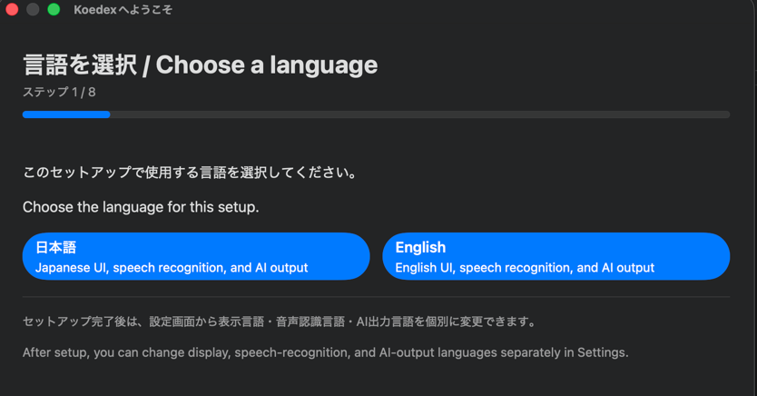
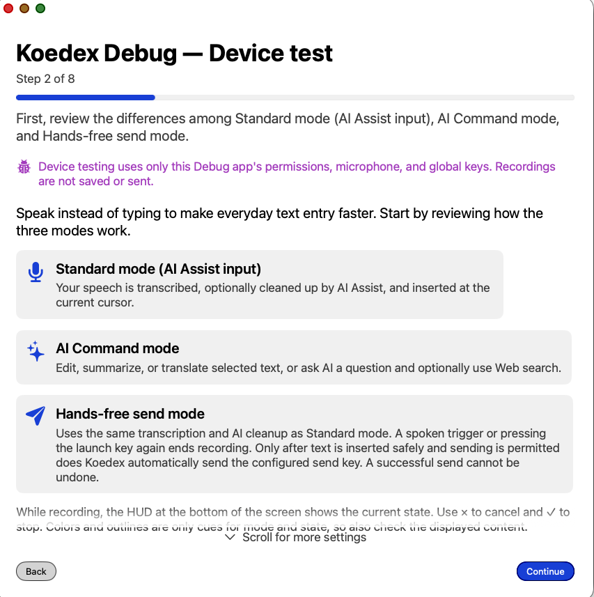
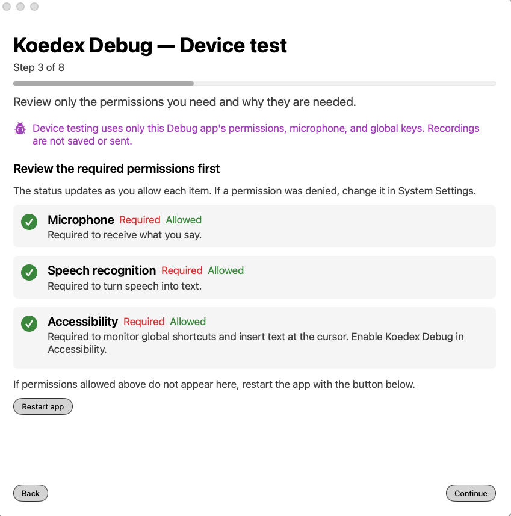
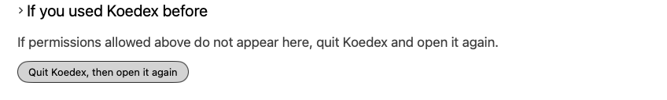
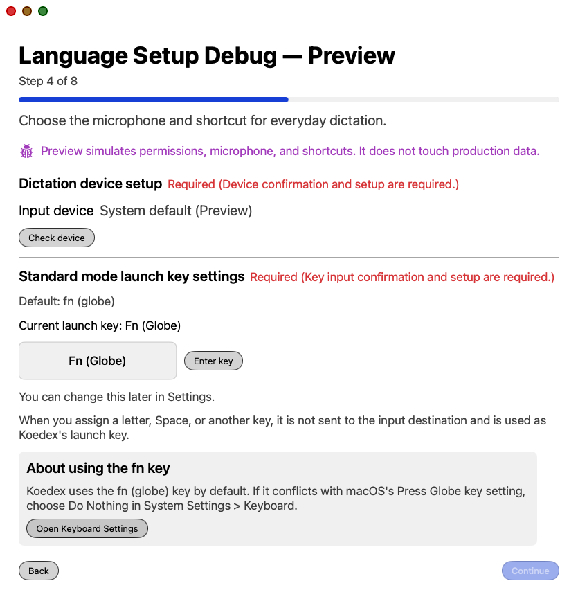
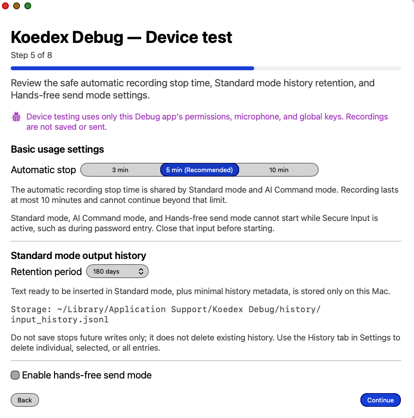
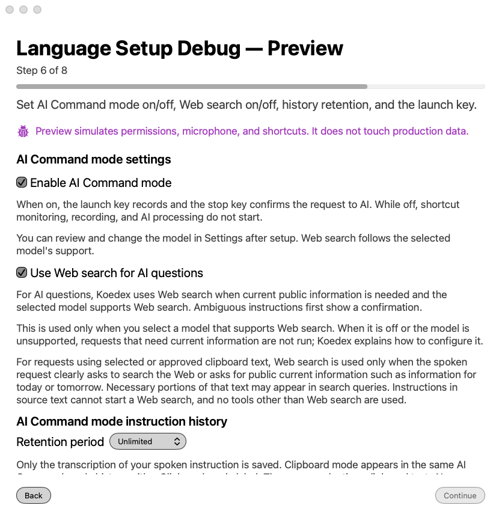
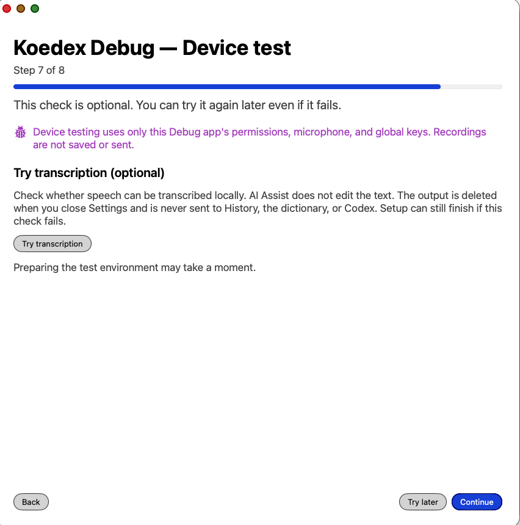
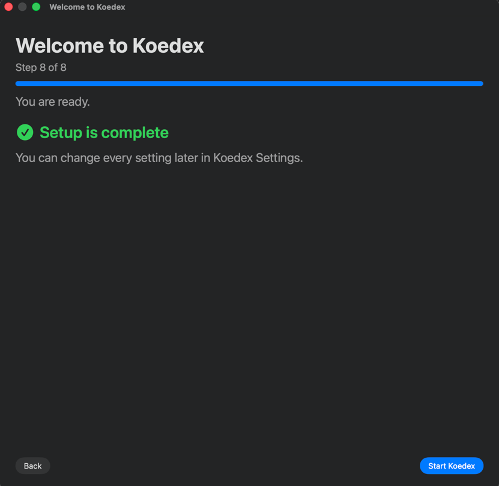
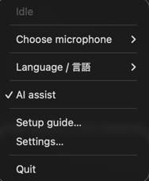

# Koedex User Manual (English)

Koedex is a voice-input app you can use anywhere on your Mac. What you say is typed directly
into whatever text field your cursor is in.

This manual assumes you have no background in Terminal use or programming. When a technical
term appears, check the [15. Glossary](#15-glossary).

---

## Table of contents

1. [Introduction](#1-introduction)
2. [Get started in 5 minutes](#2-get-started-in-5-minutes)
3. [System requirements](#3-system-requirements)
4. [Setup: Codex CLI and ChatGPT sign-in](#4-setup-codex-cli-and-chatgpt-sign-in)
5. [Get the app](#5-get-the-app)
6. [First-time setup](#6-first-time-setup)
7. [Choosing among the three modes](#7-choosing-among-the-three-modes)
8. [Settings screen reference](#8-settings-screen-reference)
9. [History tab](#9-history-tab)
10. [Personal dictionary](#10-personal-dictionary)
11. [Menu bar](#11-menu-bar)
12. [Privacy and data](#12-privacy-and-data)
13. [Troubleshooting](#13-troubleshooting)
14. [Frequently asked questions](#14-frequently-asked-questions)
15. [Glossary](#15-glossary)
16. [Uninstalling](#16-uninstalling)
17. [Appendix A: Let an AI agent handle installation](#17-appendix-a-let-an-ai-agent-handle-installation)
18. [Appendix B: Build from source yourself](#18-appendix-b-build-from-source-yourself)
19. [Appendix C: Version and distribution covered by this manual](#19-appendix-c-version-and-distribution-covered-by-this-manual)

---

## 1. Introduction

### What Koedex is

Koedex is a voice-input app for macOS. It works anywhere you can type text — email, chat
apps, note-taking apps, and more.

Using it is simple:

1. Click into the text field where you want to type, so your cursor is there.
2. Press the `fn` (🌐) key on your keyboard. Recording starts.
3. Speak.
4. Press `fn` again. Recording stops.
5. After a short pause, your speech becomes clean, well-formed text at your cursor.

Koedex lives in the [menu bar](#11-menu-bar), and **it also shows an icon in the Dock**.
Clicking the Dock icon opens Settings (or the setup screen, if setup isn't finished yet).
You don't need to keep a window open.

### What it can do

| What it does | Description |
| --- | --- |
| Type with your voice | Converts what you say into text at your cursor |
| Clean up your speech automatically | Removes filler words like "um" and adds punctuation |
| Give AI a command | Summarize, translate, or rewrite selected text, or answer a question |
| Send after you finish speaking | In chat fields, presses the send key right after typing (off by default) |
| Keep proper nouns consistent | Prefers the spellings you register in your [personal dictionary](#10-personal-dictionary) |

### What it can't do, and where it isn't a good fit

- It does not run on Windows or iPhone. It is macOS-only.
- AI-based cleanup does not work with no internet connection at all (transcription alone
  still works).
- Currently, only Japanese and English are supported.

### Where your voice goes

- **Your voice itself never leaves your Mac.** Transcription uses a mechanism Apple built
  into macOS, and it happens entirely on your Mac.
- **Text can leave your Mac, depending on what you use.** When you use AI cleanup or AI
  command, the transcribed **text** (not audio) is passed to a tool on your Mac called
  [Codex CLI](#codex-cli). Codex CLI then communicates with OpenAI using your own ChatGPT
  account.
- See [12. Privacy and data](#12-privacy-and-data) for details.

### Koedex is unaffiliated with OpenAI

Koedex is an independent community project. **It is not affiliated with, sponsored by, or
endorsed by OpenAI.** "OpenAI," "ChatGPT," and "Codex" are trademarks of OpenAI. Koedex does
not use any OpenAI logo or brand colors.

Koedex never communicates with OpenAI directly and holds no API key. All AI processing goes
through the Codex CLI already installed on your Mac.

---

## 2. Get started in 5 minutes

If this is your first time, follow these steps in order. Click each heading to jump to the
details.

| Step | What to do | Time | Details |
| --- | --- | --- | --- |
| 1 | Check that your Mac meets the system requirements | 1 min | [3. System requirements](#3-system-requirements) |
| 2 | Install Codex CLI and sign in with ChatGPT | 5–10 min | [4. Setup](#4-setup-codex-cli-and-chatgpt-sign-in) |
| 3 | Get Koedex | 5–20 min | [5. Get the app](#5-get-the-app) |
| 4 | Launch Koedex and complete the 8-step setup | 5 min | [6. First-time setup](#6-first-time-setup) |
| 5 | Click into a text field, press `fn`, and speak | 1 min | [7. Choosing among the three modes](#7-choosing-among-the-three-modes) |

### Common stumbling points

| Where people get stuck | Read this first |
| --- | --- |
| Not sure what Codex CLI is | [4. Setup](#4-setup-codex-cli-and-chatgpt-sign-in) |
| Never used Terminal before | [17. Appendix A](#17-appendix-a-let-an-ai-agent-handle-installation) |
| The app says it "can't be opened" | [13. Troubleshooting](#13-troubleshooting) |
| Nothing happens when you press the key | [13. Troubleshooting](#13-troubleshooting) |
| Started talking but want to stop partway through | [7. Cancel with Esc](#common-to-all-modes-cancel-with-esc) |

---

## 3. System requirements

### Required

| Item | Detail |
| --- | --- |
| OS | **macOS 26 (Tahoe) or later** |
| Prerequisite software | [Codex CLI](#codex-cli) (`codex`) installed and signed in with a ChatGPT account |
| Internet connection | Needed the first time a speech-recognition model downloads, and whenever AI processing runs |

> Just having a ChatGPT account, or just having the ChatGPT app installed on your Mac, is
> not enough. You need to separately install a command called `codex` that you use from
> Terminal, and sign in there.

For the full reason, see [4. Setup](#4-setup-codex-cli-and-chatgpt-sign-in).

Koedex does not run on macOS versions earlier than 26, because it relies on Apple's
SpeechAnalyzer speech-recognition framework, which was added in macOS 26. This is not a
limitation you can work around in Settings.

**To check your macOS version**: click the Apple menu () at the top left of the screen and
choose "About This Mac."

### Confirmed working configuration

| Item | Detail |
| --- | --- |
| Processor | [Apple Silicon](#apple-silicon) (an M-series chip) |
| OS | macOS 26.6 |

The developer has personally verified this combination works.

### Untested configurations

The following configurations **have not been verified, because the developer does not have
the hardware to test them.** We cannot say whether they work or not.

| Item | Status |
| --- | --- |
| Intel-based Macs | Untested. We have no test results for Intel Macs |
| macOS 26.0–26.5 | Untested. Only 26.6 has been confirmed |

If you try Koedex on an untested configuration, be aware it may not work correctly.

### Additional requirements for building from source

If you build the app yourself using [Appendix B](#18-appendix-b-build-from-source-yourself),
you will also need:

| Item | Detail |
| --- | --- |
| [Swift](#swift) | 6.2 or later |
| Developer tools | [Command Line Tools](#command-line-tools) is enough. You do not need the full Xcode.app |

---

## 4. Setup: Codex CLI and ChatGPT sign-in

### What Codex CLI is

Codex CLI is a tool distributed by OpenAI for **using AI from the Terminal.** It installs on
your Mac as a command named `codex`.

Here is what matters for Koedex:

> **Koedex never talks to AI directly.**
> Koedex launches the `codex` command already on your Mac in the background and just hands
> it text. `codex` is what communicates with OpenAI, using your own ChatGPT account.

This design has a few consequences:

| What it means | Explanation |
| --- | --- |
| You never enter an API key into Koedex | Koedex holds no API key |
| You never pay Koedex directly | AI usage draws from your own ChatGPT account's allowance |

### How to install it

Follow OpenAI's official instructions to install it. This manual does not repeat those
steps, because the official instructions can change, and a copy here would go stale and
confuse readers.

Look for OpenAI's official Codex CLI page.

### If you already have Codex CLI installed

**If you already have it installed, we strongly recommend updating it first.**

Koedex never checks the Codex CLI version. Koedex will launch fine even with an old version,
and problems only surface the moment you actually try to use an AI feature. Updating in
advance avoids this kind of confusing failure.

#### Step 1: Check the version

Open [Terminal](#terminal), type the following line, and press `return`.

```bash
codex --version
```

If a version number appears, Codex CLI is installed. If you see something like
`command not found`, it is not installed yet.

#### Step 2: Find out how it was installed

```bash
which codex
```

The result tells you how to update it.

| Result of `which codex` | How it was installed | Update command |
| --- | --- | --- |
| Ends in `/.npm-global/bin/codex` (your home folder's absolute path comes first) or `/usr/local/bin/codex` | npm | `npm install -g @openai/codex@latest` |
| `/opt/homebrew/bin/codex` | Homebrew | `brew upgrade codex` |
| Nothing appears | Not installed | Follow OpenAI's official instructions |

> **Note**: `~` stands for your home folder — the same place you get to from Finder's Go
> menu → Home.

### Signing in to ChatGPT (the most common pitfall)

> **Important: being signed in to the ChatGPT app or the ChatGPT website is not enough.**

It doesn't matter whether you have the ChatGPT app installed on your Mac, or whether you're
signed in to ChatGPT in your browser — neither has anything to do with Koedex. **You must
separately sign in as the `codex` command in Terminal.**

Sign in with this command:

```bash
codex login
```

If you're not signed in yet, a browser window opens with a sign-in screen. If you're already
signed in, it tells you so.

#### Why a separate sign-in is required

| Reason | Explanation |
| --- | --- |
| Koedex doesn't have its own AI | It launches `codex` on your Mac in the background and just hands it text |
| `codex` is a separate program | It's a **different program** from the ChatGPT app, with its own separate sign-in |
| Koedex never touches your credentials | Since it has no code to read them, Koedex can't see whether you're signed in to the ChatGPT app or a browser |

Even with the same ChatGPT account, think of it this way: **`codex` is the only "door"
Koedex can use.**

### What doesn't work without Codex CLI

Some features work without Codex CLI, and some don't.

| Feature | Does it need Codex CLI? |
| --- | --- |
| Transcription | No. It's completed entirely on your Mac |
| AI assist (cleanup) | Yes. If it fails, the raw, unformatted text is inserted instead |
| AI Command mode | Yes. There is no substitute |
| Web search (used inside AI Command mode) | Yes. It uses a feature built into Codex CLI |
| Hands-free send (the send itself) | No. The send mechanism itself doesn't use Codex CLI |
| Optimizing custom instructions | Yes |
| Fetching the model list | Yes |

In short, **transcription alone works without Codex CLI, but every AI-related feature
requires Codex CLI.**

### The order Koedex searches for `codex`

At launch, Koedex looks for `codex` in this order, checking each location from top to
bottom and using the first one it finds:

| Order | Location |
| --- | --- |
| 1 | The path entered in Settings under "Codex executable location (Advanced)" (only if it actually exists and is executable) |
| 2 | `~/.npm-global/bin/codex` |
| 3 | `/opt/homebrew/bin/codex` |
| 4 | `/usr/local/bin/codex` |
| 5 | As a last resort, it asks the shell with `command -v codex` (times out after 5 seconds) |

If none of these succeed, Koedex shows **"Codex CLI was not found. Specify the path in
Settings."** In that case, run `which codex` and paste the path it shows into Settings under
"Codex executable location (Advanced)."

### Koedex does not check your sign-in status ahead of time

Koedex does not check whether you're signed in when it launches. It only finds out from the
response the first time it actually calls AI processing. So the following messages appear
only "the moment you use it":

| Situation | What Koedex shows |
| --- | --- |
| Authentication fails | "Codex authentication failed. Sign in again with codex login." |
| You've used too much in a short time | "Rate limit reached. Wait a moment and try again." |
| You've used up your allowance | "Usage limit reached. Check your plan or billing settings." |

---

## 5. Get the app

There are three ways to get Koedex. Pick whichever suits you.

| Method | Best for | Difficulty |
| --- | --- | --- |
| (a) Let a desktop AI agent do it | People who don't want to do the build work in Terminal | Easy |
| (b) Let a terminal AI agent (CLI) do it | People comfortable opening Terminal | Moderate |
| (c) Build it yourself | People comfortable with the command line | Somewhat difficult |

> **Whichever method you choose, finish [4. Setup](#4-setup-codex-cli-and-chatgpt-sign-in)
> first.** Installing Codex CLI and running `codex login` has to be done in Terminal, even
> if you choose (a). "Easy" here refers to **the work of building the app**, nothing else.

### Current distribution method

| Item | Detail |
| --- | --- |
| How to get it | Clone the public repository and build it on your own Mac |
| Signing | Self-signed (not signed with the developer's Developer ID) |
| Notarization | Not performed |
| Pre-built app distribution | **Undecided at this time** (we haven't decided whether to offer one) |
| Getting an Apple Developer ID | **Undecided at this time** |

### (a) Let a desktop AI agent do it

Here, "a desktop AI agent" means **an AI agent that can work directly with folders on your
Mac and run commands on it.** This isn't tied to any specific product, since these tools'
exact capabilities can change. Check whether your agent meets both of these conditions
first:

| # | Check |
| --- | --- |
| 1 | Can it be pointed at a working folder (for example, your Downloads folder)? |
| 2 | Can it run commands inside that folder? |

**If either is missing, use method (b), Let a terminal AI agent (CLI) do it, instead.**

Steps and a copy-paste prompt are in
[17. Appendix A](#17-appendix-a-let-an-ai-agent-handle-installation).

> **Please make sure to read this**
> Even with an agent installing it for you this way, **Codex CLI is still required
> separately to run Koedex.** Just having the ChatGPT desktop app installed is not enough
> for Koedex's AI features to work. See [4. Setup](#4-setup-codex-cli-and-chatgpt-sign-in)
> for why.

### (b) Let a terminal AI agent (CLI) do it

Once you finish [4. Setup](#4-setup-codex-cli-and-chatgpt-sign-in), Codex CLI is already
installed on your Mac — and it is itself an AI agent. **You can hand the work of building
the app to this AI agent.**

Steps and a copy-paste prompt are in
[17. Appendix A](#17-appendix-a-let-an-ai-agent-handle-installation). If you can already
open Terminal, this is the most reliable route.

### (c) Build it yourself

If you're comfortable with the command line, you can build it yourself. See
[18. Appendix B](#18-appendix-b-build-from-source-yourself).

### Opening the app for the first time

Koedex is currently distributed [self-signed](#self-signed) and is not
notarized. An app you built yourself on this Mac normally opens without any
warning. If you obtained the `.app` some other way — downloaded, AirDropped,
or copied from another Mac — macOS's [Gatekeeper](#gatekeeper) may block the
first launch.

If that happens, there are two ways to open it:

1. Right-click (or Control-click) `Koedex.app`, choose **"Open,"** and approve it in the
   confirmation dialog that appears.
2. Double-click it normally once (it will be blocked), then open **System Settings** →
   **"Privacy & Security,"** and click **"Open Anyway"** next to Koedex.

You only need to do this once per build.

**Updating an existing installation**

If you already have Koedex installed and want to move to a newer release, follow this.

`scripts/install_app.sh`, used by the agent-assisted methods ((a) and (b)), stops with an
error and **does not overwrite** an existing `/Applications/Koedex.app`. So updating goes in
this order:

1. Move the currently installed `Koedex.app` out of `/Applications` without deleting it (for
   example, drag it to the Desktop).
2. Clone the new release tag into a **fresh** folder — don't update the old clone folder in
   place. The steps are the same ones used for (a), (b), or (c): see
   [17. Appendix A](#17-appendix-a-let-an-ai-agent-handle-installation) or
   [18. Appendix B](#18-appendix-b-build-from-source-yourself).
3. Build it. If you kept the app you moved aside in step 1, add
   `--previous-app <path to that app>` to the build command
   (`./scripts/make_app.sh release --previous-app <path>`) so the build verifies signing
   continuity against it and prints
   `更新互換性OK: bundle ID、Designated Requirement、署名者証明書は連続しています。`
4. Now that step 1 cleared `/Applications`, install the new app — either with
   `scripts/install_app.sh` or by dragging `dist/Koedex.app` into `/Applications` yourself.

**Your permissions carry over — you don't need to grant them again.** Building from this
repository always keeps the same bundle ID and signing identity, and `scripts/make_app.sh`
itself checks that continuity (see step 3). macOS ties the Microphone, Speech Recognition,
and Accessibility grants to that identity rather than to the specific `.app` file, so a new
build inherits what you already granted the old one.

**But updating does not fix a permission that's already broken.** If Koedex shows a
permission as already granted yet recording or pasting still doesn't work, and Koedex
doesn't appear at all in System Settings → Privacy & Security →
Microphone/Speech Recognition/Accessibility, that's a leftover macOS permission record (TCC)
from an earlier install on this Mac — updating the app doesn't touch it. This was confirmed
on a real affected Mac. To clear it, quit Koedex, then run these three commands **without
`sudo`**:

```bash
tccutil reset Microphone com.koedex.app
tccutil reset SpeechRecognition com.koedex.app
tccutil reset Accessibility com.koedex.app
```

Then reopen Koedex and grant the three permissions again normally, as in
[Step 3: Three permissions](#step-3-three-permissions) above.

---

## 6. First-time setup

The first time you launch Koedex, an 8-step setup screen opens. The top of the screen shows
"Step N of M" and a progress bar.

Except on the very first step, you can go back with the **"Back"** button in the lower left.

### There are three gates where you can't move forward

At three points, "Continue" won't respond until certain conditions are met. This isn't a
bug.

| Where | Condition |
| --- | --- |
| Step 3 | You can't continue until you allow all three permissions |
| Step 4 | You can't continue until you've confirmed both the microphone and the launch key |
| Step 6 | If you enable AI Command mode, you can't continue until you've confirmed the launch key and the stop key |

> **About the screenshots in this chapter**
> These were captured with the Debug app's device-test mode, so that capturing them would
> not overwrite any real settings. A few things differ from what you will see: the **window
> title** at the top reads "Koedex Debug", a **purple note** explains that the Debug app
> uses its own permissions and storage, the storage paths shown name the Debug app's own
> folder, and Step 8 ends with a button back to the Debug menu instead of finishing setup.
> Step 1 appears in both languages because the display language has not been chosen yet —
> that is what a real first run looks like too. The steps, the order of the items, and the
> default values are the same as on the real screen.

### Step 1: Choose your language



| Item | Detail |
| --- | --- |
| What this screen does | Shows only two buttons: "Japanese" and "English" |
| What happens when you tap one | The moment you tap one, setup automatically moves to the next step |
| What this decides | This single choice sets **the display language, the speech-recognition language, and the AI output language all at once** |
| Can you change it later | **Yes.** You can change all three independently in Settings |

Choosing Japanese makes the screens Japanese, the language it listens for Japanese, and AI's
replies Japanese too.

### Step 2: Welcome



| Item | Detail |
| --- | --- |
| What this screen does | Introduces the three modes: Standard mode, AI Command mode, and Hands-free send mode |
| Anything to choose | No. It's read-only |
| What happens when you tap something | "Continue" advances. You can always continue |

This screen also notes that signing in to Codex CLI is required, that **the ChatGPT app
cannot substitute for it**, and that on-device transcription still works even when Codex
can't be reached. Scrolling down continues with more detail on connecting to Codex CLI.
**You can finish setting up Codex CLI later — it doesn't have to be done before you
complete onboarding.**

### Step 3: Three permissions



**You can't continue past this step until you allow all three.**

Koedex requests exactly these three [permissions](#permission). It does not request
notifications or Input Monitoring.

| Permission | What it's for | Required |
| --- | --- | --- |
| Microphone | Recording your voice | Required |
| [Speech recognition](#speech-recognition-permission) | Transcribing on your Mac | Required |
| [Accessibility](#accessibility-permission) | Receiving your launch key press and inserting text at your cursor | Required |

| Item | Detail |
| --- | --- |
| What happens when you tap something | Tapping a permission's button opens the macOS permission dialog. Choosing "Allow" adds a green checkmark |
| What happens if you deny it | A red × appears, with a link to the relevant System Settings screen |
| Can you retry | Only Accessibility lets you trigger the dialog again after denying it. Microphone and Speech Recognition must be enabled manually in System Settings |
| Allowed it, but nothing changed | Quit Koedex completely and open it again. See "If you used Koedex before" below |
| Can you change it later | Yes, anytime, from System Settings → "Privacy & Security." Revoking it, though, stops Koedex from working |

**"If you used Koedex before" (a permanently visible, collapsed section)**

Below the permission list, this step always shows a collapsed section headed "> If you
used Koedex before" (closed by default). Expanding it reveals one line:

> If permissions allowed above do not appear here, quit Koedex and open it again.

Below that line is a button labeled **"Quit Koedex, then open it again."** Pressing it
quits Koedex immediately. **It does not relaunch automatically.** Open Koedex again
yourself; setup resumes at the step you were on when it quit.

If this Mac had an earlier copy of Koedex installed, the screen can show a permission as
already granted even though recording or pasting does not actually work. That happens
because an old macOS permission (TCC) record is still in place, and this section exists to
point you at the fix. For the full explanation and the recovery commands, see
[5. Get the app](#5-get-the-app), "Updating an existing installation."



A close-up of this collapsed section and the "Quit Koedex, then open it again" button.

### Step 4: Microphone and launch key



**You can't continue past this step until you've confirmed both the microphone and the
launch key.**

#### Confirming the microphone

| Item | Detail |
| --- | --- |
| Default | "Automatic" (the system's default microphone) |
| What happens when you tap something | Pressing "Check device" shows a volume meter. It moves as you speak |
| To finish confirming | Once you see the meter move, press **"Use this device"** |
| Can you change it later | **Yes.** Change it from "Microphone" in Settings, or "Choose microphone" in the menu bar |

#### Confirming the Standard-mode launch key

| Item | Detail |
| --- | --- |
| Default | `fn` (🌐) key |
| What happens when you tap something | Follow the on-screen prompt and actually press the key; once recognized, it's confirmed |
| If you want to change it | You can assign any single key you like |
| Can you change it later | **Yes.** Change it in Settings under "Standard mode launch key settings" |

### Step 5: Usage preferences



**Every item on this step is optional.** You can press "Continue" without changing anything.

| Item | Choices | What it changes | Can you change it later |
| --- | --- | --- | --- |
| Automatic recording stop | 3 min / 5 min (recommended) / 10 min | If you forget to stop while still talking, recording stops automatically after this time | Yes |
| Standard-mode history retention | Do not save / 1 day / 30 days / 180 days / Unlimited | How many days of results stay in the [History tab](#9-history-tab) | Yes |
| Enable Hands-free send mode | On / Off (optional) | Turning it on shows extra history settings on this same screen, and if Compatibility Input Mode is on, it also turns on "Also auto-send in external apps" in Settings. Unticking it turns that back off | Yes |

> **Note**: "1 minute" only appears as a choice if your existing setting for automatic stop
> is already 60 seconds.

### Step 6: AI Command mode



**If you enable AI Command mode, you can't continue until you've confirmed both the launch
key and the stop key.**

| Item | Default | What it changes | Can you change it later |
| --- | --- | --- | --- |
| Enable AI Command mode | On | Turning it off disables this mode's launch key | Yes |
| Use Web search for AI questions | On | AI searches the web when it decides it's needed. See [Chapter 8](#about-the-web-search-decision) for details | Yes |
| Input history retention | 180 days | How many days of AI Command mode history stay | Yes |
| Clipboard mode | Off (only shown if conditions are met) | Adding an extra key to the chord targets your clipboard's contents instead of your selected text | Yes |

#### Confirming the launch key and stop key

| Item | Default |
| --- | --- |
| Launch key | `fn` + `Space` |
| Stop key | `fn` |
| Clipboard mode's extra key | `Option` |

Follow the on-screen prompts and actually press the launch key and the stop key to confirm
them. Once both are confirmed, "Continue" becomes available.

If you turn AI Command mode off, no key confirmation is needed, and you can continue right
away.

### Step 7: Practice



| Item | Detail |
| --- | --- |
| What this screen does | Lets you actually speak and try transcription |
| Is the result saved | **No.** The screen states this explicitly |
| Is it required | No. It's optional |
| If it doesn't work | Press **"Try later"** to skip. You can still finish setup |

### Step 8: Complete



| Item | Detail |
| --- | --- |
| Button label | **"Start Koedex"** |
| Is a restart required | **No.** Koedex switches straight into menu-bar residency |
| What happens next | Only the first time, Settings opens automatically right after you finish |

That's the end of setup. Click into a text field and try pressing `fn`.

### Running setup again later

| Method | When it's available | Does it change your settings |
| --- | --- | --- |
| Menu bar → "Setup guide…" | Anytime | No |
| Menu bar → "Resume setup…" | Only shown if setup is incomplete | Continues from where setup left off |
| Settings → "Setup guide" section → "Open setup guide" | Anytime | No |

---

## 7. Choosing among the three modes

Koedex has three modes. Each one launches with a different key.

|  | Standard mode | AI Command mode | Hands-free send mode |
| --- | --- | --- | --- |
| Launch key (default) | `fn` | `fn` + `Space` | `fn` + `Right Shift` |
| How to stop | Press the same key again (one-tap) / release the key (hold-to-record) | Stop key (default `fn`) | Press the same launch key again, **or** speak a trigger phrase |
| Number of keys you can assign | 1 | Launch: 1–3, Stop: 1 | 1–3 |
| What it does | Cleans up and types what you said | Edits selected text, or answers a question | Types what you said and **presses the send key too** |
| Does it send | No | No | Presses `Enter` only if conditions are met |
| Default state | On | On | Off |

### Standard mode

The most basic mode. What you say is typed directly into the field.

You can choose how it stops in Settings.

| Method | Behavior | Good for |
| --- | --- | --- |
| One-tap (default) | Press to start, press again to stop | Longer passages |
| Hold-to-record | Records only while held down | Short phrases |

### AI Command mode

Treats what you say as an "instruction." **The behavior depends on whether you have text
selected when you start recording.**

| Situation | Behavior |
| --- | --- |
| You have text selected | Runs your spoken instruction against the selected text (summarize, translate, rewrite, etc.) |
| Nothing is selected | Treats what you said as a question for AI and shows the answer |

### Hands-free send mode

Types what you said and then **presses the send key automatically.** Use it for chat apps
and similar fields where you want to send hands-free.

It's off by default. You can turn it on in Settings under "Hands-free send mode."

### When hands-free send does not send

> **Please read this section especially carefully.**
> Once something is sent, it can't be undone. So Koedex is designed to **stop after typing
> the text, without sending,** whenever there is any uncertainty.
> If nothing was sent, in most cases that's not a malfunction — it's Koedex being cautious
> on purpose.

The default send key is `Enter`. `⌘Enter` and `⌃Enter` are also available.

**The overriding condition**: on every path, **Hands-free send mode itself must still be on,
right up until the moment it would send.** If you turn the mode off in Settings while
recording, nothing is sent from that point on.

#### When it does send

If Koedex can confirm through [Accessibility](#accessibility-permission) **that the text
was actually inserted into the field**, it sends.

#### When that confirmation isn't available (four conditions)

For paths where Koedex can't get that confirmation — for example, in some external apps —
it sends, on top of the overriding condition above, **only when all four of the following
are true:**

| # | Condition |
| --- | --- |
| 1 | [Compatibility Input Mode](#compatibility-input-mode) was **on when recording started** |
| 2 | "Also auto-send in external apps" was **on when recording started** |
| 3 | "Also auto-send in external apps" is **still on right now** |
| 4 | Compatibility Input Mode is **still on right now** |

It checks both the start of recording and the current moment because settings might have
been changed mid-recording, and it always takes the safer of the two.

**If even one of the four is missing, Koedex types the text but does not send it.**

#### When it can't even confirm where the text is going

If Koedex cannot safely determine the target field at all, it neither types nor sends — it
**only leaves the text on your clipboard.** Paste it with `⌘V`.

### The spoken trigger phrase

Instead of pressing a key, you can say a fixed phrase to end recording and send.

| Item | Detail |
| --- | --- |
| Japanese preset | "ストップ送信" |
| English preset | "Send Now" |
| Custom phrase rules | 4–20 characters, one line, no quotation marks, cannot match the preset |

> **Note**: **A custom phrase must be registered in the same language as your
> speech-recognition language, or it won't be recognized.** If your speech-recognition
> language is Japanese and you register an English phrase, it may never match the
> transcription and never trigger.

### Common to all modes: cancel with Esc

Pressing **`Esc`** while recording or processing cancels whatever's happening. This works
the same way across all three modes.

| State | What `Esc` does |
| --- | --- |
| Showing a failed AI result | Works. Dismisses that display |
| Preparing to record (right after you press the key; recording hasn't started yet) | Works. Cancels before recording starts |
| Recording | Works. Cancels the recording |
| Transcribing | Works. Cancels the process |
| AI processing (cleanup / AI Command mode) | Works. Cancels the process |
| Inserting (typing the text into the field) | **Only partly works. Once pasting has started, it can no longer be undone** |
| Hands-free send, right before the send key is pressed | Works. **You can stop it up until the send key is actually pressed** |
| Idle, or showing an error | Doesn't work. `Esc` passes straight through to whatever app is in front |

Koedex only intercepts `Esc` while something cancellable is happening. The rest of the time
(while idle, or while showing an error), it doesn't take over `Esc` from the app in front.

While recording, pressing the **✕ button** shown in the [HUD](#hud) does the same thing.

> **Exception**: while you're assigning a launch key in Settings, `Esc` means "stop
> assigning this key." It isn't used to cancel recording at that moment.

> **Note**: `Esc` only works if [Accessibility permission](#accessibility-permission) is
> granted, because it uses the same mechanism as the launch key.

### A limit shared by all three modes: Secure Input

While [Secure Input](#secure-input) is active — for example, in a password field —
**none of the three modes can start recording.** This comes from a macOS mechanism, and
Koedex cannot override it.

The message shown at that time is:

> Recording cannot start while Secure Input is active. Close the password field or similar
> input, then try again.

---

## 8. Settings screen reference

Open Settings from the menu bar's "Settings…" item.

The sidebar on the left has three tabs.

| Tab | Covered in |
| --- | --- |
| Settings | This chapter |
| History | [9. History tab](#9-history-tab) |
| Personal dictionary | [10. Personal dictionary](#10-personal-dictionary) |

A **"Display size"** slider is always shown at the bottom of the sidebar.

| Item | Detail |
| --- | --- |
| What it's for | Changes the size of text and buttons throughout Settings |
| Default | 100% |
| Range | 65%–140%, in 5% steps |

### Order of sections on the Settings tab

| Order | Section |
| --- | --- |
| 1 | Setup guide |
| 2 | Languages |
| 3 | Microphone |
| 4 | Automatic recording stop (shared by Standard mode and AI Command mode) |
| 5 | Browser and Other App Support |
| 6 | AI assist |
| 7 | Standard mode launch key settings |
| 8 | AI Assist model selection |
| 9 | Custom instruction (Standard mode / Hands-free send mode) |
| 10 | AI Command mode |
| 11 | AI Command mode launch key settings |
| 12 | Model for AI Command mode |
| 13 | Custom instruction (AI Command mode) |
| 14 | Hands-free send mode |
| 15 | Model used for optimization (shared by Standard mode, Hands-free send mode, and AI Command mode) |
| 16 | Reset AI processing |
| 17 | Codex executable location (Advanced) |

### Setup guide

| Item | Detail |
| --- | --- |
| What it's for | Lets you revisit the first-time setup content anytime |
| What happens | Pressing "Open setup guide" opens a 4-step review screen (Welcome / Microphone and launch key / AI Command mode / Complete). The last button is "Close" |
| Note | Opening it this way is for review only — your settings don't change |

### Languages

There are three separate language settings. **Each is independent.**

| Item | Default | Choices | Description |
| --- | --- | --- | --- |
| Display language | Japanese | Japanese / English | The language used for Settings, the menu bar, setup, and the HUD |
| Speech-recognition language | Japanese | Japanese / English | The language you speak |
| AI output language | Automatic | Automatic / Japanese / English | The language AI replies in |

| Note | Detail |
| --- | --- |
| Speech-recognition language | **Cannot be changed while recording or processing.** Change it once things are idle |
| AI output language | If you explicitly state a language by voice, that always takes priority |

### Microphone

| Item | Detail |
| --- | --- |
| What it's for | Chooses which microphone to record with |
| Default | Automatic (system default) |
| What changing it does | Records using the device you specify |
| Note | If the specified device can't be found, it automatically falls back to the system default |

You can also change this from "Choose microphone" in the menu bar.

### Automatic recording stop (shared by Standard mode and AI Command mode)

| Item | Detail |
| --- | --- |
| What it's for | Stops recording automatically if you forget to |
| Default | 5 min |
| Choices | 1 min / 3 min / 5 min / 10 min |
| Note | Recording lasts at most 10 minutes; it never continues past this setting |

### Browser and Other App Support (Compatibility Input Mode)

This section has two toggles.

#### Compatibility Input Mode (ON Recommended)

| Item | Detail |
| --- | --- |
| What it's for | Uses an alternate input method for apps and web pages that don't accept direct text insertion |
| Default | On, on a new install. If you were already using Koedex, your existing setting is kept unchanged |
| What turning it on does | Allows capturing selected text in external apps, and direct input via a virtual-input method that doesn't touch the clipboard |
| Note | In some fields, Koedex may not be able to confirm the text was actually inserted |

#### Insert AI Command mode results directly

| Item | Detail |
| --- | --- |
| What it's for | Puts AI Command mode's result directly into the text field instead of a separate window |
| Default | On, on a new install. If you were already using Koedex, your existing setting is kept unchanged |
| Note | **Unavailable while Compatibility Input Mode is off.** Turning Compatibility Input Mode back off effectively disables this too |

**To put an AI answer directly into the text field, both of the following must be on both
*before you start recording* and *at the moment the text is inserted*.**

| # | Condition |
| --- | --- |
| 1 | Compatibility Input Mode |
| 2 | Insert AI Command mode results directly |

**If only one is on, AI's answer shows in a separate window instead.** Copy it from there
and paste it with `⌘V`. Turning either one off mid-recording has the same effect.

Note that this is about putting an **AI answer** into a text field. Replacing text you
selected and asked to be rewritten works through a different mechanism.

**If the AI's answer is too long, it may also be shown in a separate window instead of
being inserted directly.** There's a safety limit on how much text can be sent at once;
results over that limit are shown in a separate window instead of being inserted partway
and broken. In that case you'll see: "The result was too long to type directly into this
input field. Copy the text below and paste it." Copy it from there and paste it. Asking
again in smaller pieces can get the result inserted directly.

The same limit applies to the replacement you get when you select text and ask for a
rewrite. The one exception is a rewrite in [clipboard mode](#clipboard-mode): it is
pasted with `⌘V`, so the limit doesn't apply.

With Compatibility Input Mode on, the same notification can also appear for standard-mode
voice input, if what you say is long enough to hit the same limit.

### AI assist

| Item | Detail |
| --- | --- |
| What it's for | Decides whether transcription gets cleaned up by AI |
| Default | On |
| When on | Removes filler words, fixes punctuation, and then inserts the result |
| When off | Inserts the raw speech-recognition result immediately |
| Note | **In Standard mode and Hands-free send mode**, turning it off also disables the [personal dictionary](#10-personal-dictionary). **In AI Command mode, the dictionary is used regardless of the AI assist setting** |

You can also toggle this from the menu bar.

### Standard mode launch key settings

| Item | Default | Description |
| --- | --- | --- |
| Launch key | `fn` | Only one key can be assigned |
| Recording method | One-tap | One-tap / Hold-to-record |

| Note | Detail |
| --- | --- |
| Duplicate keys | You can't save if the Standard-mode launch key **exactly matches** another mode's key |
| Hold-to-record delay | With hold-to-record, if another mode's key combination shares this prefix, Standard mode's recording can start up to 150 ms later |

### AI Assist model selection, Model for AI Command mode, and Model used for optimization

Koedex lets you choose an AI [model](#model) for each purpose.

| Section | Used for | Default |
| --- | --- | --- |
| AI Assist model selection | Cleanup in Standard mode | On a fresh install: GPT-5.6 Luna / low (falls back to your Codex CLI settings if that can't be fetched) |
| Model for AI Command mode | Processing in AI Command mode | On a fresh install: GPT-5.6 Luna / low (falls back to your Codex CLI settings if that can't be fetched) |
| Model used for optimization | Optimizing custom instructions | On a fresh install: GPT-5.6 Luna / low (falls back to your Codex CLI settings if that can't be fetched) |

#### Models you can choose

The list of selectable models is fetched dynamically from Codex CLI. There's also a
built-in list as a fallback in case that fetch fails.

Six presets are shown:

| Display name |
| --- |
| GPT-5.6 Luna / low (fast, low-cost) |
| GPT-5.6 Luna / medium (balanced) |
| GPT-5.6 Terra / low (light everyday use) |
| GPT-5.6 Terra / medium (recommended for everyday use) |
| GPT-5.6 Sol / medium (for complex tasks) |
| GPT-5.6 Sol / high (highest accuracy) |

[Reasoning effort](#reasoning-effort) can be set to low, medium, high, or xhigh.

#### Notes

| Note | Detail |
| --- | --- |
| Automatic setup on a fresh install | On first connection, Koedex fetches the model list, and if `GPT-5.6 Luna / low` is available, applies it to all three model settings at once. **It never changes the choice of an existing user** |
| If the list can't be fetched | Koedex shows "Could not retrieve the model list. Your saved settings are unchanged. Update the Codex CLI, then refresh the model list again." and **disables the Save button** |
| Why you can't press Save | This isn't a bug. It's designed to prevent saving a guessed model name that might not actually exist |
| When you can save | **You can't save while recording or processing** |

### Custom instructions

You can register your own instructions to AI. There are two places for this.

| Location | Applies to |
| --- | --- |
| Custom instruction (Standard mode / Hands-free send mode) | Standard mode and Hands-free send mode |
| Custom instruction (AI Command mode) | AI Command mode |

| Item | Detail |
| --- | --- |
| Default | Empty |
| Note | **Nothing takes effect until you press "Save."** Just typing it isn't enough |

#### Optimize

A feature that has AI reorganize your freely written instructions.

| Item | Detail |
| --- | --- |
| What it does | Rewrites a vague instruction into a safe, clear one |
| Output limit | Up to 5 items, 500 characters total |
| What's prohibited | Changing the meaning, summarizing, answering questions, translating, or weakening safety rules |
| Where it runs | A read-only, temporary session that times out after 45 seconds |
| Undo | Keeps up to 20 past versions, and you can step forward and back through them |

### AI Command mode

| Item | Detail |
| --- | --- |
| What it's for | Turns AI Command mode on or off |
| Default | On |
| What turning it off does | The launch key no longer starts this mode |

### AI Command mode launch key settings

| Item | Default | Description |
| --- | --- | --- |
| Launch key | `fn` + `Space` | You can assign 1–3 keys |
| Stop key | `fn` | Just 1 key |
| Enable Clipboard mode | Off | Can only be turned on if conditions are met |
| Extra key | `Option` | Choose from Command / Option / Control / Shift |

#### Clipboard mode

Adding an extra key to the AI Command mode launch key lets you target **your clipboard's
contents instead of your selected text.**

**Conditions to enable it (all seven must be met)**

| # | Condition |
| --- | --- |
| 1 | The AI Command mode launch key includes a regular (non-modifier) key |
| 2 | The launch key uses 2 or fewer keys |
| 3 | The extra key doesn't duplicate the launch key itself |
| 4 | The extra key doesn't duplicate the stop key |
| 5 | The extra key doesn't duplicate the Standard-mode launch key |
| 6 | The extra key doesn't duplicate the Hands-free send key |
| 7 | The resulting combination doesn't conflict with a macOS-reserved shortcut (Spotlight, input source switching, etc.) |

If the conditions aren't met, you can't turn it on, and **the reason is shown on screen.**
Koedex never silently rewrites an already-saved value that no longer qualifies.

**Conditions that cancel a clipboard read (in priority order)**

| Order | Condition |
| --- | --- |
| 1 | [Secure Input](#secure-input) is active (the read itself is refused) |
| 2 | The content is what Koedex itself just pasted (to avoid reprocessing the same content) |
| 3 | The content is marked confidential by a password manager or similar app |
| 4 | The clipboard has multiple items, or isn't text |
| 5 | The clipboard is empty |
| 6 | The content exceeds 12,000 characters |

**What is never saved**: the clipboard's contents, the source text, AI's answer, any
referenced URLs, or audio. Only the transcription of the spoken instruction stays in
history, tagged "Clipboard mode."

**Clipboard restoration**: about one second after pasting, Koedex **attempts to restore**
your original clipboard content. If that fails, the original content isn't guaranteed. It
only restores what it placed there itself — if you or another app copies something new in
the meantime, that new content is never overwritten. **If you had something important
copied, we recommend saving it somewhere else beforehand, just in case.**

### Use Web search for AI questions

| Item | Detail |
| --- | --- |
| What it's for | Decides whether AI Command mode searches the web when you ask a question |
| Default | On |
| Note | Unavailable with models that don't support web search, and it's **automatically turned off** (with a notification) |

#### About the Web search decision

> **The only input that decides whether to search the web is what you said out loud.**

Even if the selected text or clipboard content says "search the web for this," Koedex
**ignores it.**

This is a deliberate safety design. If instructions like "search the web for this" were
embedded in text written by someone else, they could drive AI behavior without your intent —
an attack called [prompt injection](#prompt-injection). By basing the decision only on what
you spoke, Koedex prevents this.

> **Note**: If you allow web search, the parts of your selected text or clipboard content
> needed to run the search may be sent as the search query. **If you're working with
> sensitive text, turn Web search off.**

Here's how the decision works. The rules below apply when you have text selected or are
using Clipboard mode. If you ask a general question with nothing selected, AI searches the
web whenever it decides that's needed.

| What you said | Behavior |
| --- | --- |
| You clearly said something like "search the web" | It searches |
| Words like "today's" or "latest," plus public information like weather or stock prices, phrased as a question | It searches |
| Ambiguous | It shows a confirmation dialog once |
| Web search is off, or the model doesn't support it | Instead of a search failure, it shows guidance on how to enable it |

### Hands-free send mode

| Item | Default | Description |
| --- | --- | --- |
| Enable hands-free send mode | Off | Turning it on makes the items below available |
| Launch key | `fn` + `Right Shift` | 1–3 keys; doubles as both start and stop |
| Spoken trigger phrase | Preset | Preset / Custom |
| Custom phrase | Empty | 4–20 characters, one line, no quotation marks |
| Send key | `Enter` | Enter / ⌘Enter / ⌃Enter |
| Also auto-send in external apps | Off | Turning it on shows a confirmation dialog. It is also turned on for you if you tick "Enable Hands-free send mode" during first-run setup while Compatibility Input Mode is on |

| Note | Detail |
| --- | --- |
| Also auto-send in external apps | **Cannot be selected while Compatibility Input Mode is off** |
| Custom phrase | **Register it in the same language as your speech-recognition language** |
| When it doesn't send | See [Chapter 7's four conditions](#when-hands-free-send-does-not-send) |

### Reset AI processing

| Item | Detail |
| --- | --- |
| What it's for | Resets the state of AI processing. Use it if responses start acting oddly |
| What happens | Rebuilds the connection to Codex |
| Note | **Unavailable while recording or processing** |

### Codex executable location (Advanced)

| Item | Detail |
| --- | --- |
| What it's for | Lets you manually tell Koedex where `codex` is, if it couldn't find it automatically |
| Default | Blank (automatic detection) |
| When to use it | Only when you see "Codex CLI was not found" |
| What to enter | The path shown when you run `which codex` in Terminal |
| Note | Leave it blank if automatic detection is already working |

### History settings

| Item | Default | Choices |
| --- | --- | --- |
| History retention (three, one per mode) | 180 days | Do not save / 1 day / 30 days / 180 days / Unlimited |
| History display limit | 50 | 50 / 100 / 200 / All |

| Note | Detail |
| --- | --- |
| Shortening the retention period | Old history entries are actually deleted (a confirmation dialog appears) |
| Switching to "Do not save" | **Existing history is not deleted.** Only new entries stop being saved |

### When settings can't be saved

If reading or migrating the settings file fails, Koedex enters a "Settings cannot be saved"
state, and a red banner appears at the top of the screen. You can't change settings in this
state. See [13. Troubleshooting](#13-troubleshooting).

---

## 9. History tab

Choose "History" in the Settings sidebar to review your past input.

### What is and isn't saved

> **Most important point: in AI Command mode, only the transcription of your spoken
> instruction is saved.**

| Mode | What's saved as the body |
| --- | --- |
| Standard mode | The **output text** that was safely inserted |
| Hands-free send mode | The **output text** that was safely inserted |
| AI Command mode | **Only the transcription of your spoken instruction** |

What is **not** saved in AI Command mode:

| Not saved |
| --- |
| The text you had selected |
| Clipboard content |
| AI's answer |
| Any referenced URL |
| Audio data |

This isn't something turned off by a setting. It is **structurally impossible to pass to
history** in the first place. No setting change makes it start saving these.

### When insertion fails

If insertion fails, or the input was too short, **only metadata is kept, with no body text**
(date and time, which model was used, etc.). This too is removed by "Delete all history."

### What each row shows

| Shown | Detail |
| --- | --- |
| Date and time | When it was recorded |
| Mode label | "Standard mode," "Hands-free send mode," or "AI Command mode" |
| Body | Up to 8 lines are shown |
| Status label | See the table below |

If you used Clipboard mode, a "Clipboard mode" tag is added.

#### Status labels

| Label | Meaning |
| --- | --- |
| AI assist failed | AI cleanup could not run |
| Insertion failed | The text could not be typed into the field |
| Stopped for secure input | Cancelled because [Secure Input](#secure-input) was active |
| Short input | The input was too short |
| Excluded | Excluded from saving |
| Clipboard restoration failed | The original clipboard could not be restored |

### Filtering and search

| Feature | Detail |
| --- | --- |
| History type | All / Standard mode / Hands-free send mode / AI Command mode |
| Search box | Filters by words in the body text |
| History display limit | 50 / 100 / 200 / All |

> **Note**: **Search only covers entries within the display limit.** If the display limit
> is 50, search only looks through the most recent 50 entries. To search older history too,
> change the display limit to "All."

### Deleting entries

"History actions" switches the display mode.

| Mode | What you can do |
| --- | --- |
| Normal view | Each row's "Copy" (if it has a body) and "Delete" |
| Select to delete | The actions below |

Actions available in "Select to delete":

| Action | Detail |
| --- | --- |
| Select all | Checks all currently displayed entries |
| Delete all selected history | Removes the checked entries |
| Delete all except selected history | Removes everything except the checked entries |
| Delete all hidden metadata | Also removes bodiless records that don't show up on screen |

"Delete all history" removes both the visible bodies and the metadata that doesn't appear on
screen.

### About retention periods

| Item | Detail |
| --- | --- |
| Setting scope | Configured independently per mode |
| Entry-count limit | **None.** Only the number of days controls automatic deletion |
| Default | 180 days on a new install. If you were already using Koedex, your existing setting is kept unchanged |
| Storage location | `~/Library/Application Support/Koedex/history/input_history.jsonl` |
| File permissions | Saved so that only your account can read them. Other accounts on the same Mac cannot |

---

## 10. Personal dictionary

You can register pairs like "when I say it this way, type it that way" for proper nouns and
jargon. Choose "Personal dictionary" in the Settings sidebar.

### What you can register

| Item | Detail |
| --- | --- |
| Term / spelling | The spelling you want typed |
| Readings / how it sounds | What triggers it. **You can register multiple** |
| Notes | This is context for this term only. Put overall style and output rules in Custom instruction |
| Enabled / disabled | Lets you temporarily stop using an entry |

### How the dictionary actually works (a common misunderstanding)

> **The personal dictionary does not replace text after the fact.**

Koedex passes enabled dictionary entries along in its prompt to AI, with an instruction
like: "only prefer this spelling when this reading actually appears in what was said."

This design has three consequences:

| What it means | Explanation |
| --- | --- |
| A word you didn't say never appears on its own | It only kicks in when that reading actually appears in your speech |
| **In Standard mode and Hands-free send mode, it does nothing if AI assist is off** | Since the dictionary is passed as an instruction to AI, it has no effect when AI isn't used. **In AI Command mode, the dictionary is used regardless of the AI assist setting** |
| It considers context | Because it isn't a plain find-and-replace, it won't apply in completely unrelated contexts |

> **Notes are also passed to AI.** When you use cleanup in Standard mode, Hands-free send
> mode, or optimizing custom instructions, the full text of an entry's notes is also passed
> to `codex` as part of the prompt (it leaves your Mac). **It is not passed in AI Command
> mode** (only the term/spelling and readings are). This isn't a place for personal notes —
> only write things you're fine with leaving your Mac.

If the dictionary doesn't seem to be working, first check whether "AI assist" is on in
Settings, and whether that specific entry is "Enabled."

### Reading and writing CSV

You can export and import the whole dictionary at once.

| Item | Detail |
| --- | --- |
| Columns (Japanese) | 単語 / 読み方 / 補足メモ / 有効 |
| Columns (English) | word / readings / notes / enabled |
| Multiple readings | Listed comma-separated within the same column |
| Export encoding | UTF-8 (with BOM), CRLF line endings |
| Import encoding | Automatically detects UTF-8 / UTF-16 / Shift_JIS |
| Values accepted in the "enabled" column | TRUE / FALSE (yes/no, 1/0, on/off, and similar values are also accepted; a blank cell is treated as enabled) |

#### Limits on import (CSV)

These limits apply only to CSV import. There's no character limit when you type directly
into Settings. Note, though, that a note longer than 500 characters is rejected if you
export the dictionary and import it back.

| Item | Limit |
| --- | --- |
| Rows | 1,000 |
| File size | 8 MiB |
| Term length | 100 characters |
| Readings | Up to 20, each up to 100 characters |
| Notes | 500 characters |

#### Keeping spreadsheet apps from mangling your data

Values starting with `=`, `+`, `-`, `@`, a tab, a newline, or `'` automatically get a `'`
prefix added on export, and it's automatically stripped again on import. This prevents
spreadsheet apps from misreading these characters as formulas.

### When imported terms conflict

If an imported term matches an existing one, you choose per entry from:

| Choice | Behavior |
| --- | --- |
| Keep existing | Leaves what's already there unchanged |
| Replace | Overwrites it with the imported content |
| Add as a separate entry | Keeps both |

| Situation | Behavior |
| --- | --- |
| The same term already appears multiple times in your existing dictionary | Excluded from automatic handling; you must review it manually |
| The dictionary changed after the preview was shown | The import is cancelled |

### Backups

| Item | Detail |
| --- | --- |
| Storage location | `~/Library/Application Support/Koedex/personal_dictionary.json` |
| Automatic backup | If an import will cause replacements, Koedex automatically backs up to `personal_dictionary.pre-import-backup.json` first |

---

## 11. Menu bar



Koedex lives in the menu bar at the top right of your screen, and **it also shows an icon
in the Dock**. Click the microphone icon to open the menu. Even if you close every window,
Koedex keeps running in the background.

### Menu items

Listed top to bottom. Some items only appear in certain situations.

| Order | Item | Detail |
| --- | --- | --- |
| 1 | Current state | Idle / Preparing to record... / Recording... / Transcribing... / AI Assist in progress... / Inserting... / Error |
| 2 | "Codex connection error: …" + "Reconnect to Codex" | Only shown while an error is occurring |
| 3 | "Settings cannot be saved. See the Settings window for details." | Only shown when settings can't be saved |
| 4 | Choose microphone | A submenu listing "Automatic" and detected devices, with a checkmark on the current one |
| 5 | Language / 言語 | A submenu |
| 6 | AI assist | Toggles on/off |
| 7 | Copy Last AI Output | Only shown when there's a recent AI output |
| 8 | Resume setup… | Only shown if setup is incomplete |
| 9 | Setup guide… | Opens a 4-step review screen (Welcome / Microphone and launch key / AI Command mode / Complete). Doesn't change your settings |
| 10 | Settings… | Opens the Settings window |
| 11 | Quit | Quits Koedex |

### How the icon changes

The menu-bar icon's appearance changes with Koedex's state.

| State | Icon |
| --- | --- |
| Normal | A microphone |
| Recording | A microphone with a `+` badge |
| AI assist failed | An outlined warning triangle. Shown for about 8 seconds, then reverts automatically |
| `codex` not found | A filled warning triangle. **Disappears the next time you record** |

The icon only turns into a filled warning triangle when **`codex` can't be found.** No
other connection error changes the icon. It also disappears the next time you start, stop,
or [cancel](#common-to-all-modes-cancel-with-esc) a recording, so it may vanish even though
the problem is still there. To check the
actual state, open the menu and look at the "Codex connection error" line.
See [13. Troubleshooting](#13-troubleshooting) for details.

---

## 12. Privacy and data

### What leaves your Mac, and what doesn't

| Type | Leaves your Mac? | Explanation |
| --- | --- | --- |
| **Audio** | **No** | Transcription happens entirely in Apple's on-device engine |
| **Text** | **Sometimes** | Only when using AI assist and AI Command mode |
| **Settings** | No | Stored on your Mac |
| **History** | No | Stored on your Mac |
| **Personal dictionary** | **Stored on your Mac, but sent when it's used** | Enabled dictionary entries are passed to `codex` as part of the prompt when you use AI assist or AI Command mode |
| **Custom instructions** | **Stored on your Mac, but sent when it's used** | Your saved instructions are passed to `codex` as part of the prompt when you use AI assist or AI Command mode |

#### About audio

Your audio is never sent off your Mac. Transcription uses a mechanism Apple built into
macOS (SpeechAnalyzer / SpeechTranscriber), and it happens entirely on your Mac.

The only network traffic involved is **macOS downloading a speech-recognition model from
Apple, the first time you use a given language.** That's a macOS operation, not Koedex
sending your audio anywhere.

#### About text

With AI assist and AI Command mode, the transcribed **text** (not audio) is passed to the
`codex` command on your Mac. `codex` communicates with OpenAI using **your own ChatGPT
account.**

| Fact | Explanation |
| --- | --- |
| Koedex never talks to OpenAI directly | Everything goes through `codex` |
| Koedex holds no API key | `codex` handles authentication |
| If you turn off AI assist (cleanup in Standard mode / Hands-free send mode) | **That cleanup-related send stops.** The raw transcription result is inserted as-is |

> **Important**: **AI Command mode is different.** Regardless of your AI assist setting,
> what you said, the target text (the text you had selected, or the clipboard content you
> approved), enabled personal-dictionary entries, and your custom instructions are all
> passed to `codex`. The only way to stop this is to not use AI Command mode itself.

> **Note**: Koedex refuses to read the current selection whenever macOS reports that
> secure input is active. This covers ordinary password fields in native Mac apps, as
> well as password fields in Safari, Chrome, and similar browsers.

> **Note**: It does not, however, detect fields that merely look secret but are,
> technically, ordinary text fields. One-time passcode (OTP) and two-factor
> authentication (2FA) boxes are the main example. In fields like these, don't select
> the text, and don't start AI Command mode.

> **Note**: Selected text and web-search results are sent to the AI, and can also
> influence where the AI decides to place its answer. Always check the result before
> relying on it.

> **Note**: When Koedex has to copy your selection in order to read it and the capture is
> then abandoned, the copied text stays on the clipboard. Secure input turning on, the
> focus moving elsewhere, and the request being cancelled all do this. Koedex never uses
> the text, but it cannot put your previous clipboard contents back.

> **Note**: The delivery paths that go through the clipboard can lose what was on it.
> Clipboard mode, and the support-only fallback for Mail and Google Docs in Chrome,
> replace the clipboard in order to paste; if that fails partway, your previous contents
> may be lost rather than restored. Both are off unless you turn them on yourself.

#### Koedex never touches Codex CLI's own configuration

When Koedex launches `codex`, it passes `mcp_servers={}` and `plugins={}`. It never
rewrites `~/.codex/config.toml`. Everything under `~/.codex/` belongs to Codex CLI's own
management, and Koedex never writes there.

### Where your data is stored

Koedex's **app data — settings, history, dictionary, and so on —** is stored inside
`~/Library/Application Support/Koedex/`.

| File / folder | Contents |
| --- | --- |
| `settings.json` | All settings |
| `settings.pre-v24-backup.json` | Automatic backup made during a settings migration |
| `history/input_history.jsonl` | Input history |
| `personal_dictionary.json` | Personal dictionary |
| `personal_dictionary.pre-import-backup.json` | Automatic backup made when importing a dictionary |
| `custom_instruction_state.json` | Custom instructions for Standard mode / Hands-free send mode |
| `ai_command_custom_instruction_state.json` | Custom instructions for AI Command mode |
| `logs/koedex.log` | App logs (rotated at 5 MB, 2 generations kept) |
| `logs/koedex.log.1` and `logs/koedex.log.2` | Older, rotated-out log files |
| `koedex_dev_cert.crt` | A copy of the signing certificate, created only if you built Koedex yourself (it does not contain the private key) |
| `AICommandRuntime/` | Working files for AI Command mode |
| `appserver.pid` | Records used to prevent double-launching |
| `onboarding_restart_intent.json` | Used to resume setup |

> **Note**: The `~/Library` folder is normally hidden in Finder. Open Finder's Go menu and
> hold the `option` key — "Library" appears.

> **Note**: If you built it yourself using
> [Appendix B](#18-appendix-b-build-from-source-yourself), the signing private key is also
> kept separately, in your Mac's login keychain. See
> [16. Uninstalling](#16-uninstalling) if you want to remove it.

---

## 13. Troubleshooting

Start by looking up your symptom. If you can't find it, use
[Look up by the exact wording shown on screen](#look-up-by-the-exact-wording-shown-on-screen).

### Launch key does nothing

Check these in order.

| # | Check | What to do |
| --- | --- | --- |
| 1 | Is [Accessibility permission](#accessibility-permission) enabled? | Check System Settings → "Privacy & Security" → "Accessibility" to confirm Koedex is on |
| 2 | Did you just grant the permission? | If the setup screen is open, **return to it after granting** and the display updates within a few seconds. If it doesn't update, or if you granted the permission after finishing setup, **quit Koedex completely and relaunch it** |
| 3 | Is your cursor in a password field or similar? | Recording can't start while [Secure Input](#secure-input) is active. Close that screen and try again |
| 4 | Does the key exactly match another mode's key? | In Settings, check whether the Standard-mode key **exactly matches** the AI Command mode or Hands-free send key |
| 5 | Is another app using the same key? | Try assigning a different key |

> **Note**: A combination that merely shares a prefix with another mode's key — like the
> defaults (`fn` and `fn`+`Space`) — is normal and not a problem.

### I want to cancel recording or processing partway through

See [Chapter 7: Common to all modes: cancel with Esc](#common-to-all-modes-cancel-with-esc).
**If pressing `Esc` doesn't do anything, check whether
[Accessibility permission](#accessibility-permission) is enabled.**

### Text isn't inserted, or appears in a separate window

| Symptom | Cause | What to do |
| --- | --- | --- |
| No text is typed at all | Koedex couldn't safely confirm the target field | Turn on [Compatibility Input Mode](#compatibility-input-mode) in Settings and try again |
| The result shows in a separate window | Koedex couldn't confirm the state of the text field | Copy from the window and paste it, or turn on Compatibility Input Mode |
| Only long results show in a separate window | The result went over the limit on how much text can be sent at once | Copy and paste it, or try dictating it again in smaller pieces |
| Only the clipboard has it | Koedex couldn't confirm the target field at all | Paste it with `⌘V` |

Some apps and web pages don't report their text-field state through macOS's standard
mechanism. In that situation, Koedex avoids "inserting without knowing whether it landed,"
and chooses the safer behavior instead.

> **AI Command mode's results** aren't inserted directly just from turning on
> "Compatibility Input Mode" above. "Insert AI Command mode results directly" in Settings
> must also be on **before you start recording.** If only one is on, the result shows in a
> separate window. See [Chapter 8](#insert-ai-command-mode-results-directly) for details.

### Hands-free send does not send

In most cases, this isn't a malfunction — it's a safety behavior. See
[Chapter 7's four conditions](#when-hands-free-send-does-not-send).

| # | Check |
| --- | --- |
| 1 | Is Compatibility Input Mode on? |
| 2 | Is "Also auto-send in external apps" on? |
| 3 | Were both of the above **already** on before you started recording? |
| 4 | Did you change any settings while recording? |

If a spoken trigger phrase doesn't stop recording, check whether **you registered the
phrase in the same language as your speech-recognition language.**

### Transcription doesn't start, or is slow

| Cause | What to do |
| --- | --- |
| The speech-recognition model hasn't finished downloading yet | Stay connected to the internet and wait a bit, then try again. This only happens the first time you use a given language |
| No microphone is selected, or it's unavailable | Check the input device under "Microphone" in Settings |
| You unplugged an external microphone | Switch the setting back to "Automatic," or choose another available device |
| Your speech-recognition language doesn't match the language you're speaking | Check "Speech-recognition language" under "Languages" in Settings |

### AI doesn't work

| Cause | How to recognize it | What to do |
| --- | --- | --- |
| Codex CLI isn't installed | "Codex CLI was not found" | See [Chapter 4](#4-setup-codex-cli-and-chatgpt-sign-in) |
| You're not signed in | "Codex authentication failed. Sign in again with codex login." | Run `codex login` in Terminal |
| You've used too much in a short time | "Rate limit reached" | Wait a while, then try again |
| You've used up your allowance | "Usage limit reached" | Check your ChatGPT account's usage allowance |
| Codex CLI is out of date | Unstable behavior, odd responses | Update it using [Chapter 4's update commands](#if-you-already-have-codex-cli-installed) |

First things to try: **"Reconnect to Codex"** in the menu bar, or **"Reset AI processing"**
in Settings (unavailable while recording or processing).

### Model list unavailable, or Save is disabled

| Situation | Explanation |
| --- | --- |
| What's shown | "Could not retrieve the model list. Your saved settings are unchanged. Update the Codex CLI, then refresh the model list again." |
| Cause | Koedex couldn't fetch the model list from Codex CLI |
| Why Save is disabled | Designed to prevent saving a model name that might not exist. It isn't a bug |
| What to do | Check your Codex CLI sign-in status and internet connection, then try "Reconnect to Codex" in the menu bar |
| Your saved settings | Unchanged. Nothing is lost |

Also note: **the Save button is disabled while recording or processing, too.** Try again
once processing finishes.

### Clipboard mode can't be turned on

One of [Chapter 8's seven conditions](#clipboard-mode) isn't met. **The reason it isn't met
is shown on screen.** Read it and fix the relevant item.

The two most common causes are:

| Cause | What to do |
| --- | --- |
| The extra key duplicates another key | Change the extra key to a different one of Command / Option / Control / Shift |
| The launch key doesn't include a regular key | Add a non-modifier key (like `Space`) to the AI Command mode launch key |

### Dictionary entries are not applied

| Check | Explanation |
| --- | --- |
| Is "AI assist" on in Settings? | **In Standard mode and Hands-free send mode, the dictionary does nothing if it's off.** In AI Command mode, the dictionary is used regardless of this setting |
| Is that entry "Enabled"? | Disabled entries are never used |
| Did you actually say that reading? | A word you didn't say is never inserted on its own |
| Have you registered multiple readings? | Pronunciation can vary. Registering several likely readings helps it trigger |

### Settings cannot be saved

A red banner appears at the top of the screen reading "Settings cannot be saved."

| What to do |
| --- |
| Quit Koedex, move `~/Library/Application Support/Koedex/settings.json` somewhere else (or to the Trash), then relaunch Koedex. Your settings reset to their defaults, but your history and dictionary are kept |
| Quit Koedex and relaunch it |
| Check your available disk space |
| If it still doesn't resolve, `~/Library/Application Support/Koedex/logs/koedex.log` may offer a clue |

### The app can't be opened ("cannot be opened because the developer cannot be verified," etc.)

Koedex is currently [self-signed](#self-signed) and is not notarized. An app you built
yourself normally opens without a warning, but if the `.app` reached this Mac some other way,
macOS's [Gatekeeper](#gatekeeper) can block the first launch.

| # | What to do |
| --- | --- |
| 1 | Right-click (or Control-click) `Koedex.app` → "Open" → approve it in the confirmation dialog |
| 2 | After a normal double-click fails once, open System Settings → "Privacy & Security" → click "Open Anyway" next to Koedex |

You only need to do this once per build.

### Look up by the exact wording shown on screen

These headings use the exact wording Koedex shows on screen. Search for the text you're
seeing.

#### Codex CLI was not found

Koedex couldn't find `codex`. Run `which codex` in Terminal, and paste the path it shows
into Settings under "Codex executable location (Advanced)." If nothing appears, Codex CLI
isn't installed yet — see [Chapter 4](#4-setup-codex-cli-and-chatgpt-sign-in).

#### Could not connect to Codex app-server

Koedex found `codex`, but couldn't start communicating with it. Try "Reconnect to Codex" in
the menu bar. If that doesn't help, restart Koedex.

#### Codex app-server is not running

Same as above. Try "Reconnect to Codex," or restart Koedex.

#### Could not start Codex app-server

Koedex couldn't launch `codex`. Run `codex --version` in Terminal to confirm Codex CLI is
installed correctly.

#### Codex app-server stopped

`codex` exited partway through processing. Try "Reconnect to Codex." If it keeps happening,
update Codex CLI to the latest version.

#### Timed out waiting for Codex

The response didn't come back in time. Check your internet connection and try again. For
long passages, switching to a lighter model (for example, GPT-5.6 Luna / low) can help.

#### Codex returned an invalid response

The response came back in an unexpected format. Update Codex CLI to the latest version.

#### Could not connect to Codex

Couldn't connect. Check your sign-in status (`codex login`) and your internet connection.

#### AI Assist is repeatedly failing. Check the Codex connection.

Failures keep happening. Check your sign-in status, internet connection, and Codex CLI
version, in that order. You can also try "Reset AI processing" in Settings.

#### Rate limit reached. Wait a moment and try again.

You've used too much in a short time. Wait a while and try again.

#### Codex authentication failed. Sign in again with codex login.

Codex isn't signed in. Run `codex login` in Terminal to sign in again.

#### Usage limit reached. Check your plan or billing settings.

You've used up your ChatGPT account's usage allowance. Check your plan or billing settings.

#### Recording cannot start while Secure Input is active. Close the password field or similar input, then try again.

[Secure Input](#secure-input) is active. Close the password field or similar input and try
again. This comes from a macOS mechanism, and Koedex cannot override it.

#### Koedex could not safely verify insertion into the requested input target, so the result is shown in a separate window.

Koedex couldn't confirm the text landed in the field, so it showed the result in a separate
window instead. Copy it from the window and paste it, or turn on
[Compatibility Input Mode](#compatibility-input-mode) and try again. **If you want AI
Command mode results inserted directly, both Compatibility Input Mode and "Insert AI
Command mode results directly" need to be on before you start recording.**

#### The result was too long to type directly into this input field. Copy the text below and paste it.

There's a safety limit on how much text can be sent at once. If a result goes over that
limit, it's shown in a separate window instead of being inserted partway and broken. Copy
it from the window and paste it, or try dictating again in smaller pieces. This can happen
both with standard voice input and with AI Command mode.

#### This output will not be retried automatically. Copy and paste it, or turn on Compatibility Input Mode and dictate it again.

Same situation as above. Koedex never retries the same operation on its own, because doing
so could risk typing it twice into an unintended place.

#### Settings cannot be saved. See the Settings window for details.

There's a problem reading or writing the settings file. See
[Settings cannot be saved](#settings-cannot-be-saved).

#### Could not retrieve the model list. Your saved settings are unchanged. Update the Codex CLI, then refresh the model list again.

See
[Model list unavailable, or Save is disabled](#model-list-unavailable-or-save-is-disabled).

#### Could not change the speech-recognition language. Check permissions and the speech model, then try again.

Check that Speech Recognition permission is enabled. Also, if you're using a new language's
speech model for the first time, stay connected to the internet and wait a bit before
retrying.

---

## 14. Frequently asked questions

### Does it cost anything?

Koedex itself is free. AI features, however, draw on your own ChatGPT account's usage
allowance. There's no mechanism for paying Koedex directly.

### Can I use it without an internet connection?

Partly, yes.

| Feature | Works offline? |
| --- | --- |
| Transcription | Yes (once that language's model has already been downloaded) |
| AI assist (cleanup) | No |
| AI Command mode | No |
| Personal dictionary | No (it depends on AI processing, such as AI assist or AI Command mode) |

Even when AI is unavailable, turning off AI assist still lets you type the raw
transcription result.

### Is my voice ever stored anywhere?

No. Audio is never kept, and it never appears in history either.

### Can I use it with confidential work documents?

That's a judgment call based on your own organization's rules. Here are the facts:

- Your voice never leaves your Mac.
- With AI assist or AI Command mode, **the transcribed text** is sent to OpenAI through
  your ChatGPT account. If you're using your personal dictionary or custom instructions,
  their contents are sent along with it too.
- If you turn off AI assist (cleanup in Standard mode / Hands-free send mode), that portion
  of the sending stops. **But if you use AI Command mode, text is still sent regardless of
  this setting.**

### I have the ChatGPT app installed, but it still doesn't work

Being signed in to the ChatGPT app or website has nothing to do with Koedex. You need to
separately sign in as the `codex` command in Terminal. See
[Chapter 4](#signing-in-to-chatgpt-the-most-common-pitfall).
For a detailed explanation of why a separate sign-in is required, see
[Why a separate sign-in is required](#why-a-separate-sign-in-is-required).

### Does it work on an Intel Mac?

**We don't know.** The developer doesn't have that hardware to test with, so it's
unverified. We can't say it works, and we can't say it doesn't. See
[3. System requirements](#3-system-requirements).

### Can I use it on macOS 25 or earlier?

No. Koedex depends on Apple's speech-recognition framework added in macOS 26.

### Can I use languages other than Japanese and English?

Currently, only Japanese and English are supported.

### How do I switch the speech-recognition language?

Change it under "Languages" → "Speech-recognition language" in Settings. **It can't be
changed while recording or processing.**

### AI keeps replying in English

Lock "AI output language" to "Japanese" (or your preferred language) under "Languages" in
Settings. Note that if you explicitly say something like "answer in English," that always
takes priority.

### Why doesn't AI's answer show up in history?

By design, AI Command mode only passes the transcription of your spoken instruction to
history. The selected text, AI's answer, and any referenced URLs are never saved. See
[9. History tab](#9-history-tab).

### Hands-free send won't send for me

It's likely a safety behavior. Check
[Chapter 7's four conditions](#when-hands-free-send-does-not-send).

### I want to change the launch key

You can change it in Settings.

| Mode | Section |
| --- | --- |
| Standard mode | Standard mode launch key settings |
| AI Command mode | AI Command mode launch key settings |
| Hands-free send mode | Hands-free send mode |

You can't save a key that exactly matches another mode's key. A combination that merely
shares a prefix with another mode's key (like the defaults) is fine.

### What does clicking the Dock icon do?

Koedex shows an icon in both the menu bar and the Dock. Clicking the Dock icon opens
**Settings** if all permissions and setup are complete, or the **setup screen** if not. It
also appears in the list when you switch apps with `⌘Tab`. Day-to-day, you operate Koedex
from the microphone icon in the menu bar at the top right of your screen.

### Can I reset all settings back to their defaults?

There's no single button that resets everything. Deleting
`~/Library/Application Support/Koedex/settings.json` restores the default state, but you'll
lose every setting you made. See also [16. Uninstalling](#16-uninstalling).

---

## 15. Glossary

Terms used in this manual, in no particular order.

### Terminal

An app for typing text commands to control your Mac. You'll find it in Finder under
Applications → Utilities. You can also open it via Spotlight (`⌘Space`) by typing
"Terminal."

### Command

An instruction you type into Terminal. Type a line and press `return` to run it.

### CLI

Short for Command Line Interface. It refers to a tool you operate with typed commands
instead of icons and buttons.

### Codex CLI

A tool distributed by OpenAI for using AI from Terminal. It installs on your Mac as a
command named `codex`. Koedex launches this `codex` in the background to run AI processing.

### PATH

The list of places macOS looks when searching for a command. If `codex` sits somewhere in
this list, you can run it from anywhere just by typing `codex`.

### Permission

Whether an app is allowed to use a feature of your Mac (microphone, camera, and so on).
Managed under "Privacy & Security" in System Settings.

### Accessibility permission

Lets an app read the state of other apps' windows, and perform keyboard or mouse actions.
Koedex uses it to receive your launch key and insert text at your cursor.

> **Note**: While the setup screen is open, granting this permission updates the display
> right away. If you grant it at any other time, quit Koedex completely and relaunch it.

### Speech recognition permission

Lets an app use speech-recognition features. Koedex needs this to transcribe your speech on
your Mac.

### Secure Input

A macOS mechanism that hides keystrokes from other apps while something like a password
field is open. Koedex cannot start recording while this is active. This is a macOS-level
mechanism, and Koedex cannot override it.

### Compatibility Input Mode

A Koedex setting. Enables an alternate way of typing text into apps and web pages that
don't accept direct text insertion. Found in Settings under "Browser and Other App
Support."

### Clipboard

Where content goes temporarily when you "copy" it. `⌘C` copies, `⌘V` pastes.

### Prompt injection

A technique where instructions to AI are hidden inside ordinary text, steering AI toward
unintended behavior. Koedex defends against this by basing web-search decisions only on
"what you said out loud."

### Model

A particular kind of AI. Some are fast and light, others are slower but smarter. Koedex
lets you choose one for each purpose.

### Reasoning effort

How much AI thinks before answering. From low to medium, high, and xhigh, accuracy tends to
improve at the cost of more time.

### Rate limit

A mechanism that temporarily restricts usage after too much activity in a short time. It
opens back up again after you wait.

### HUD

A small status display near the bottom of the screen — for example, showing "Recording."

### Gatekeeper

A macOS mechanism that blocks apps of unverified origin from launching. Koedex is currently
[self-signed](#self-signed), so it gets blocked the first time you launch it.

### Self-signed

When the app's creator signs the app themselves, without going through a public
certificate authority. Koedex currently ships this way, so it needs manual approval the
first time you open it.

### Keychain

Where macOS stores passwords and certificates. When building from source, the signing
certificate is stored here.

### Command Line Tools

A set of development tools Apple distributes. You can build Koedex with just this — you
don't need to install the full Xcode.app.

### Swift

The programming language Apple created. Koedex is written in it.

### Build

The process of turning source code (text a person wrote) into an app that actually runs.

### Repository

Where a program's source code is stored.

### Clone

Copying a repository's contents onto your own Mac.

### Apple Silicon

Apple's own Mac chip design — M1, M2, M3, and so on. Most Macs from 2020 onward use one of
these.

### Menu-bar app

A style of app that stays running, living in the menu bar. **Koedex shows icons in both the
menu bar and the Dock.**

### Modifier key

A key like `command`, `option`, `control`, or `shift`, meant to be combined with another
key.

### CSV

A file format for tabular data, using commas to separate values. You can open it with any
spreadsheet app.

---

## 16. Uninstalling

Here's how to remove Koedex completely.

### Step 1: Quit Koedex

Click the menu-bar icon and choose **"Quit."**

### Step 2: Delete the app

Move `Koedex.app` to the Trash. If you placed it in `/Applications`, that's where you'll
find it.

### Step 3: Delete your data

Move the `~/Library/Application Support/Koedex/` folder to the Trash. **Deleting this
whole folder removes the app data listed below (settings, history, dictionary, and so
on).** However, if you built the app yourself using
[Appendix B](#18-appendix-b-build-from-source-yourself), the signing certificate lives
somewhere else and isn't removed by this (see Step 5).

Here's how to get to that folder:

1. Open Finder.
2. Open the "Go" menu in the menu bar and hold the `option` key. "Library" appears.
3. Open "Library" → "Application Support" → "Koedex," in that order.

This deletes:

| Item |
| --- |
| Settings |
| Input history |
| Personal dictionary |
| Custom instructions |
| Logs |

> **Note**: If you've ever built with `onboarding-debug` from
> [Appendix B](#18-appendix-b-build-from-source-yourself), you'll also have a separate folder
> named `Koedex Debug/` inside
> `~/Library/Application Support/`. Move it to the Trash the same way if you want to
> remove it too. If you ever built with `language-setup-debug`, a
> `Koedex Language Setup Debug/` folder is still there as well — that build has been
> retired.

### Step 4: Remove permission entries (optional)

Open System Settings → "Privacy & Security," and remove Koedex from the "Accessibility,"
"Microphone," and "Speech Recognition" lists.

### Step 5: Delete the signing certificate (only if you built it yourself; optional)

If you've ever built the app yourself using
[Appendix B](#18-appendix-b-build-from-source-yourself), a signing certificate and private
key are kept separately in your Mac's **login keychain**. Deleting
`~/Library/Application Support/Koedex/` does not remove these.

If you want to delete it, open the **Keychain Access** app, find the certificate, and
delete it manually. **This is entirely optional -- it's up to you whether to delete it.**

### What you don't need to delete

| Item | Explanation |
| --- | --- |
| `~/.codex/` | Codex CLI's own management area. **Koedex never writes there.** Keep it if you'll keep using Codex CLI |
| Codex CLI itself | Fine to keep, if you use it for anything besides Koedex |

---

## 17. Appendix A: Let an AI agent handle installation

### About this method

You can hand the work of building Koedex to an AI agent. Even if you're not comfortable
with Terminal, this route can be as simple as "paste a prepared block of text, then just
answer whatever the screen asks."

There are two ways to do this: using a "desktop AI agent," or using a "terminal AI agent
(CLI)." If you've already finished [4. Setup](#4-setup-codex-cli-and-chatgpt-sign-in), the
Codex CLI you installed there is ready to use as-is (Method 2).

> **Important**
>
> Only use the prompt below **against Koedex's official repository.** Don't substitute a
> URL from an unknown source. The AI agent will run scripts found inside whatever
> repository you point it at. Pointing it at a malicious repository could harm your Mac.

### What an AI agent can't do for you

These are common examples that **need your confirmation or personal action.** Missing
prerequisites are reported in one batch, but safety-sensitive actions are still confirmed
immediately before they happen. Your environment may also require sandbox or network
approval, so the number of pauses is not fixed.

| Can't be automated | Explanation |
| --- | --- |
| Responding to macOS permission dialogs | You click through prompts like "Allow access to the microphone?" |
| Approving a certificate in Keychain | Trusting the signing certificate happens in the [Keychain](#keychain) app |
| Entering an administrator password | If asked for a password, you type it |

The AI agent will tell you "your action is needed here" and pause. When it does, follow the
on-screen instructions, then tell it you're done.

### Working location and recommended model

Use `~/Developer` as the default parent folder and make the new clone at
`~/Developer/Koedex`. Only use `~/Downloads/Koedex` if Developer cannot be used. Avoid
Desktop, Documents, iCloud Drive, File Provider locations, symlinks, and old clones.

As of 2026-08-24, the recommended installer agent is Codex `GPT-5.6-Terra` / `medium`, or
Claude Code `Sonnet 5` / `medium` when available and `default` / `medium` otherwise. Use the
client default if effort cannot be selected. Check Claude Code's current availability and
configuration in its [official model documentation](https://code.claude.com/docs/en/model-config).
This setting is for the agent doing the installation, not Koedex's in-app AI model.

### Method 1: Using a desktop AI agent

Steps for when you're using "an AI agent that can work directly with folders on your Mac
and run commands on it."

#### Check these first

| # | Check |
| --- | --- |
| 1 | Can it be pointed at the working folder `~/Developer`? |
| 2 | Can it run commands inside that folder? |

If either is missing, use "Method 2: Using a terminal AI agent" below instead.

#### Steps for a desktop AI agent

1. In the AI agent's interface, point it at `~/Developer`. Create that folder if needed.
   Only use `~/Downloads` if Developer cannot be selected.
2. Copy the entire copy-paste prompt below, paste it in, and ask it to run.
3. If it asks you to confirm before running something, read it and approve.
4. If it asks for a macOS permission dialog, Keychain approval, or an administrator
   password, that's your cue to act.

### Method 2: Using a terminal AI agent

Steps for when you're using an AI agent from Terminal.

#### If you're using Codex CLI

1. Open [Terminal](#terminal).
2. Move to a working folder. If you don't have a preference, type this and press `return`:

   ```bash
   mkdir -p ~/Developer
   cd ~/Developer
   ```

3. Type this and press `return`. Codex launches.

   ```bash
   codex
   ```

4. Copy the entire prompt below, paste it into Codex's input field, and press `return`.
5. Follow along as Codex explains what it's doing. When it asks to confirm running
   something, read it and approve.
6. If it asks for permission dialogs or a password, that's your cue to act.

#### If you're using Claude Code (terminal version)

1. Open [Terminal](#terminal).
2. Move to a working folder.

   ```bash
   mkdir -p ~/Developer
   cd ~/Developer
   ```

3. Type this and press `return`.

   ```bash
   claude
   ```

4. Copy the entire prompt below, paste it in, and press `return`.
5. Follow along as it explains what it's doing.

### Copy-paste prompt

Koedex's official repository is <https://github.com/GrShin5/Koedex>.
Use the following URL, tag, and full SHA exactly as written.

> Removing an older Koedex.app may leave previous macOS permissions such as Microphone or
> Accessibility, and an older signing certificate can remain too. The agent does not reset
> TCC or automatically remove old certificates or app data. Follow macOS only if it asks you
> to grant permission again.

<!-- BEGIN KOEDEX_AGENT_INSTALL_PROMPT_EN -->
```text
Build and install the Koedex macOS app from its official GitHub repository. I am not
comfortable with Terminal. Explain each action in plain English, including exactly what I
need to look for or click, instead of asking me questions that only use engineering terms.

PINNED SOURCE
- Official URL: https://github.com/GrShin5/Koedex.git
- Release tag: v0.1.7
- Verification method: GitHub immutable release

WORKING LOCATION
1. Use ~/Developer as the default parent and ~/Developer/Koedex as the clone destination.
2. Only if ~/Developer cannot be created or used, offer ~/Downloads/Koedex instead.
3. Do not work in Desktop, Documents, iCloud Drive, another File Provider location, or
   through a symlink.
4. If the destination already exists, contains anything, is a symlink, or is an existing
   clone with uncommitted changes, do not delete, overwrite, or reuse it. Report its location
   and state in plain language, then stop.

HOW TO PROCEED
- Complete all read-only preflight checks first, then report every finding and all action I
  need to take in one batch. Do not interrupt me once per finding.
- Still ask immediately before a safety-sensitive action such as changing Keychain,
  writing to /Applications, handling Gatekeeper, or granting macOS permissions. Explain
  what will change and wait for my approval. Do not promise a fixed number of pauses.
- If sandbox or network approval caused a command to fail, after approval you may retry the
  same URL, ref, and command once. Do not independently switch to another URL, ref, mirror,
  ZIP download, or installation method.

FETCH AND VERIFY
1. Clone v0.1.7 into the new destination using a command equivalent to:
   git clone --branch v0.1.7 --single-branch https://github.com/GrShin5/Koedex.git <new-destination>
2. Before running any repository script, verify all of the following:
   - origin's fetch URL matches https://github.com/GrShin5/Koedex.git
     (you may treat only a trailing .git as equivalent during comparison)
   - the local v0.1.7 tag's commit exactly equals HEAD
   - refs/tags/v0.1.7 returned by git ls-remote against the official URL exactly equals HEAD
   - GitHub's official releases/tags/v0.1.7 API reports tag_name=v0.1.7 and immutable=true
   - if GitHub CLI is already available, gh release verify v0.1.7 --repo GrShin5/Koedex also succeeds
   - the checkout is clean and has no untracked files
3. If any value differs, the release is missing or not immutable, or a value cannot be
   verified, do not run a repository script. Report the values you could verify in a table
   and stop.

PREFLIGHT
Only after every source check passes, run this inside the clone:
  KOEDEX_LANG=en bash scripts/preflight.sh --install
Review the complete output for macOS, Swift, Command Line Tools, Codex CLI, OpenSSL 3,
Keychain, free disk space, working location, and /Applications/Koedex.app. Report every
PASS/WARN/FAIL in one batch. Do not treat an inaccessible Keychain as an absent certificate
or a broken signature. If /Applications/Koedex.app exists as an app, regular file, or
symlink, do not overwrite or delete it; stop.

BUILD AND INSTALL
1. Only if a signing identity is absent, explain before running
   bash scripts/make_signing_cert.sh that it creates a self-signed code-signing certificate,
   imports it into the login Keychain, and marks it Always Trust for code signing, which
   triggers a macOS authentication dialog. Wait for my approval.
2. After approval, run that script and verify success. If Keychain is inaccessible, do not
   recreate or delete anything; stop.
3. Run ./scripts/make_app.sh release.
4. Verify exit status zero, dist/Koedex.app exists, bundle ID is com.koedex.app, its deep
   strict signature is valid, and its signer fingerprint can be read.
5. Before running bash scripts/install_app.sh, explain that it makes a new installation from
   dist/Koedex.app to /Applications and never overwrites an existing Koedex.app. Wait for my
   approval.
6. After approval, run bash scripts/install_app.sh with no arguments. Do not switch to a
   manual copy or alternate destination.
7. Verify the installed bundle ID, deep strict signature, signer fingerprint, and identity
   continuity with the source app, then report the results.

DO NOT CHANGE
- Do not modify anything under ~/.codex/ and do not reset TCC permissions.
- Do not automatically delete an existing app, old certificate, Keychain item, Koedex
  settings, or history.
- Do not fetch or run scripts from outside the repository or install new software on your
  own.
- Do not independently use sudo, delete or overwrite files, disable Gatekeeper, or broadly
  remove quarantine attributes.

FINAL REPORT
1. Working location and the verified origin, tag, and HEAD
2. Every preflight, build, install, and signature PASS/WARN/FAIL
3. Safe first launch in Finder and what to do if Gatekeeper blocks it
4. How to grant Microphone, Speech Recognition, and Accessibility permissions
5. How to verify the Codex CLI connection and what to do if it is unavailable
6. State that old macOS permissions or signing records can remain after deleting an older
   app, and that you did not automatically reset or delete them
```
<!-- END KOEDEX_AGENT_INSTALL_PROMPT_EN -->

### After the agent finishes

1. Right-click (or Control-click) `Koedex.app` inside `/Applications` and choose "Open."
   Approve the confirmation dialog if one appears.
2. The setup screen opens. Continue with [6. First-time setup](#6-first-time-setup).

### If something goes wrong

If the agent stops and reports a problem, read what it tells you. If you're still stuck,
check [13. Troubleshooting](#13-troubleshooting), or try the steps in
[Appendix B](#18-appendix-b-build-from-source-yourself) one at a time by hand.

---

## 18. Appendix B: Build from source yourself

Steps for people comfortable with the command line.

### What you need

| Item | Detail |
| --- | --- |
| macOS | 26 (Tahoe) or later |
| [Swift](#swift) | 6.2 or later |
| Developer tools | [Command Line Tools](#command-line-tools). You don't need the full Xcode.app |

You can check your Swift version with:

```bash
swift --version
```

### Step 1: Clone the repository

<!-- BEGIN KOEDEX_SOURCE_PIN_EN -->
Clone only the single point tagged `v0.1.7` from the official repository. Do not take the latest
state (`main`) — take this release and nothing else. Do not run this where a folder named `Koedex`
already exists.

```bash
git clone --branch v0.1.7 --single-branch https://github.com/GrShin5/Koedex.git Koedex \
  && cd Koedex
```

**Do not run a single script from the repository until every check below prints ✅.**
Inside the folder the clone created, paste and run the following as-is.

```bash
export GIT_TERMINAL_PROMPT=0
OFFICIAL_URL="https://github.com/GrShin5/Koedex.git"
EXPECTED_TAG="v0.1.7"
ok=1
fail() { echo "❌ $1"; ok=0; }
git rev-parse --is-inside-work-tree >/dev/null 2>&1 \
  && echo "✅ you are inside the cloned folder" || fail "you are not inside the cloned folder"
origin_url="$(git remote get-url origin 2>/dev/null)"
[ -n "$origin_url" ] && [ "${origin_url%.git}" = "${OFFICIAL_URL%.git}" ] \
  && echo "✅ origin URL matches the official URL" || fail "origin URL does not match"
head_sha="$(git rev-parse HEAD 2>/dev/null)"
tag_sha="$(git rev-parse "${EXPECTED_TAG}^{commit}" 2>/dev/null)"
[ -n "$head_sha" ] && [ "$tag_sha" = "$head_sha" ] \
  && echo "✅ local ${EXPECTED_TAG} matches HEAD" || fail "local ${EXPECTED_TAG} does not match HEAD"
remote_sha="$(git ls-remote "$OFFICIAL_URL" "refs/tags/${EXPECTED_TAG}^{}" 2>/dev/null | cut -f1)"
[ -n "$remote_sha" ] || remote_sha="$(git ls-remote "$OFFICIAL_URL" "refs/tags/${EXPECTED_TAG}" 2>/dev/null | cut -f1)"
[ -n "$remote_sha" ] && [ -n "$head_sha" ] && [ "$remote_sha" = "$head_sha" ] \
  && echo "✅ ${EXPECTED_TAG} on GitHub matches HEAD" || fail "${EXPECTED_TAG} on GitHub is unreachable or does not match HEAD"
status_out="$(git status --porcelain 2>/dev/null)"; status_rc=$?
[ "$status_rc" = 0 ] && [ -z "$status_out" ] \
  && echo "✅ working tree has no changes and no untracked files" || fail "working tree is not clean, or could not be checked"
[ "$ok" = 1 ] && echo "-> Everything matches. You can continue." \
              || echo "-> Something does not match. Stop here."
```

If even one ❌ appears, stop there. Do not switch to a different URL, a different tag, a ZIP
download, a mirror, or any other way of obtaining the source.

A tag can be moved later, so also confirm on GitHub's Releases page that `v0.1.7` is published as
an immutable release. If you have the GitHub CLI, you can confirm the same thing with:

```bash
gh release verify v0.1.7 --repo GrShin5/Koedex
```
<!-- END KOEDEX_SOURCE_PIN_EN -->

### Step 2: Create a signing certificate (first time only)

```bash
bash scripts/make_signing_cert.sh
```

This script creates a self-signed code-signing certificate and imports it into your login
keychain.

> **Your action is needed here.**
> macOS will ask whether to trust this certificate for code signing. This approval happens
> in the [Keychain](#keychain) Access screen, and **cannot be automated from a script.**
> This is an intentional part of macOS's security design.

The next step won't complete until the certificate is recognized as a trusted
code-signing identity.

#### Why a certificate is needed

If the signature changes every time you build, macOS revokes the Accessibility,
Microphone, and Speech Recognition permissions you previously granted, every single time.
Using a stable signature avoids having to re-grant those permissions.

> **Note**: This certificate and private key are stored separately from
> `~/Library/Application Support/Koedex/`, in your Mac's login keychain. Deleting the app
> or its stored data doesn't remove this certificate. See
> [16. Uninstalling](#16-uninstalling) if you want to remove it.

### Step 3: Build the app

```bash
./scripts/make_app.sh release
```

On success, this creates `dist/Koedex.app`.

`make_app.sh` also accepts these arguments:

| Argument | Purpose |
| --- | --- |
| `release` | The standard build for distribution |
| `debug` | A build for development |
| `onboarding-debug` | For testing first-time setup (uses an isolated data location) |

If you only want the executable, this also works:

```bash
swift build
```

### Step 4: Place the app

Move `dist/Koedex.app` into `/Applications`. Dragging it there in Finder works too.

### Step 5: First launch

Koedex is currently [self-signed](#self-signed) and is not notarized. An app you just built
here normally opens without a warning. If [Gatekeeper](#gatekeeper) does block the first
launch, open it this way:

| # | How to open it |
| --- | --- |
| 1 | Right-click (or Control-click) `Koedex.app` → "Open" → approve it in the confirmation dialog |
| 2 | After a normal double-click fails once, open System Settings → "Privacy & Security" → click "Open Anyway" next to Koedex |

You only need to do this once per build.

Once it launches, continue with [6. First-time setup](#6-first-time-setup).

---

## 19. Appendix C: Version and distribution covered by this manual

### Scope

| Item | Detail |
| --- | --- |
| Release covered | v0.1.7 |
| App version covered | 0.1.7 |
| Manual language | English |

This manual was written against the source code in the release above. Newer versions may
have different screens or settings.

### Distribution status (see Chapter 5)

Distribution method, signing, and notarization status are covered in
[Chapter 5, "Current distribution method"](#current-distribution-method). This chapter
doesn't repeat them.

Because of this, macOS's [Gatekeeper](#gatekeeper) can block the first launch when the
`.app` did not come from a build on this Mac. This is expected behavior. See
[Chapter 5](#opening-the-app-for-the-first-time) and
[Appendix B, Step 5](#step-5-first-launch) for how to open it.

If the distribution method changes, review both
[Chapter 5, "Current distribution method"](#current-distribution-method) and this chapter.

### Future review items

Review the corresponding text if any of the following changes:

| Chapter | What to review |
| --- | --- |
| 5. Get the app | Once the pre-built app distribution policy is decided, update the "Current distribution method" table |
| 19. Appendix C | Once notarization happens, update "Not performed" |
| 3. System requirements | Once Intel Macs or macOS 26.0-26.5 are confirmed, update "Untested" |
