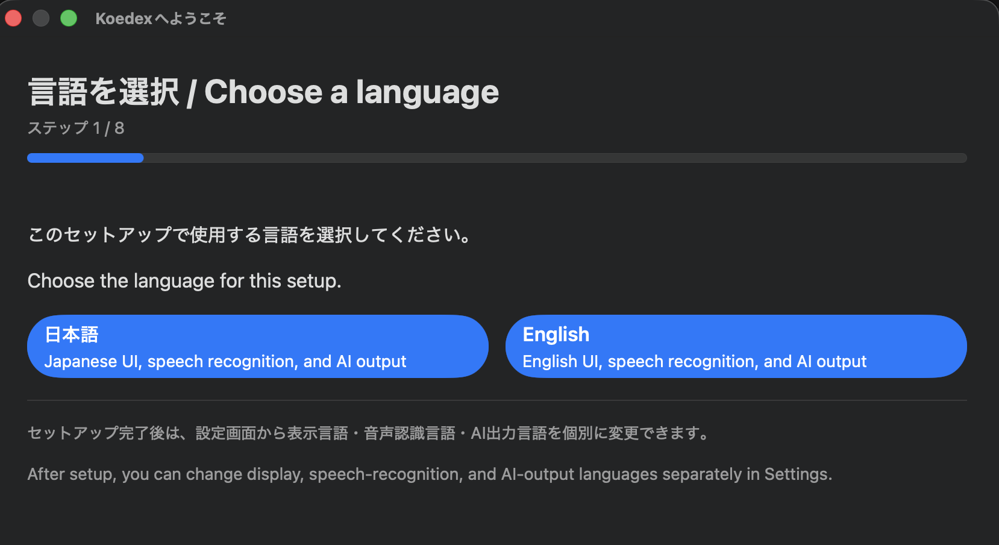
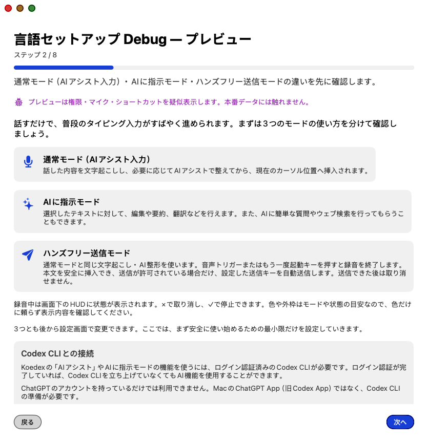
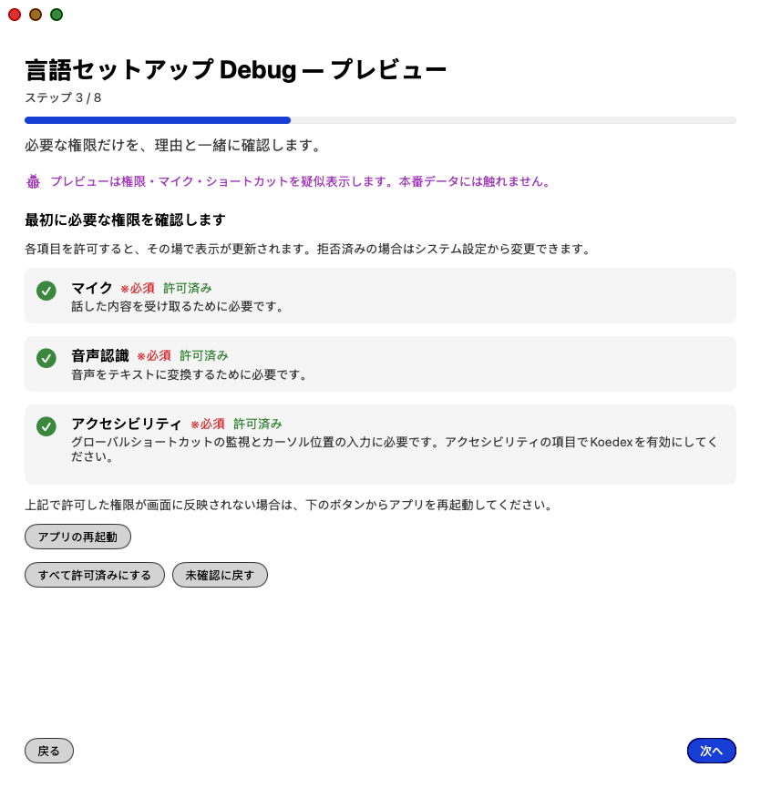
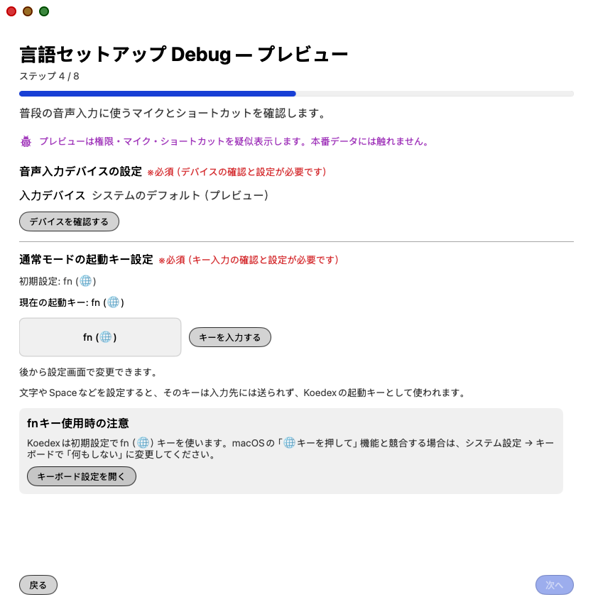
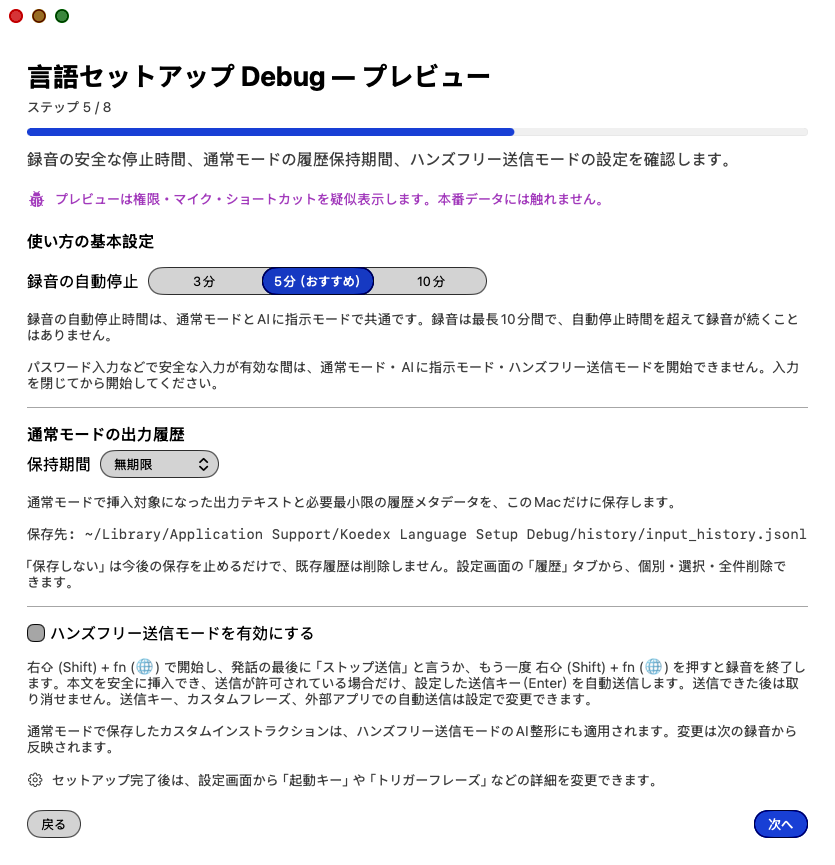
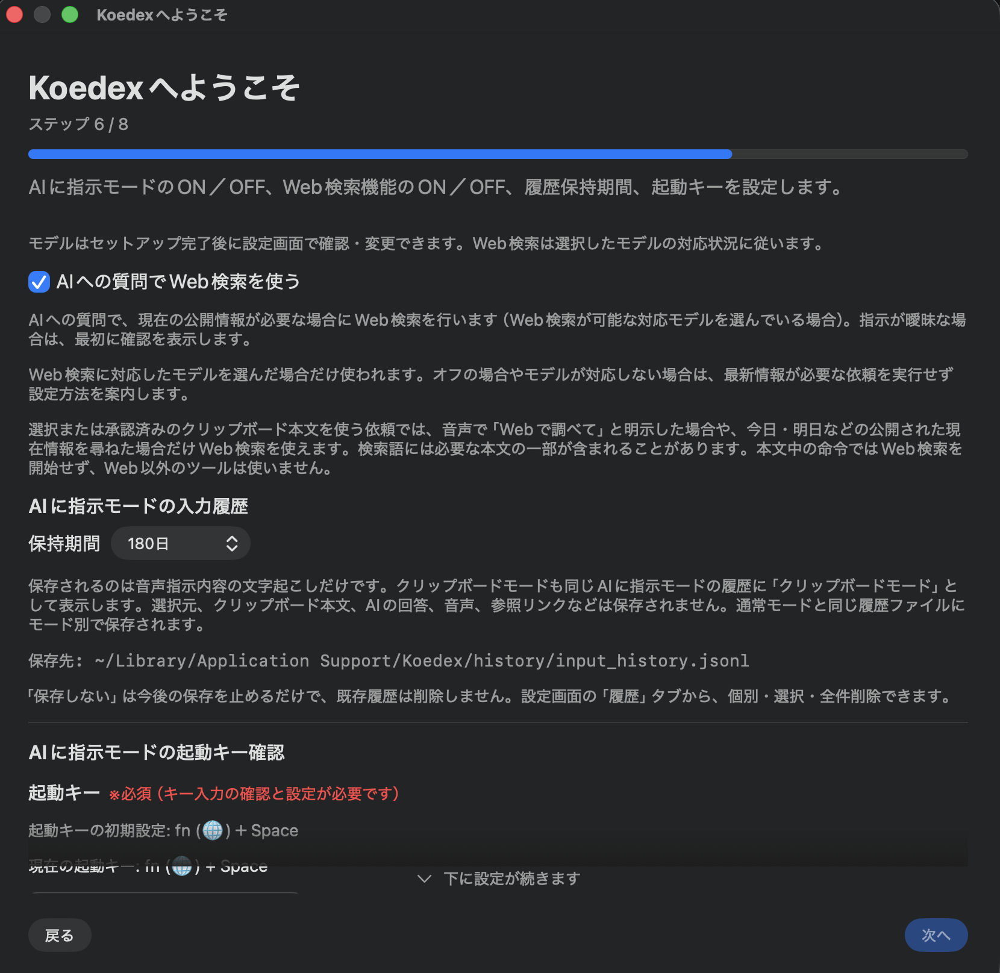
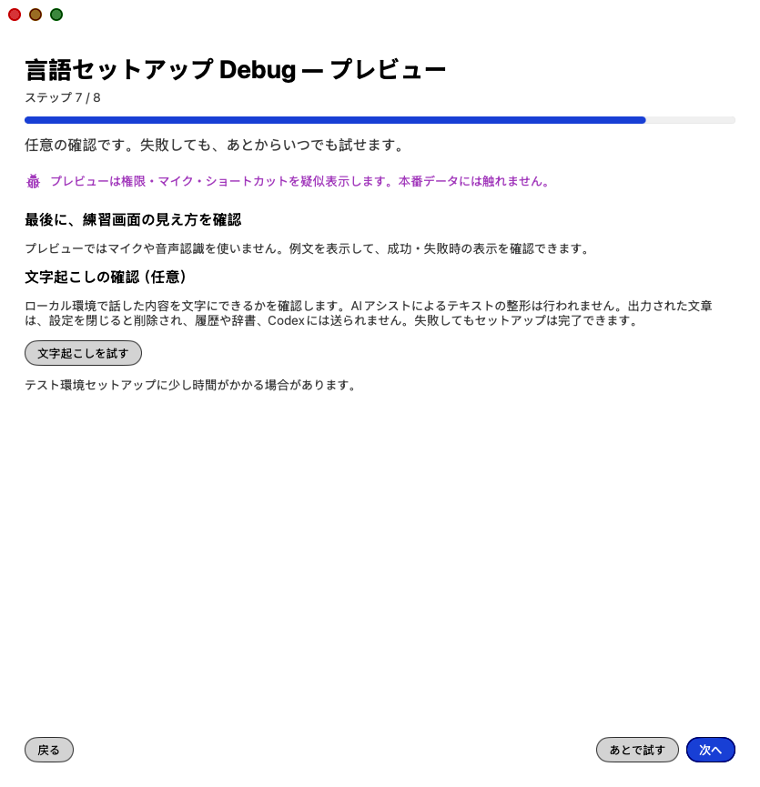
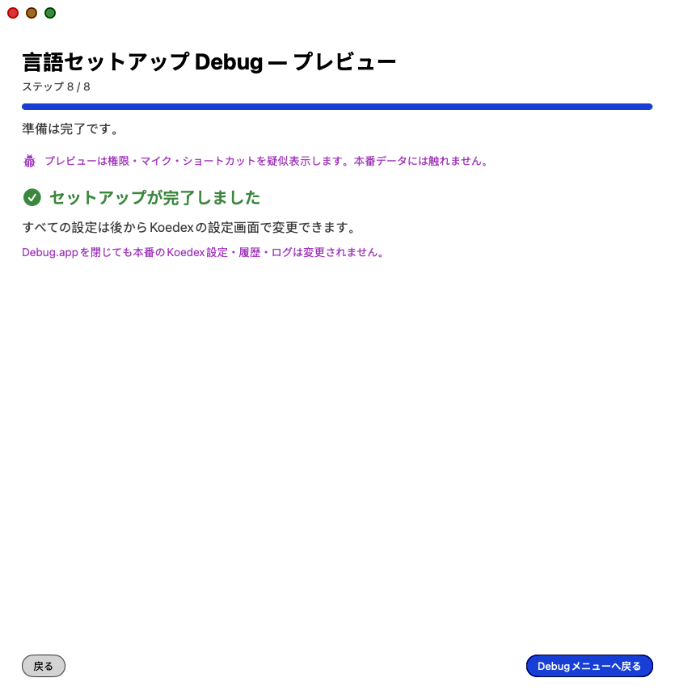
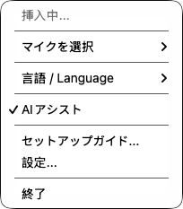

# Koedex 取扱説明書（日本語）

Koedex は、Mac 全体で使える音声入力アプリです。話した内容が、今カーソルのある入力欄に
そのまま文字として入ります。

この説明書は、ターミナルやプログラミングの知識がない方が読むことを前提に書いています。
専門用語が出てきたら、[15. 用語集](#15-用語集)を参照してください。

---

## 目次

1. [はじめに](#1-はじめに)
2. [5分ではじめる](#2-5分ではじめる)
3. [動作要件](#3-動作要件)
4. [準備：Codex CLI と ChatGPT ログイン](#4-準備codex-cli-と-chatgpt-ログイン)
5. [アプリを入手する](#5-アプリを入手する)
6. [初回セットアップ](#6-初回セットアップ)
7. [3つのモードの使い分け](#7-3つのモードの使い分け)
8. [設定画面の各項目](#8-設定画面の各項目)
9. [履歴タブ](#9-履歴タブ)
10. [ユーザー辞書](#10-ユーザー辞書)
11. [メニューバー](#11-メニューバー)
12. [プライバシーとデータ](#12-プライバシーとデータ)
13. [困ったとき（トラブルシューティング）](#13-困ったときトラブルシューティング)
14. [よくある質問](#14-よくある質問)
15. [用語集](#15-用語集)
16. [アンインストール](#16-アンインストール)
17. [付録A：AIエージェントに導入を任せる](#17-付録aaiエージェントに導入を任せる)
18. [付録B：自分でソースからビルドする](#18-付録b自分でソースからビルドする)
19. [付録C：この説明書が対象とするバージョンと配布形態](#19-付録cこの説明書が対象とするバージョンと配布形態)

---

## 1. はじめに

### Koedex とは何か

Koedex は macOS 用の音声入力アプリです。メールでも、チャットでも、メモアプリでも、
文字を入力できる場所ならどこでも使えます。

使い方はとても単純です。

1. 文字を入れたい場所をクリックして、カーソルを置きます。
2. キーボードの `fn`（🌐）キーを押します。録音が始まります。
3. 話します。
4. もう一度 `fn` キーを押します。録音が止まります。
5. 少し待つと、話した内容が整った文章になって、カーソルの位置に入ります。

Koedex は[メニューバー](#11-メニューバー)に常駐し、**Dock にもアイコンが出ます**。
Dock のアイコンをクリックすると、設定画面（セットアップが未完了の場合はセットアップ
画面）が開きます。ウィンドウを開いたままにしておく必要はありません。

### できること

| できること | 説明 |
| --- | --- |
| 音声で文字を入力する | 話した内容を文字にして、カーソルの位置に入れます |
| 文章を自動で整える | 「えーと」などの言い直しを取り除き、句読点を補います |
| AI に指示する | 選択した文章を要約・翻訳・書き換えしたり、質問に答えてもらったりします |
| 話し終わったら送信まで行う | チャット欄などで、入力に続けて送信キーまで押します（初期状態では無効） |
| 固有名詞の表記をそろえる | [ユーザー辞書](#10-ユーザー辞書)に登録した書き方を優先します |

### できないこと・向いていないこと

- Windows や iPhone では使えません。macOS 専用です。
- インターネットに一切つながっていない状態では、AI による整形は使えません
  （文字起こしだけなら使えます）。
- 現時点では、日本語と英語のみに対応しています。

### 音声はどこへ行くのか

- **音声そのものは、あなたの Mac の外へ出ません。** 文字起こしは Apple が macOS に
  組み込んでいる仕組みで、Mac の中だけで行われます。
- **文字は、条件によって外へ出ます。** AI による整形や「AIに指示」を使うとき、
  文字起こしされた**文字**（音声ではありません）が、あなたの Mac にある
  [Codex CLI](#codex-cli) という道具へ渡されます。Codex CLI が、あなた自身の
  ChatGPT アカウントで OpenAI と通信します。
- 詳しくは [12. プライバシーとデータ](#12-プライバシーとデータ)を参照してください。

### OpenAI とは無関係です

Koedex は独立したコミュニティプロジェクトです。**OpenAI と提携・後援・公認された関係には
ありません。** 「OpenAI」「ChatGPT」「Codex」は OpenAI の商標です。Koedex は OpenAI の
ロゴやブランドカラーを一切使用していません。

Koedex は OpenAI と直接通信しません。API キーも持ちません。AI の処理は、すべて
あなたの Mac に入っている Codex CLI を通して行われます。

---

## 2. 5分ではじめる

はじめての方は、この順番で進めてください。各項目の見出しをクリックすると、
詳しい説明へ移動します。

| 順番 | やること | かかる時間 | 詳しい説明 |
| --- | --- | --- | --- |
| 1 | Mac が動作要件を満たしているか確認する | 1分 | [3. 動作要件](#3-動作要件) |
| 2 | Codex CLI を入れて、ChatGPT でログインする | 5〜10分 | [4. 準備](#4-準備codex-cli-と-chatgpt-ログイン) |
| 3 | Koedex を入手する | 5〜20分 | [5. アプリを入手する](#5-アプリを入手する) |
| 4 | Koedex を起動して、8ステップのセットアップを行う | 5分 | [6. 初回セットアップ](#6-初回セットアップ) |
| 5 | 文字入力欄で `fn` キーを押して話してみる | 1分 | [7. 3つのモード](#7-3つのモードの使い分け) |

### つまずきやすいところ

| つまずくところ | 先に読むと良い場所 |
| --- | --- |
| Codex CLI が何なのか分からない | [4. 準備](#4-準備codex-cli-と-chatgpt-ログイン) |
| ターミナルを使ったことがない | [17. 付録A](#17-付録aaiエージェントに導入を任せる) |
| アプリが「開けません」と言われる | [13. 困ったとき](#13-困ったときトラブルシューティング) |
| キーを押しても何も起きない | [13. 困ったとき](#13-困ったときトラブルシューティング) |
| 話し始めたけど途中でやめたい | [7章：Esc キーで途中でやめる](#3モード共通esc-キーで途中でやめる) |

---

## 3. 動作要件

### 必須の条件

| 項目 | 内容 |
| --- | --- |
| OS | **macOS 26 (Tahoe) 以降** |
| 前提ソフト | [Codex CLI](#codex-cli)（`codex`）が入っていて、ChatGPT アカウントでログイン済みであること |
| インターネット接続 | 音声認識モデルの初回ダウンロード時と、AI 処理を行うときに必要です |

> ChatGPT のアカウントを持っているだけ、ChatGPT のアプリを Mac に入れているだけでは
> 足りません。ターミナルから使う `codex` というコマンドを別に入れて、そこでログイン
> する必要があります。

詳しい理由は[4. 準備](#4-準備codex-cli-と-chatgpt-ログイン)を参照してください。

macOS 26 未満では動作しません。Koedex は macOS 26 で追加された Apple の音声認識の
仕組み（SpeechAnalyzer）を使っているためです。これは設定で回避できる制限ではありません。

**お使いの macOS のバージョンを調べる方法**：画面左上のアップルマーク（）→
「このマックについて」を選ぶと、バージョンが表示されます。

### 動作確認済みの構成

| 項目 | 内容 |
| --- | --- |
| プロセッサ | [Apple Silicon](#apple-silicon)（M シリーズのチップ） |
| OS | macOS 26.6 |

この組み合わせは、開発者の手元で実際に動作を確認しています。

### 未検証の構成

次の構成は、**開発者の手元に実機がないため確認できていません。**
動くとも動かないとも申し上げられません。

| 項目 | 状況 |
| --- | --- |
| Intel 搭載の Mac | 未検証です。開発者の手元に実機がなく、検証結果がありません |
| macOS 26.0 〜 26.5 | 未検証です。26.6 でのみ確認しています |

未検証の構成でお試しになる場合は、うまく動かない可能性があることをご承知おきください。

### ソースからビルドする場合の追加要件

[付録B](#18-付録b自分でソースからビルドする)の方法でご自分でアプリを作る場合は、
次も必要です。

| 項目 | 内容 |
| --- | --- |
| [Swift](#swift) | 6.2 以降 |
| 開発ツール | [Command Line Tools](#command-line-tools) で足ります。Xcode.app 全体は不要です |

---

## 4. 準備：Codex CLI と ChatGPT ログイン

### Codex CLI とは何か

Codex CLI は、OpenAI が配布している、**AI をターミナルから使うための道具**です。
`codex` という名前のコマンドとして、あなたの Mac の中に入ります。

Koedex にとって重要なのは、次の点です。

> **Koedex は AI と直接やり取りしません。**
> Koedex は、あなたの Mac に入っている `codex` を裏で起動して、そこに文章を渡すだけです。
> `codex` が、あなた自身の ChatGPT アカウントを使って OpenAI とやり取りします。

この作りには、次の意味があります。

| 内容 | 説明 |
| --- | --- |
| Koedex に API キーを入れる必要がない | Koedex は API キーを持ちません |
| Koedex に料金を払う必要がない | AI の利用枠は、あなたの ChatGPT アカウントのものです |

### インストール方法

インストール手順は OpenAI 公式のページに従ってください。
この説明書には手順を書きません。公式の手順は更新されることがあり、
書き写した内容が古くなると、かえって迷わせてしまうためです。

OpenAI 公式の Codex CLI のページを参照してください。

### すでに Codex CLI が入っている方へ

**すでに入っている場合は、先に更新しておくことを強くおすすめします。**

Koedex は Codex CLI のバージョンを一切チェックしません。古いバージョンでも Koedex は
起動できてしまい、実際に AI 機能を使った瞬間に初めて不具合として現れます。
先に更新しておけば、この種の分かりにくい失敗を避けられます。

#### 手順1：バージョンを確認する

[ターミナル](#ターミナル)を開いて、次の1行を入力し、`return` キーを押します。

```bash
codex --version
```

バージョン番号が表示されれば、Codex CLI は入っています。
`command not found` などと表示された場合は、まだ入っていません。

#### 手順2：どの方法で入れたかを調べる

```bash
which codex
```

表示された結果で、更新の仕方が分かります。

| `which codex` の結果 | 導入方法 | 更新コマンド |
| --- | --- | --- |
| 末尾が `/.npm-global/bin/codex` で終わる（先頭にホームフォルダの絶対パスが付きます）、または `/usr/local/bin/codex` | npm 版 | `npm install -g @openai/codex@latest` |
| `/opt/homebrew/bin/codex` | Homebrew 版 | `brew upgrade codex` |
| 何も表示されない | 入っていません | OpenAI 公式の手順に従ってください |

> **メモ**：`~` は、あなたのホームフォルダを表す記号です。Finder の
> 「移動」メニュー →「ホーム」で開ける場所と同じです。

### ChatGPT へのログイン（ここが一番の落とし穴です）

> **重要：ChatGPT のアプリやウェブ版にログインしているだけでは足りません。**

Mac に ChatGPT アプリを入れていても、ブラウザで ChatGPT にログインしていても、
それは Koedex には関係ありません。**ターミナルの `codex` として、別途ログインする
必要があります。**

ログインは次のコマンドで行います。

```bash
codex login
```

まだログインしていなければ、ブラウザが開いてログイン画面が表示されます。
すでにログイン済みであれば、その旨が表示されます。

#### なぜ別にログインが必要なのか

| 理由 | 説明 |
| --- | --- |
| Koedex は AI を自前で持ちません | Mac の中の `codex` を裏で起動して、文章を渡すだけです |
| `codex` は別のプログラムです | ChatGPT アプリとは**別のプログラム**で、ログイン情報も別に持ちます |
| Koedex は認証情報に触れません | 読むコードが無いため、ChatGPT アプリやブラウザのログイン状態は Koedex からは見えません |

同じ ChatGPT アカウントでも、**Koedex にとっての「入口」は `codex` だけ**、という
イメージです。

### Codex CLI がないと何ができないか

Codex CLI が無くても動く機能と、動かない機能があります。

| 機能 | Codex CLI が必要か |
| --- | --- |
| 文字起こし | 不要です。Mac の中だけで完結します |
| AIアシスト（整形） | 必要です。失敗した場合は、整形前の文字がそのまま入ります |
| AIに指示モード | 必要です。代わりになる仕組みはありません |
| Web検索（AIに指示モードの中で使う機能） | 必要です。Codex CLI に内蔵された機能を使います |
| ハンズフリー送信（送信そのもの） | 不要です。送信の仕組み自体は Codex CLI を使いません |
| カスタムインストラクションの最適化 | 必要です |
| モデル一覧の取得 | 必要です |

まとめると、**文字起こしだけなら Codex CLI なしでも使えますが、AI に関わる機能は
すべて Codex CLI が必要**です。

### Koedex が `codex` を探す順番

Koedex は、起動時に次の順番で `codex` を探します。上から順に調べ、
最初に見つかったものを使います。

| 順番 | 探す場所 |
| --- | --- |
| 1 | 設定画面の「Codex実行ファイルの場所（詳細設定）」に入力されたパス（実際に存在して実行できる場合のみ） |
| 2 | `~/.npm-global/bin/codex` |
| 3 | `/opt/homebrew/bin/codex` |
| 4 | `/usr/local/bin/codex` |
| 5 | 最後の手段として、シェルに `command -v codex` を問い合わせます（5秒でタイムアウト） |

すべて見つからなかった場合、Koedex は
**「codex CLIが見つかりません。設定でパスを指定してください」** と表示します。
この場合は、`which codex` で表示されたパスを、設定画面の
「Codex実行ファイルの場所（詳細設定）」に入力してください。

### Koedex はログイン状態を先には確認しません

Koedex は、起動時にログイン済みかどうかを調べません。実際に AI 処理を呼び出したときの
応答で、初めて分かる仕組みです。そのため、次のような表示は「使った瞬間」に出ます。

| 状況 | Koedex の表示 |
| --- | --- |
| 認証が通らない | Codexの認証に失敗しています。codex loginで再ログインしてください |
| 短時間に使いすぎた | レートリミットに達しています。しばらく待ってから再試行してください |
| 利用枠を使い切った | 利用枠を使い切っています。プランや請求設定を確認してください |

---

## 5. アプリを入手する

Koedex を手に入れる方法は3通りあります。ご自分に合うものを選んでください。

| 方法 | 向いている方 | 難易度 |
| --- | --- | --- |
| (a) デスクトップアプリの AI エージェントに任せる | アプリを組み立てる作業をターミナルで行いたくない方 | かんたん |
| (b) ターミナルの AI エージェント（CLI）に任せる | ターミナルを開ける方 | ふつう |
| (c) 自分でビルドする | コマンド操作に慣れている方 | やや難しい |

> **どの方法を選んでも、先に [4. 準備](#4-準備codex-cli-と-chatgpt-ログイン)を終えてください。**
> Codex CLI の導入と `codex login` は、(a) を選んだ場合でもターミナルで行う必要があります。
> ここで言う「かんたん」は、**アプリを組み立てる作業**の難しさのことです。

### 現在の配布形態

| 項目 | 現状 |
| --- | --- |
| 入手方法 | 公開リポジトリを clone して、ご自分の Mac でビルドします |
| 署名 | 自己署名（開発者の Developer ID による署名ではありません） |
| 公証（notarize） | 行われていません |
| 組み立て済みアプリの配布 | **現時点では未定です**（提供するともしないとも決まっていません） |
| Apple Developer ID の取得 | **現時点では未定です** |

### (a) デスクトップアプリの AI エージェントに任せる

ここでいう「デスクトップアプリの AI エージェント」とは、**あなたの Mac のフォルダを
直接扱えて、Mac 上でコマンドを実行できる AI エージェント**のことです。特定の製品名を
前提にはしません。お使いのエージェントが次の2つを満たすか、先に確かめてください。

| # | 確かめること |
| --- | --- |
| 1 | 作業フォルダ（例：ダウンロードフォルダ）を指定できるか |
| 2 | そのフォルダの中でコマンドを実行できるか |

**どちらか一方でも欠ける場合は、(b) ターミナルの AI エージェント（CLI）に任せる方法を
お使いください。**

手順とコピペ用の文面は [17. 付録A](#17-付録aaiエージェントに導入を任せる)にあります。

> **必ずお読みください**
> この方法でインストールを代行してもらっても、**Koedex を動かすには Codex CLI が
> 別に必要です。** ChatGPT のデスクトップアプリを入れているだけでは、Koedex の
> AI 機能は動きません。理由は[4. 準備](#4-準備codex-cli-と-chatgpt-ログイン)を
> 参照してください。

### (b) ターミナルの AI エージェント（CLI）に任せる

[4. 準備](#4-準備codex-cli-と-chatgpt-ログイン)の手順を終えた時点で、
あなたの Mac には Codex CLI が入っています。これは AI エージェントそのものです。
**アプリを組み立てる作業を、この AI エージェントに任せられます。**

手順とコピペ用の文面は [17. 付録A](#17-付録aaiエージェントに導入を任せる)にあります。
すでにターミナルを開ける方には、この方法がいちばん確実です。

### (c) 自分でビルドする

コマンド操作に慣れている方は、自分で組み立てられます。
手順は [18. 付録B](#18-付録b自分でソースからビルドする)にあります。

### 共通：初回起動時の注意

現在の Koedex は[自己署名](#自己署名)という形で配布されています。
そのため、初めて開くときに macOS の[Gatekeeper](#gatekeeper)が起動をブロックします。

開き方は次の2通りです。

1. `Koedex.app` を右クリック（または Control キーを押しながらクリック）して
   **「開く」** を選び、表示される確認ダイアログで承認します。
2. 一度ふつうにダブルクリックして開こうとし（ブロックされます）、そのあと
   **システム設定** → **「プライバシーとセキュリティ」** を開き、Koedex の横にある
   **「このまま開く」** をクリックします。

この操作が必要なのは、ビルドごとに一度だけです。

---

## 6. 初回セットアップ

Koedex を初めて起動すると、8ステップのセットアップ画面が開きます。
画面の上部には「ステップ N / M」という表示と進捗バーが出ます。

最初のステップ以外では、左下の **「戻る」** ボタンで前のステップへ戻れます。

### 先に進めない箇所（ゲート）は3つあります

途中で「次へ」が押せなくなる場所が3つあります。故障ではありません。

| 場所 | 条件 |
| --- | --- |
| ステップ3 | 3つの権限すべてを許可するまで進めません |
| ステップ4 | マイクの確認と起動キーの確認が両方終わるまで進めません |
| ステップ6 | AIに指示モードを有効にした場合、起動キーと停止キーの確認が終わるまで進めません |

> **この章の画面写真について**
> 以下の写真は、実際の設定を書き換えずに撮影するため、開発用のプレビュー版で撮っています。
> **ウィンドウ上部のタイトル**と、**紫色の注記（「プレビューは…疑似表示します」）**は、
> あなたの画面と異なります。このほか、ステップ3の権限ボタンの動き、ステップ8の完了
> ボタン、開発用ビルド特有の保存先の注記なども、プレビュー版だけの表示です。
> 項目の並びや選択肢そのものは、実際の画面と同じです。

### ステップ1：言語の選択



| 項目 | 内容 |
| --- | --- |
| 何をする画面か | 「日本語」と「English」の2つのボタンだけが表示されます |
| 何を押すと何が起きるか | どちらかを押すと、その瞬間に次のステップへ自動で進みます |
| 何が決まるか | この1回の選択で、**表示言語・音声認識言語・AI出力言語の3つが同時に決まります** |
| 後から変えられるか | **変えられます。** 3つとも設定画面で個別に変更できます |

日本語を選べば、画面表示も日本語、聞き取る言語も日本語、AI の返答も日本語になります。

### ステップ2：ようこそ



| 項目 | 内容 |
| --- | --- |
| 何をする画面か | 「通常モード」「AIに指示モード」「ハンズフリー送信モード」の3つを紹介します |
| 選ぶものはあるか | ありません。読むだけの画面です |
| 何を押すと何が起きるか | 「次へ」で先に進みます。常に進めます |

この画面には、Codex CLI へのログインが必要であること、
**ChatGPT アプリでは代用できない**ことも書かれています。
また、Codex に接続できない場合でも、Mac の中だけで行う文字起こしは使えます。

### ステップ3：3つの権限



**このステップは、3つすべてを許可しないと先へ進めません。**

Koedex が要求する[権限](#権限)は次の3つだけです。通知や入力監視は要求しません。

| 権限 | 何のために使うか | 必須か |
| --- | --- | --- |
| マイク | 音声を録音するため | 必須 |
| [音声認識](#音声認識権限) | Mac の中で文字起こしをするため | 必須 |
| [アクセシビリティ](#アクセシビリティ権限) | 起動キーを受け取り、カーソル位置へ文字を入れるため | 必須 |

| 項目 | 内容 |
| --- | --- |
| 何を押すと何が起きるか | 各権限のボタンを押すと、macOS の許可ダイアログが出ます。「許可」を選ぶと緑のチェックが付きます |
| 拒否したらどうなるか | 赤い × が表示され、システム設定の該当画面へのリンクが出ます |
| やり直せるか | アクセシビリティだけは、拒否したあとにもう一度ダイアログを出せます。マイクと音声認識はシステム設定から手動で有効にします |
| 許可したのに反映されないとき | 画面にある「アプリの再起動」ボタンを押してください |
| 後から変えられるか | システム設定 →「プライバシーとセキュリティ」でいつでも変更できます。ただし取り消すと Koedex は動作しなくなります |

### ステップ4：マイクと起動キー



**このステップは、マイクの確認と起動キーの確認の両方が終わらないと先へ進めません。**

#### マイクの確認

| 項目 | 内容 |
| --- | --- |
| 既定値 | 「自動」（システムのデフォルトのマイク） |
| 何を押すと何が起きるか | 「デバイスを確認する」を押すと、音量メーターが表示されます。話すとメーターが動きます |
| 確認を終えるには | メーターが動くことを確認したら **「このデバイスで設定」** を押します |
| 後から変えられるか | **変えられます。** 設定画面の「マイク」、またはメニューバーの「マイクを選択」から変更できます |

#### 通常モードの起動キーの確認

| 項目 | 内容 |
| --- | --- |
| 既定値 | `fn`（🌐）キー |
| 何を押すと何が起きるか | 画面の指示に従って実際にキーを押すと、押されたことが認識され、確認済みになります |
| 変えたい場合 | 好きなキーを1つ割り当てられます |
| 後から変えられるか | **変えられます。** 設定画面の「通常モードの起動キー設定」で変更できます |

### ステップ5：使い方の好み



**このステップの項目はすべて任意です。** 何も変えずに「次へ」で進めます。

| 項目 | 選べるもの | 何が変わるか | 後から変えられるか |
| --- | --- | --- | --- |
| 録音の自動停止 | 3分 / 5分（おすすめ）/ 10分 | 話し続けたまま止め忘れても、この時間で録音が自動的に止まります | 変えられます |
| 通常モードの履歴の保持 | 保存しない / 1日 / 30日 / 180日 / 無期限 | [履歴タブ](#9-履歴タブ)に入力結果を何日残すかが決まります | 変えられます |
| ハンズフリー送信モードの有効化 | ON / OFF（任意） | ON にすると、この画面に履歴の設定も追加で表示されます | 変えられます |

> **メモ**：これまでの設定で自動停止が60秒になっている場合に限り、「1分」も選択肢に出ます。

### ステップ6：AIに指示モード



**AIに指示モードを有効にした場合、起動キーと停止キーの確認が終わらないと先へ進めません。**

| 項目 | 既定値 | 何が変わるか | 後から変えられるか |
| --- | --- | --- | --- |
| AIに指示モードを有効にする | ON | OFF にすると、このモードの起動キーが無効になります | 変えられます |
| AIへの質問でWeb検索を使用 | ON | AI が必要と判断したときに Web を検索します。詳しくは[8章](#web検索の判定について) | 変えられます |
| 入力履歴の保持 | 180日 | AIに指示モードの履歴を何日残すかが決まります | 変えられます |
| クリップボードモード | OFF（条件を満たす場合のみ表示） | 追加キーを足して押すと、選択中の文章の代わりにクリップボードの中身が対象になります | 変えられます |

#### 起動キー・停止キーの確認

| 項目 | 既定値 |
| --- | --- |
| 起動キー | `fn` + `Space` |
| 停止キー | `fn` |
| クリップボードモードの追加キー | `Option` |

画面の指示に従って、起動キーと停止キーを実際に押して確認します。
両方の確認が終わると「次へ」が押せるようになります。

AIに指示モードを OFF にした場合、キーの確認は不要です。そのまま次へ進めます。

### ステップ7：練習



| 項目 | 内容 |
| --- | --- |
| 何をする画面か | 実際に話して、文字起こしを試せます |
| 結果は保存されるか | **保存されません。** その旨が画面にも明記されています |
| 必須か | いいえ。任意です |
| うまくいかない場合 | **「あとで試す」** を押せばスキップできます。スキップしてもセットアップは完了できます |

### ステップ8：完了



| 項目 | 内容 |
| --- | --- |
| ボタンのラベル | **「Koedexを開始」** |
| 再起動は必要か | **不要です。** そのままメニューバー常駐へ切り替わります |
| このあと何が起きるか | 初回のみ、完了直後に設定画面が自動で開きます |

これでセットアップは終わりです。文字入力欄にカーソルを置いて、`fn` キーを押してみてください。

### あとからセットアップをやり直したいとき

| 方法 | いつ使えるか | 設定は変わるか |
| --- | --- | --- |
| メニューバー →「セットアップガイド...」 | いつでも | 変わりません |
| メニューバー →「セットアップを再開…」 | セットアップが未完了のときだけ表示されます | セットアップの続きから設定します |
| 設定画面 →「セットアップガイド」→「セットアップガイドを開く」 | いつでも | 変わりません |

---

## 7. 3つのモードの使い分け

Koedex には3つのモードがあります。それぞれ別のキーで起動します。

|  | 通常モード | AIに指示モード | ハンズフリー送信モード |
| --- | --- | --- | --- |
| 起動キー（既定） | `fn` | `fn` + `Space` | `fn` + `右Shift` |
| 停止のしかた | 同じキーをもう一度（ワンタップ方式）／キーを離す（長押し方式） | 停止キー（既定 `fn`） | 同じ起動キーをもう一度、**または**音声トリガー句を話す |
| 割り当てられるキーの数 | 1個 | 起動 1〜3個・停止 1個 | 1〜3個 |
| することは | 話した内容を整えて入力します | 選択中の文章を編集するか、質問に答えます | 話した内容を入力して**送信キーまで押します** |
| 送信するか | しません | しません | 条件を満たしたときだけ `Enter` を押します |
| 初期状態 | 有効 | 有効 | 無効 |

### 通常モード

いちばん基本のモードです。話した内容が、そのまま入力欄に入ります。

停止のしかたは設定で選べます。

| 方式 | 動き | 向いている場面 |
| --- | --- | --- |
| ワンタップ（既定） | 押して開始、もう一度押して停止 | 長めの文章 |
| 長押し | 押している間だけ録音 | 短い一言 |

### AIに指示モード

話した内容を「指示」として扱います。**録音を始めたときに文章を選択しているかどうかで、
動きが変わります。**

| 状況 | 動き |
| --- | --- |
| 文章を選択している | 選択した文章に対して、話した指示を実行します（要約・翻訳・書き換えなど） |
| 何も選択していない | 話した内容を AI への質問として扱い、回答を表示します |

### ハンズフリー送信モード

話した内容を入力したあと、**送信キーまで自動で押す**モードです。
チャットアプリなどで、手を使わずに送信までしたい場合に使います。

初期状態では無効です。設定画面の「ハンズフリー送信モード」で有効にできます。

### ハンズフリー送信が「送信しない」条件

> **ここは最も丁寧に読んでください。**
> 一度送信してしまうと取り消せません。そのため Koedex は、少しでも不確かなときは
> **送信せず、文字を入力するだけで止まる**ように作ってあります。
> 「送信されなかった」のは、多くの場合、故障ではなく安全のための動作です。

送信キーの既定は `Enter` です。ほかに `⌘Enter` と `⌃Enter` を選べます。

**大前提**：どの経路であっても、**送信の直前まで、ハンズフリー送信モード自体が ON に
なっている必要があります。** 録音中に設定画面でこのモードを OFF にすると、
その時点で送信されなくなります。

#### 送信する場合

[アクセシビリティ](#アクセシビリティ権限)の仕組みを通じて
**「文字がちゃんと入力欄に入った」ことを確認できた場合**、Koedex は送信します。

#### 確認が取れない経路の場合（4条件）

外部アプリなどで、上記の確認が取れない経路を使ったときは、上の大前提に加えて
**次の4つがすべて揃ったときだけ**送信します。

| # | 条件 |
| --- | --- |
| 1 | 録音を**開始した時点**で、[互換入力モード](#互換入力モード)が ON である |
| 2 | 録音を**開始した時点**で、「外部アプリでも自動送信する」が ON である |
| 3 | **現在の設定でも**、「外部アプリでも自動送信する」が ON である |
| 4 | **現在も**、互換入力モードが ON である |

開始時点と現在の両方を見ているのは、録音中に設定を変えられた場合に、
どちらか安全側の判断を採るためです。

**4つのうち1つでも欠けたら、文字だけを入力して送信しません。**

#### そもそも入力先を確認できない場合

入力先そのものを安全に確認できない場合は、入力も送信も行わず、
**本文をクリップボードに残すだけ**にします。`⌘V` で貼り付けてください。

### 音声トリガー句

キーを押す代わりに、決まった言葉を話して録音を終わらせて送信できます。

| 項目 | 内容 |
| --- | --- |
| 日本語のプリセット | 「ストップ送信」 |
| 英語のプリセット | 「Send Now」 |
| カスタム句の条件 | 4〜20文字・1行・引用符は使えない・プリセットと同じ句にはできない |

> **注意**：カスタム句は、**音声認識言語と同じ言語で登録しないと認識されません。**
> 音声認識言語が日本語のときに英語の句を登録しても、聞き取り結果と一致しないため
> 反応しないことがあります。

### 3モード共通：Esc キーで途中でやめる

録音中や処理中に **`Esc`** キーを押すと、そこで作業を取りやめられます。
3つのモードすべてで共通の動きです。

| 状態 | `Esc` の効果 |
| --- | --- |
| AI の処理に失敗した結果を表示しているとき | 効きます。その表示を消します |
| 録音準備中（キーを押した直後。まだ録音が始まっていない） | 効きます。録音を始めずに取りやめます |
| 録音中 | 効きます。録音を取りやめます |
| 文字起こし中 | 効きます。処理を取りやめます |
| AI の処理中（整形・AIに指示） | 効きます。処理を取りやめます |
| 挿入中（文字を入力欄へ入れている最中） | **一部だけ効きます。貼り付けが始まったあとは取り消せません** |
| ハンズフリー送信で、送信キーが押される直前 | 効きます。**送信キーが押される前まで**なら止められます |
| 何も起きていない待機中／エラーを表示しているとき | 効きません。`Esc` は前面のアプリへそのまま届きます |

取りやめられる状態のときだけ、Koedex が `Esc` を受け取ります。それ以外のとき
（待機中やエラー表示中）は、前面のアプリの `Esc` の動きを横取りしません。

録音中は、[HUD](#hud) に表示される **✕ ボタン**を押しても同じことができます。

> **例外**：設定画面で起動キーを登録している最中は、`Esc` は「キーの登録をやめる」
> 意味になります。このときは録音の取りやめには使われません。

> **注意**：`Esc` が働くには、[アクセシビリティ権限](#アクセシビリティ権限)が必要です。
> 起動キーを受け取るのと同じ仕組みを使っているためです。

### 3モード共通の制限：秘匿入力

パスワード入力欄など、[秘匿入力](#秘匿入力)（Secure Input）が有効になっている間は、
**3つのモードすべてで録音を開始できません。** これは macOS の仕組みによるもので、
Koedex 側では解除できません。

このとき表示されるメッセージは次のとおりです。

> 安全な入力が有効な間は録音を開始できません。パスワード入力などを閉じてから、もう一度試してください。

---

## 8. 設定画面の各項目

設定画面は、メニューバーの「設定...」から開きます。

左側のサイドバーには3つのタブがあります。

| タブ | 内容 |
| --- | --- |
| 設定 | この章で説明します |
| 履歴 | [9. 履歴タブ](#9-履歴タブ) |
| ユーザー辞書 | [10. ユーザー辞書](#10-ユーザー辞書) |

サイドバーの下部には **「表示サイズ」** のスライダーが常に表示されています。

| 項目 | 内容 |
| --- | --- |
| 何のための設定か | 設定画面の文字やボタンの大きさを変えます |
| 既定値 | 100% |
| 取りうる値 | 65% 〜 140%（5%刻み） |

### 「設定」タブのセクションの並び順

| 順番 | セクション名 |
| --- | --- |
| 1 | セットアップガイド |
| 2 | 言語 |
| 3 | マイク |
| 4 | 録音の自動停止（通常モード／AIに指示モード共通） |
| 5 | ブラウザや各種アプリへ対応 |
| 6 | AIアシスト |
| 7 | 通常モードの起動キー設定 |
| 8 | AIアシストのモデル選択 |
| 9 | カスタムインストラクション（通常モード / ハンズフリー送信モード） |
| 10 | AIに指示モード |
| 11 | AIに指示モードの起動キー設定 |
| 12 | AIに指示モードに使用するモデル |
| 13 | カスタムインストラクション（AIに指示モード） |
| 14 | ハンズフリー送信モード |
| 15 | 最適化に使用するモデル（通常モード／ハンズフリー送信モード／AIに指示モード共通） |
| 16 | AI処理のリセット |
| 17 | Codex実行ファイルの場所（詳細設定） |

### セットアップガイド

| 項目 | 内容 |
| --- | --- |
| 何のための設定か | 初回セットアップの内容をいつでも見直せます |
| 何が起きるか | 「セットアップガイドを開く」を押すと、4ステップ（ようこそ／マイクと起動キー／AIに指示モード／完了）の確認画面が開きます。最後のボタンは「閉じる」です |
| 注意点 | ガイドとして開いた場合、確認だけで設定は変更されません |

### 言語

3つの言語設定があります。**それぞれ独立しています。**

| 項目 | 既定値 | 取りうる値 | 説明 |
| --- | --- | --- | --- |
| 表示言語 | 日本語 | 日本語 / English | 設定画面・メニューバー・セットアップ・HUD の表示言語です |
| 音声認識言語 | 日本語 | 日本語 / English | 話す言葉の言語です |
| AI出力言語 | 自動 | 自動 / 日本語 / English | AI が返す文章の言語です |

| 注意点 | 内容 |
| --- | --- |
| 音声認識言語 | **録音中や処理中は変更できません。** 一度終わってから変更してください |
| AI出力言語 | 音声で明示的に言語を指定した場合、そちらが常に優先されます |

### マイク

| 項目 | 内容 |
| --- | --- |
| 何のための設定か | どのマイクで録音するかを決めます |
| 既定値 | 自動（システムのデフォルト） |
| 変えると何が起きるか | 指定したデバイスで録音します |
| 注意点 | 指定したデバイスが見つからない場合、自動的にシステムの既定へ戻ります |

メニューバーの「マイクを選択」からも変更できます。

### 録音の自動停止（通常モード／AIに指示モード共通）

| 項目 | 内容 |
| --- | --- |
| 何のための設定か | 停止し忘れたときに、録音を自動で終わらせます |
| 既定値 | 5分 |
| 取りうる値 | 1分 / 3分 / 5分 / 10分 |
| 注意点 | 録音は最長10分です。この設定を超えて録音が続くことはありません |

### ブラウザや各種アプリへ対応（互換入力モード）

このセクションには2つのトグルがあります。

#### 互換入力モード（ON推奨）

| 項目 | 内容 |
| --- | --- |
| 何のための設定か | テキストを直接挿入できないアプリや Web ページに対して、別の入力方法を使います |
| 既定値 | OFF |
| ON にすると何が起きるか | 外部アプリでの選択文章の取得と、クリップボードを変更しない仮想入力による直接入力が許可されます |
| 注意点 | 入力欄によっては、入力が反映されたことを確認できないことがあります |

#### AIに指示モードの結果を直接挿入する

| 項目 | 内容 |
| --- | --- |
| 何のための設定か | AIに指示モードの結果を、別ウィンドウではなく入力欄へ直接入れます |
| 既定値 | OFF |
| 注意点 | **互換入力モードが OFF の間は操作できません。** 互換入力モードを OFF に戻すと、この設定も実質的に無効になります |

**AI の回答を入力欄へ直接入れるには、次の2つが、録音を開始する前の時点と、
実際に文字を入れる時点の両方で ON になっている必要があります。**

| # | 条件 |
| --- | --- |
| 1 | 互換入力モード |
| 2 | AIに指示モードの結果を直接挿入する |

録音中にどちらかを OFF に戻すと、直接は入らず別ウィンドウに表示されます。
なお、これは **AI の回答**を入力欄へ入れる場合の話です。文章を選択した状態で
書き換えを頼んだときの置き換えは、別の仕組みで動きます。

**片方だけが ON の場合、AI の回答は別ウィンドウに表示されます。** そこからコピーして、
`⌘V` で貼り付けてください。

### AIアシスト

| 項目 | 内容 |
| --- | --- |
| 何のための設定か | 文字起こしの結果を AI で整えるかどうかを決めます |
| 既定値 | ON |
| ON のとき | フィラー除去・句読点補正などの整形を行ってから挿入します |
| OFF のとき | 音声認識の結果をそのまま、すぐに挿入します |
| 注意点 | **通常モードとハンズフリー送信モードでは**、OFF にすると[ユーザー辞書](#10-ユーザー辞書)も効きません。**AIに指示モードでは、AIアシストの設定に関わらず辞書が使われます** |

メニューバーからも切り替えられます。

### 通常モードの起動キー設定

| 項目 | 既定値 | 説明 |
| --- | --- | --- |
| 起動キー | `fn` | 割り当てられるのは1個だけです |
| 録音方式 | ワンタップ | ワンタップ / 長押し |

| 注意点 | 内容 |
| --- | --- |
| キーの重複 | 通常モードの起動キーが、他のモードのキーと**完全に同じ組み合わせ**だと保存できません |
| 長押し方式の遅延 | 長押し方式で、他モードと前方一致する組み合わせがあると、通常モードの録音開始が最大150ミリ秒遅れます |

### AIアシストのモデル選択・AIに指示モードに使用するモデル・最適化に使用するモデル

Koedex では、AI の[モデル](#モデル)を用途ごとに選べます。

| 場所 | 用途 | 既定値 |
| --- | --- | --- |
| AIアシストのモデル選択 | 通常モードの整形 | 新規インストール時は GPT-5.6 Luna / low（取得できなかった場合は Codex CLI の設定に従います） |
| AIに指示モードに使用するモデル | AIに指示モードの処理 | 新規インストール時は GPT-5.6 Luna / low（取得できなかった場合は Codex CLI の設定に従います） |
| 最適化に使用するモデル | カスタムインストラクションの最適化 | 新規インストール時は GPT-5.6 Luna / low（取得できなかった場合は Codex CLI の設定に従います） |

#### 選べるモデル

選べるモデルの一覧は、Codex CLI から動的に取得します。取得できなかった場合に備えて、
内蔵の一覧もあります。

プリセットとして表示されるのは次の6つです。

| 表示名 |
| --- |
| GPT-5.6 Luna / low（高速・低コスト） |
| GPT-5.6 Luna / medium（バランス） |
| GPT-5.6 Terra / low（軽快な日常利用） |
| GPT-5.6 Terra / medium（日常利用の推奨） |
| GPT-5.6 Sol / medium（複雑な処理向け） |
| GPT-5.6 Sol / high（高精度） |

[推論レベル](#推論レベル)は low / medium / high / xhigh から選べます。

#### 注意点

| 注意点 | 内容 |
| --- | --- |
| 新規インストール時の自動設定 | 初回接続でモデル一覧を取得し、`GPT-5.6 Luna / low` が使えれば3箇所へ一括で設定します。**すでに使っている方の選択は変更しません** |
| 一覧を取得できなかったとき | 「モデル一覧を取得できませんでした。保存済みの設定は保持されています。Codex CLIを最新バージョンに更新してから、もう一度モデル一覧を更新してください。」と表示され、**保存ボタンが無効になります** |
| 保存ボタンが押せない理由 | これは不具合ではありません。存在しないかもしれないモデル名を、当てずっぽうで保存してしまわないための設計です |
| 保存できるタイミング | **録音中や処理中は保存できません** |

### カスタムインストラクション

AI に対する、あなた独自の指示文を登録できます。2箇所あります。

| 場所 | 効く範囲 |
| --- | --- |
| カスタムインストラクション（通常モード / ハンズフリー送信モード） | 通常モードとハンズフリー送信モード |
| カスタムインストラクション（AIに指示モード） | AIに指示モード |

| 項目 | 内容 |
| --- | --- |
| 既定値 | 空 |
| 注意点 | **「保存」を押すまで反映されません。** 書いただけでは効きません |

#### 最適化機能

自由に書いた指示文を、AI に整理し直してもらう機能です。

| 項目 | 内容 |
| --- | --- |
| 何をするか | 曖昧な指示文を、安全で明確な指示文に書き直します |
| 出力の上限 | 最大5項目・合計500文字以内 |
| 禁止していること | 意味を変える／要約する／質問に答える／翻訳する／安全ルールを弱める |
| 実行環境 | 読み取り専用の一時セッションで実行され、45秒でタイムアウトします |
| やり直し | 過去の本文を最大20件まで保持し、前後に戻せます |

### AIに指示モード

| 項目 | 内容 |
| --- | --- |
| 何のための設定か | AIに指示モードを使うかどうかを決めます |
| 既定値 | ON |
| OFF にすると何が起きるか | 起動キーを押しても、このモードは起動しなくなります |

### AIに指示モードの起動キー設定

| 項目 | 既定値 | 説明 |
| --- | --- | --- |
| 起動キー | `fn` + `Space` | 1〜3個まで割り当てられます |
| 停止キー | `fn` | 1個だけ |
| クリップボードモードを有効にする | OFF | 条件を満たす場合のみ ON にできます |
| 追加キー | `Option` | Command / Option / Control / Shift から選べます |

#### クリップボードモード

AIに指示モードの起動キーに追加キーを足して押すと、
**選択中の文章の代わりに、クリップボードの中身**を対象にできる機能です。

**有効化できる条件（7つすべてを満たす必要があります）**

| # | 条件 |
| --- | --- |
| 1 | AIに指示モードの起動キーに、修飾キー以外の通常キーが含まれている |
| 2 | 起動キーが2個以下である |
| 3 | 追加キーが、起動キー自身と重複しない |
| 4 | 追加キーが、停止キーと重複しない |
| 5 | 追加キーが、通常モードの起動キーと重複しない |
| 6 | 追加キーが、ハンズフリー送信キーと重複しない |
| 7 | 追加キーを足した組み合わせが、macOS の予約ショートカット（Spotlight、入力ソース切替など）と衝突しない |

条件を満たさない場合は ON にできず、**その理由が画面に表示されます。**
すでに保存されている不適格な値を、Koedex が勝手に書き換えることはありません。

**クリップボードの読み取りが中止される条件（優先順）**

| 順番 | 条件 |
| --- | --- |
| 1 | [秘匿入力](#秘匿入力)が有効なとき（読み取り自体を拒否します） |
| 2 | Koedex 自身が直前に貼り付けた内容のとき（同じ内容を繰り返し処理しないため） |
| 3 | パスワード管理アプリなどが「秘匿」と指定した内容のとき |
| 4 | 複数の項目が入っている、またはテキストでないとき |
| 5 | 空のとき |
| 6 | 12,000文字を超えるとき |

**保存されないもの**：クリップボードの本文、選択元の文章、AI の回答、参照した URL、音声。
履歴には、音声で話した指示の文字起こしだけが残り、「クリップボードモード」というタグが付きます。

**クリップボードの復元**：貼り付けの約1秒後に、元のクリップボードの内容への
**復元を試みます**。失敗した場合、元の内容を保証できません。ただし戻すのは Koedex
が置いた分だけです。その間にあなたや他のアプリが新しくコピーした内容を、上書きする
ことはありません。**重要な内容をコピーしていた場合は、念のため事前に別の場所へ
控えておくことをおすすめします。**

### AIへの質問でWeb検索を使用

| 項目 | 内容 |
| --- | --- |
| 何のための設定か | AIに指示モードで質問したときに、Web を検索するかどうかを決めます |
| 既定値 | ON |
| 注意点 | Web 検索に対応していないモデルでは操作できず、**自動的に OFF になります**（通知が出ます） |

#### Web検索の判定について

> **Web 検索するかどうかの判断材料は、「あなたが話した内容」だけです。**

選択した文章やクリップボードの本文に「Web で調べて」と書かれていても、
Koedex はそれを**無視します**。

これは安全のための設計です。他人が書いた文章の中に「この内容を Web で検索しろ」といった
指示を仕込んでおくと、あなたの意図と関係なく AI を動かせてしまいます
（[プロンプトインジェクション](#プロンプトインジェクション)と呼ばれます）。
話した内容だけを判断材料にすることで、これを防いでいます。

> **注意**：Web 検索を許可すると、検索を実行するために、選択した文章やクリップボードの
> 本文の必要な部分が検索語として送信されることがあります。**機密性の高い文章を扱う
> ときは、Web 検索を OFF にしてお使いください。**

判定の動きは次のとおりです。以下は、文章を選択しているときやクリップボードモードのときの
規則です。何も選択せずに質問した場合は、AI が必要と判断したときに検索します。

| あなたが話した内容 | 動き |
| --- | --- |
| はっきり「Web で調べて」と言った | 検索します |
| 「今日の」「最新の」などの言葉＋天気や株価などの公開情報＋質問の形 | 検索します |
| どちらとも言えない | 一度確認ダイアログを出します |
| Web 検索が OFF、またはモデルが非対応 | 検索失敗ではなく、設定の案内を表示します |

### ハンズフリー送信モード

| 項目 | 既定値 | 説明 |
| --- | --- | --- |
| ハンズフリー送信モードを有効にする | OFF | ON にすると、以下の項目が使えるようになります |
| 起動キー | `fn` + `右Shift` | 1〜3個。開始と終了を兼ねます |
| 音声トリガーフレーズ | プリセット | プリセット / カスタム |
| カスタムフレーズ | 空 | 4〜20文字・1行・引用符不可 |
| 送信キー | `Enter` | Enter / ⌘Enter / ⌃Enter |
| 外部アプリでも自動送信する | OFF | ON にすると確認ダイアログが出ます |

| 注意点 | 内容 |
| --- | --- |
| 外部アプリでも自動送信する | **互換入力モードが OFF の間は選択できません** |
| カスタムフレーズ | **音声認識言語と同じ言語で登録してください** |
| 送信されない条件 | [7章の4条件](#ハンズフリー送信が送信しない条件)を参照してください |

### AI処理のリセット

| 項目 | 内容 |
| --- | --- |
| 何のための設定か | AI 処理の状態を初期化します。反応がおかしくなったときに使います |
| 何が起きるか | Codex との接続をリセットします |
| 注意点 | **録音中や処理中は実行できません** |

### Codex実行ファイルの場所（詳細設定）

| 項目 | 内容 |
| --- | --- |
| 何のための設定か | Koedex が `codex` を自動で見つけられなかったときに、場所を手で教えます |
| 既定値 | 空欄（自動検出） |
| いつ使うか | 「codex CLIが見つかりません」と表示されたときだけ |
| 何を入れるか | ターミナルで `which codex` を実行して表示されたパス |
| 注意点 | 自動検出できているときは、空欄のままにしてください |

### 履歴の設定

| 項目 | 既定値 | 取りうる値 |
| --- | --- | --- |
| 履歴の保持（モードごとに3つ） | 180日 | 保存しない / 1日 / 30日 / 180日 / 無期限 |
| 履歴の表示件数 | 50件 | 50 / 100 / 200 / すべて |

| 注意点 | 内容 |
| --- | --- |
| 保持期間を短くしたとき | 古い履歴が実際に削除されます（確認ダイアログが出ます） |
| 「保存しない」に変えたとき | **すでにある履歴は消えません。** 新規の保存が止まるだけです |

### 設定が保存できないとき

設定ファイルの読み込みや移行に失敗すると、Koedex は「設定を保存できません」という状態になり、
画面上部に赤いバナーが表示されます。この状態では設定を変更できません。
[13. 困ったとき](#13-困ったときトラブルシューティング)を参照してください。

---

## 9. 履歴タブ

設定画面のサイドバーから「履歴」を選ぶと、これまでの入力の履歴を確認できます。

### 保存されるもの・されないもの

> **最も重要な点：AIに指示モードでは、音声で話した指示の文字起こししか保存されません。**

| モード | 本文として保存されるもの |
| --- | --- |
| 通常モード | 安全に挿入できた**出力テキスト** |
| ハンズフリー送信モード | 安全に挿入できた**出力テキスト** |
| AIに指示モード | **音声で話した指示の文字起こしだけ** |

AIに指示モードで**保存されないもの**は次のとおりです。

| 保存されないもの |
| --- |
| 選択していた文章 |
| クリップボードの本文 |
| AI の回答 |
| 参照した URL |
| 音声データ |

これは「設定で消している」のではありません。**そもそも履歴に渡せない形**に
プログラムの構造として作ってあります。設定を変えても保存されるようにはなりません。

### 挿入に失敗した場合

挿入に失敗した場合や、入力が短すぎた場合は、**本文なしでメタデータだけ**が残ります
（日時、使ったモデルの情報など）。これも「履歴をすべて削除」で消えます。

### 各行に表示されるもの

| 表示 | 内容 |
| --- | --- |
| 日時 | 記録された日時 |
| モードのラベル | 「通常モード」「ハンズフリー送信モード」「AIに指示モード」 |
| 本文 | 最大8行まで表示されます |
| 状態ラベル | 下の表を参照してください |

クリップボードモードを使った場合は、「クリップボードモード」というタグが追加されます。

#### 状態ラベル

| ラベル | 意味 |
| --- | --- |
| AIアシストに失敗 | AI による整形ができませんでした |
| 挿入に失敗 | 入力欄へ文字を入れられませんでした |
| 安全な入力のため中止 | [秘匿入力](#秘匿入力)が有効だったため中止しました |
| 短い入力 | 入力が短すぎました |
| 除外済み | 保存対象から除外されました |
| クリップボードの復元に失敗 | 元のクリップボードへ戻せませんでした |

### 絞り込みと検索

| 機能 | 内容 |
| --- | --- |
| 履歴の種類 | すべて / 通常モード / ハンズフリー送信モード / AIに指示モード |
| 検索ボックス | 本文に含まれる語で絞り込みます |
| 履歴の表示件数 | 50 / 100 / 200 / すべて |

> **注意**：**検索の対象は、表示件数の範囲内だけです。**
> 表示件数が50件なら、直近50件の中からしか検索されません。
> 古い履歴も検索したい場合は、表示件数を「すべて」に変えてください。

### 削除する

「履歴操作」で表示モードを切り替えます。

| モード | できること |
| --- | --- |
| 通常表示 | 各行の「コピー」（本文がある場合）と「削除」 |
| 選択して削除 | 下の表の操作 |

「選択して削除」でできる操作は次のとおりです。

| 操作 | 内容 |
| --- | --- |
| すべて選択 | 表示中の履歴をすべてチェックします |
| チェックしたものをすべて削除 | チェックした履歴を消します |
| チェックしたもの以外をすべて削除 | チェックしなかった履歴を消します |
| 表示されていないメタデータをすべて削除 | 本文がなく画面に出ない記録も消します |

「履歴をすべて削除」を使うと、本文だけでなく、画面に出ないメタデータも消えます。

### 保持期間について

| 項目 | 内容 |
| --- | --- |
| 設定単位 | モードごとに独立して設定できます |
| 件数の上限 | **ありません。** 日数だけで自動削除されます |
| 既定値 | 新しくインストールした場合は180日です。以前から使っている場合は、それまでの設定のまま変わりません |
| 保存場所 | `~/Library/Application Support/Koedex/history/input_history.jsonl` |
| 保存ファイルの権限 | 本人だけが読み書きできる権限で保存されます。同じMacの別アカウントからは読めません |

---

## 10. ユーザー辞書

固有名詞や専門用語など、「この読みで話したら、この表記で入力してほしい」という
組み合わせを登録できます。設定画面のサイドバーから「ユーザー辞書」を選びます。

### 登録する項目

| 項目 | 内容 |
| --- | --- |
| 単語・表記 | 実際に入力してほしい書き方 |
| 読み方・聞こえ方 | どう話したときに反応するか。**複数登録できます** |
| 補足メモ | 自分用のメモ |
| 有効 / 無効 | 一時的に使わないようにできます |

### 辞書はどう効くのか（誤解されやすい点）

> **ユーザー辞書は、後から文字を置き換えているのではありません。**

Koedex は、有効になっている辞書の項目を AI へのお願い（プロンプト）に一緒に渡し、
「話した内容にその読みが実際に出てきたときだけ、指定の表記を優先してください」と
指示しています。

この作りには、次の3つの意味があります。

| 内容 | 説明 |
| --- | --- |
| 話していない単語が勝手に入ることはありません | 実際に話した内容にその読みが出てきたときだけ働きます |
| **通常モードとハンズフリー送信モードでは、AIアシストが OFF だと効きません** | 辞書は AI への指示として渡すため、AI を使わない設定では働きません。**AIに指示モードでは、AIアシストの設定に関わらず辞書が使われます** |
| 文脈を見て判断します | 単純な文字列置換ではないため、まったく関係のない文脈では適用されません |

辞書が効かないと感じたときは、まず設定画面の「AIアシスト」が ON になっているか、
その項目が「有効」になっているかを確認してください。

### CSV での読み書き

辞書はまとめて書き出し・読み込みができます。

| 項目 | 内容 |
| --- | --- |
| 列（日本語） | 単語 / 読み方 / 補足メモ / 有効 |
| 列（英語） | word / readings / notes / enabled |
| 読み方が複数ある場合 | 同じ列の中に、カンマ区切りで並べます |
| 書き出しの文字コード | UTF-8（BOM 付き）、改行は CRLF |
| 読み込みの文字コード | UTF-8 / UTF-16 / Shift_JIS を自動で判別します |
| 「有効」列に書ける値 | TRUE / FALSE（yes・no・はい・いいえ・有効・無効・1・0・on・off・○・× も使えます。空欄は有効として扱います） |

#### 上限

| 項目 | 上限 |
| --- | --- |
| 行数 | 1,000行 |
| ファイルサイズ | 8MiB |
| 単語の長さ | 100文字 |
| 読み方 | 20個まで、各100文字まで |
| 補足メモ | 500文字 |

#### 表計算ソフトで開いても壊れないようにする工夫

`=` `+` `-` `@`、およびタブや改行、`'` で始まる値には、書き出すときに自動で `'` を付けます。
読み込むときには自動で取り除きます。表計算ソフトがこれらの記号を数式と誤解しないための
処理です。

### 読み込み時に単語がぶつかった場合

既存の辞書と単語が一致した場合、項目ごとに次から選べます。

| 選択肢 | 動き |
| --- | --- |
| 既存を維持する | 今ある内容をそのまま残します |
| 置き換える | 読み込んだ内容で上書きします |
| 別の項目として追加する | 両方を残します |

| 状況 | 動き |
| --- | --- |
| 同じ単語が既存に複数ある | 自動処理の対象外になり、手動で確認する必要があります |
| プレビュー表示後に辞書が変更されていた | 取り込みを中止します |

### バックアップ

| 項目 | 内容 |
| --- | --- |
| 保存場所 | `~/Library/Application Support/Koedex/personal_dictionary.json` |
| 事前バックアップ | 読み込みで置き換えが発生する場合、`personal_dictionary.pre-import-backup.json` に自動でバックアップを作ります |

---

## 11. メニューバー



Koedex は画面右上のメニューバーに常駐し、**Dock にもアイコンが出ます**。
マイクのアイコンをクリックすると、メニューが開きます。ウィンドウを全部閉じても、
Koedex は常駐し続けます。

### メニューの項目

上から順に並んでいます。状況によって表示されない項目もあります。

| 順番 | 項目 | 内容 |
| --- | --- | --- |
| 1 | 現在の状態 | 待機中／録音準備中…／録音中…／文字起こし中…／AIアシスト中…／挿入中…／エラー |
| 2 | 「Codex接続エラー: …」＋「Codexへ再接続」 | エラーが起きているときだけ表示されます |
| 3 | 「設定を保存できません。詳しくは設定画面を確認してください。」 | 設定を保存できない状態のときだけ表示されます |
| 4 | マイクを選択 | サブメニューです。「自動」と検出されたデバイスの一覧が出ます。選択中の項目にチェックが付きます |
| 5 | 言語 / Language | サブメニューです |
| 6 | AIアシスト | ON / OFF を切り替えます |
| 7 | 最後のAI出力をコピー | 直近の AI の出力があるときだけ表示されます |
| 8 | セットアップを再開… | セットアップが未完了のときだけ表示されます |
| 9 | セットアップガイド... | 4ステップ（ようこそ／マイクと起動キー／AIに指示モード／完了）の確認画面を開きます。設定は変更されません |
| 10 | 設定... | 設定画面を開きます |
| 11 | 終了 | Koedex を終了します |

### アイコンの変化

メニューバーのアイコンは、状態によって見た目が変わります。

| 状態 | アイコン |
| --- | --- |
| 通常 | マイク |
| 録音中 | マイクに `+` のバッジが付きます |
| AIアシストの失敗 | 枠線の警告三角。約8秒表示されて自動で元に戻ります |
| codex が見つからない | 塗りつぶしの警告三角。**ただし次に録音を行うと表示が消えます** |

塗りつぶしの警告三角になるのは、**codex が見つからないとき**だけです。
それ以外の接続エラーではアイコンは変わりません。また、次に録音を開始・停止・
[キャンセル](#3モード共通esc-キーで途中でやめる)すると表示が消えるため、
問題が続いていても気づけないことがあります。状態を確かめたいときは、
メニューを開いて「Codex接続エラー」の行で確認してください。
詳しくは[13. 困ったとき](#13-困ったときトラブルシューティング)を参照してください。

---

## 12. プライバシーとデータ

### 端末外へ出るもの・出ないもの

| 種類 | 外へ出るか | 説明 |
| --- | --- | --- |
| **音声** | **出ません** | 文字起こしは Apple の端末内エンジンで完結します |
| **文字** | **出る場合があります** | AIアシストと AIに指示モードを使うときだけ |
| **設定** | 出ません | Mac の中に保存されます |
| **履歴** | 出ません | Mac の中に保存されます |
| **ユーザー辞書** | **保存先はMac内。ただし使われるときは送信されます** | 有効な辞書項目は、AIアシストや AIに指示モードを使う際に、プロンプトの一部として `codex` へ渡されます |
| **カスタムインストラクション** | **保存先はMac内。ただし使われるときは送信されます** | 設定した指示文は、AIアシストや AIに指示モードを使う際に、プロンプトの一部として `codex` へ渡されます |

#### 音声について

音声そのものが Mac の外へ送られることはありません。文字起こしは Apple が macOS に
組み込んでいる仕組み（SpeechAnalyzer / SpeechTranscriber）で、Mac の中だけで行われます。

ここで唯一ネットワーク通信が発生するのは、**ある言語を初めて使うときに、macOS が
Apple から音声認識モデルをダウンロードする処理**です。これは macOS の動作であり、
Koedex が音声を送っているわけではありません。

#### 文字について

AIアシストと AIに指示モードでは、文字起こし済みの**テキスト**（音声ではありません）が、
あなたの Mac にある `codex` へ渡されます。`codex` が、**あなた自身の ChatGPT アカウント**で
OpenAI と通信します。

| 事実 | 説明 |
| --- | --- |
| Koedex は OpenAI と直接通信しません | すべて `codex` を経由します |
| Koedex は API キーを持ちません | 認証は `codex` が行います |
| AIアシスト（通常モード／ハンズフリー送信モードの整形）を OFF にすれば | **その整形のための送信は止まります。** 文字起こしの結果がそのまま挿入されます |

> **重要**：**AIに指示モードを使う場合は別です。** AIアシストの設定に関わらず、話した
> 内容と、対象になった文章（選択中の文章、または承認したクリップボードの本文）、
> 有効なユーザー辞書の項目、カスタムインストラクションが `codex` へ渡されます。
> AIに指示モード自体を使わないことでのみ、この送信を止められます。

#### Codex CLI の設定には触れません

Koedex は `codex` を起動するときに `mcp_servers={}` `plugins={}` を指定します。
`~/.codex/config.toml` を書き換えることはありません。`~/.codex/` の中は Codex CLI の
管理領域であり、Koedex は書き込みません。

### データの保存場所

Koedex の**設定・履歴・辞書などのアプリデータ**は、すべて
`~/Library/Application Support/Koedex/` の中に保存されます。

| ファイル / フォルダ | 内容 |
| --- | --- |
| `settings.json` | 設定全般 |
| `settings.pre-v24-backup.json` | 設定移行時の自動バックアップ |
| `history/input_history.jsonl` | 入力履歴 |
| `personal_dictionary.json` | ユーザー辞書 |
| `personal_dictionary.pre-import-backup.json` | 辞書の読み込み時に作られる自動バックアップ |
| `custom_instruction_state.json` | 通常モード／ハンズフリー送信モード用のカスタムインストラクション |
| `ai_command_custom_instruction_state.json` | AIに指示モード用のカスタムインストラクション |
| `logs/koedex.log` | アプリのログ（5MB でローテーション、2世代保持） |
| `logs/koedex.log.1`・`logs/koedex.log.2` | ローテーションされた過去のログ |
| `koedex_dev_cert.crt` | 自分でビルドした場合にだけ作られる、署名用証明書の控え（秘密鍵は含みません） |
| `AICommandRuntime/` | AIに指示モードの作業用 |
| `appserver.pid` | 二重起動を防ぐための記録 |
| `onboarding_restart_intent.json` | セットアップ再開用 |

> **メモ**：`~/Library` フォルダは、通常 Finder では隠れています。Finder の「移動」メニューを
> 開いて `option` キーを押すと「ライブラリ」が現れます。

> **メモ**：[付録B](#18-付録b自分でソースからビルドする)の方法で自分でビルドした場合は、
> 署名用の秘密鍵がこの保存場所とは別に、Mac のログインキーチェーンにも残ります。
> 削除する場合は[16. アンインストール](#16-アンインストール)を参照してください。

---

## 13. 困ったとき（トラブルシューティング）

まず、症状から探してください。見つからない場合は、
[画面に表示された文言から探す](#画面に表示された文言から探す)を使ってください。

### 起動キーを押しても何も起きない

順に確認してください。

| # | 確認すること | 対処 |
| --- | --- | --- |
| 1 | [アクセシビリティ権限](#アクセシビリティ権限)が有効か | システム設定 →「プライバシーとセキュリティ」→「アクセシビリティ」で Koedex が ON か確認します |
| 2 | 権限を許可した直後か | セットアップ画面を開いている最中なら、**許可したあとセットアップ画面へ戻れば**、数秒で表示が変わります。表示が変わらない場合や、セットアップを終えた後で許可した場合は、**Koedex を完全に終了して起動し直してください** |
| 3 | パスワード欄などにカーソルがあるか | [秘匿入力](#秘匿入力)が有効な間は録音を開始できません。その画面を閉じてから試してください |
| 4 | キーが他のモードと完全に同じになっていないか | 設定画面で、通常モードのキーが、AIに指示モード／ハンズフリー送信モードのキーと**完全に同じ**になっていないか確認します |
| 5 | 他のアプリが同じキーを使っていないか | 別のキーに変更して試してください |

> **メモ**：既定値のように前方一致する組み合わせ（`fn` と `fn`+`Space`）は正常で、問題ありません。

### 録音や処理を途中でやめたい

[7章：Esc キーで途中でやめる](#3モード共通esc-キーで途中でやめる)を参照してください。
**`Esc` キーを押しても何も起きない場合は、
[アクセシビリティ権限](#アクセシビリティ権限)が有効になっているか確認してください。**

### 文字が入力されない／別ウィンドウに出る

| 症状 | 原因 | 対処 |
| --- | --- | --- |
| 文字がまったく入らない | 入力先を安全に確認できませんでした | 設定画面で[互換入力モード](#互換入力モード)を ON にして、もう一度試してください |
| 結果が別ウィンドウに表示される | 入力欄の状態を確認できませんでした | ウィンドウからコピーして貼り付けるか、互換入力モードを ON にしてください |
| クリップボードにだけ残る | 入力先そのものを確認できませんでした | `⌘V` で貼り付けてください |

一部のアプリや Web ページは、macOS の標準的な仕組みで入力欄の状態を報告しません。
その場合、Koedex は「入ったかどうか分からないまま入力する」ことを避け、
安全側の動作を選びます。

> **AIに指示モードの結果**は、上の「互換入力モード」だけでは直接挿入されません。
> 設定画面の「AIに指示モードの結果を直接挿入する」も、**録音を始める前に** ON に
> しておく必要があります。片方だけの場合は、結果が別ウィンドウに表示されます。
> 詳しくは[8章](#aiに指示モードの結果を直接挿入する)を参照してください。

### ハンズフリー送信で送信されない

これは多くの場合、故障ではなく安全のための動作です。
[7章の4条件](#ハンズフリー送信が送信しない条件)を確認してください。

| # | 確認すること |
| --- | --- |
| 1 | 互換入力モードが ON か |
| 2 | 「外部アプリでも自動送信する」が ON か |
| 3 | 録音を開始する**前に**、上の2つが ON になっていたか |
| 4 | 録音中に設定を変更していないか |

音声トリガー句で止まらない場合は、**音声認識言語と同じ言語の句を登録しているか**を
確認してください。

### 文字起こしが始まらない・遅い

| 原因 | 対処 |
| --- | --- |
| 音声認識モデルがまだダウンロードされていない | インターネットにつないだまま、しばらく待ってからもう一度試してください。ある言語を初めて使うときだけ発生します |
| マイクが選ばれていない／使えない | 設定画面の「マイク」で入力デバイスを確認してください |
| 外部マイクを外した | 設定を「自動」に戻すか、使えるデバイスを選び直してください |
| 音声認識言語が話している言語と違う | 設定画面の「言語」→「音声認識言語」を確認してください |

### AI が動かない

| 原因 | 症状の見分け方 | 対処 |
| --- | --- | --- |
| Codex CLI が入っていない | 「codex CLIが見つかりません」 | [4章](#4-準備codex-cli-と-chatgpt-ログイン)を参照してください |
| ログインしていない | 「Codexの認証に失敗しています。codex loginで再ログインしてください」 | ターミナルで `codex login` を実行します |
| 短時間に使いすぎた | 「レートリミットに達しています」 | しばらく待ってから試してください |
| 利用枠を使い切った | 「利用枠を使い切っています。プランや請求設定を確認してください」 | ChatGPT アカウントの利用枠を確認してください |
| Codex CLI が古い | 動作が不安定、応答がおかしい | [4章の更新コマンド](#すでに-codex-cli-が入っている方へ)で更新してください |

まず試すこと：メニューバーの **「Codexへ再接続」**、または設定画面の
**「AI処理のリセット」**（録音中・処理中はできません）。

### モデル一覧が出ない／保存ボタンが押せない

| 状況 | 説明 |
| --- | --- |
| 表示 | 「モデル一覧を取得できませんでした。保存済みの設定は保持されています。Codex CLIを最新バージョンに更新してから、もう一度モデル一覧を更新してください。」 |
| 原因 | Codex CLI からモデル一覧を取得できませんでした |
| なぜ保存できないのか | 存在するか分からないモデル名を当てずっぽうで保存しないための設計です。不具合ではありません |
| 対処 | Codex CLI へのログイン状態とインターネット接続を確認し、メニューバーの「Codexへ再接続」を試してください |
| 保存済みの設定 | そのまま保持されています。消えていません |

なお、**録音中や処理中も保存ボタンは押せません。** 処理が終わってから試してください。

### クリップボードモードが ON にできない

[8章の7つの条件](#クリップボードモード)のどれかを満たしていません。
**満たしていない理由は画面に表示されます。** その文言を読んで、該当する項目を直してください。

よくある原因は次の2つです。

| 原因 | 対処 |
| --- | --- |
| 追加キーが他のキーと重複している | 追加キーを Command / Option / Control / Shift の別のものに変えます |
| 起動キーに通常キーが含まれていない | AIに指示モードの起動キーに、修飾キー以外のキー（例：`Space`）を含めます |

### 辞書が効かない

| 確認すること | 説明 |
| --- | --- |
| 設定画面の「AIアシスト」が ON か | **通常モードとハンズフリー送信モードでは、OFF だと辞書は効きません。AIに指示モードでは、この設定に関わらず辞書が使われます** |
| その項目が「有効」になっているか | 無効の項目は使われません |
| 実際にその読みで話したか | 話していない単語が勝手に挿入されることはありません |
| 読み方を複数登録しているか | 聞こえ方には揺れがあります。考えられる読みを複数登録すると効きやすくなります |

### 設定が保存されない

画面上部に赤いバナーが出て、「設定を保存できません」と表示されている状態です。

| 対処 |
| --- |
| Koedex を終了し、`~/Library/Application Support/Koedex/settings.json` を別の場所へ移動（またはゴミ箱へ）してから、Koedex を起動し直してください。設定は初期状態に戻りますが、履歴と辞書は残ります |
| Koedex を終了して、起動し直してください |
| ディスクの空き容量を確認してください |
| それでも直らない場合は、`~/Library/Application Support/Koedex/logs/koedex.log` の内容が手がかりになります |

### アプリが開けない（「開発元を確認できないため開けません」など）

現在の Koedex は[自己署名](#自己署名)のため、macOS の[Gatekeeper](#gatekeeper)が
初回起動をブロックします。

| # | 対処 |
| --- | --- |
| 1 | `Koedex.app` を右クリック（Control キーを押しながらクリック）→「開く」→ 確認ダイアログで承認 |
| 2 | 一度ふつうに開こうとして失敗したあと、システム設定 →「プライバシーとセキュリティ」→ Koedex の横の「このまま開く」 |

この操作が必要なのは、ビルドごとに一度だけです。

### 画面に表示された文言から探す

アプリが表示した文言をそのまま見出しにしています。表示されている文字で探してください。

#### codex CLIが見つかりません

Koedex が `codex` を見つけられませんでした。ターミナルで `which codex` を実行し、
表示されたパスを設定画面の「Codex実行ファイルの場所（詳細設定）」に入力してください。
何も表示されない場合は、Codex CLI がまだ入っていません。
[4章](#4-準備codex-cli-と-chatgpt-ログイン)を参照してください。

#### codex app-serverに接続できません

`codex` は見つかりましたが、通信を開始できませんでした。
メニューバーの「Codexへ再接続」を試してください。直らない場合は Koedex を再起動します。

#### codex app-serverが起動していません

同上です。「Codexへ再接続」または Koedex の再起動を試してください。

#### codex app-serverを起動できません

`codex` を起動できませんでした。Codex CLI が正しく入っているか、
ターミナルで `codex --version` を実行して確認してください。

#### codex app-serverが終了しました

処理の途中で `codex` が終了しました。「Codexへ再接続」を試してください。
繰り返す場合は、Codex CLI を最新版へ更新してください。

#### Codexの応答がタイムアウトしました

応答が時間内に返りませんでした。インターネット接続を確認して、もう一度試してください。
長い文章では、より軽いモデル（例：GPT-5.6 Luna / low）に変えると改善することがあります。

#### Codexから不正な応答を受け取りました

想定しない形式の応答が返りました。Codex CLI を最新版へ更新してください。

#### Codex接続に失敗しました

接続できませんでした。ログイン状態（`codex login`）とインターネット接続を確認してください。

#### AIアシストが繰り返し失敗しています。Codex接続を確認してください

失敗が続いています。ログイン状態、インターネット接続、Codex CLI のバージョンを
順に確認してください。設定画面の「AI処理のリセット」も試せます。

#### レートリミットに達しています。しばらく待ってから再試行してください

短時間に使いすぎました。しばらく待ってから、もう一度お試しください。

#### Codexの認証に失敗しています。codex loginで再ログインしてください

Codex の認証が通っていません。ターミナルで `codex login` を実行して、再ログインしてください。

#### 利用枠を使い切っています。プランや請求設定を確認してください

ChatGPT アカウントの利用枠を使い切っています。プランや請求設定を確認してください。

#### 安全な入力が有効な間は録音を開始できません。パスワード入力などを閉じてから、もう一度試してください。

[秘匿入力](#秘匿入力)が有効になっています。パスワード入力欄などを閉じてから、
もう一度お試しください。これは macOS の仕組みによるもので、Koedex 側では解除できません。

#### 指定された入力先への挿入を安全に確認できなかったため、結果を別ウィンドウに表示しています。

入力欄へちゃんと入ったかを確認できなかったため、別ウィンドウに表示しました。
ウィンドウからコピーして貼り付けるか、[互換入力モード](#互換入力モード)を ON にして
もう一度試してください。**AIに指示モードの結果を直接挿入したい場合は、互換入力モードに
加えて「AIに指示モードの結果を直接挿入する」も、録音を始める前に ON にしておく必要が
あります。**

#### この出力は自動で再試行しません。コピーして貼り付けるか、互換入力モードをONにしてからもう一度音声入力してください。

同上です。同じ処理を勝手に繰り返すと、意図しない場所へ二重に入力してしまう恐れがあるため、
Koedex は自動で再試行しません。

#### 設定を保存できません。詳しくは設定画面を確認してください。

設定ファイルの読み書きに問題があります。
[設定が保存されない](#設定が保存されない)を参照してください。

#### モデル一覧を取得できませんでした。保存済みの設定は保持されています。Codex CLIを最新バージョンに更新してから、もう一度モデル一覧を更新してください。

[モデル一覧が出ない／保存ボタンが押せない](#モデル一覧が出ない保存ボタンが押せない)を
参照してください。

#### 音声認識言語を変更できませんでした。権限と音声モデルを確認して、もう一度試してください。

音声認識権限が有効か確認してください。また、新しい言語の音声認識モデルを
初めて使う場合は、インターネットにつないだ状態で少し待ってから試してください。

---

## 14. よくある質問

### 料金はかかりますか

Koedex 自体は無料です。ただし AI 機能は、あなたの ChatGPT アカウントの利用枠を使います。
Koedex に料金を支払う仕組みはありません。

### インターネットがなくても使えますか

条件付きで使えます。

| 機能 | オフラインで使えるか |
| --- | --- |
| 文字起こし | 使えます（その言語のモデルが一度ダウンロード済みの場合） |
| AIアシスト（整形） | 使えません |
| AIに指示モード | 使えません |
| ユーザー辞書 | 使えません（AIアシストやAIに指示モードなど、AI処理に依存するため） |

AI が使えないときでも、AIアシストを OFF にすれば、文字起こしの結果をそのまま入力できます。

### 音声はどこかに保存されますか

保存されません。履歴にも音声データは残りません。

### 会社の機密文書に使っても大丈夫ですか

判断はご自身の環境の規則によります。事実として次のことをお伝えします。

- 音声は Mac の外へ出ません。
- AIアシストや AIに指示モードを使うと、**文字起こしされたテキストが**
  あなたの ChatGPT アカウント経由で OpenAI へ送られます。ユーザー辞書やカスタム
  インストラクションを使っている場合、その内容もあわせて送られます。
- AIアシスト（通常モード／ハンズフリー送信モードの整形）を OFF にすれば、その分の
  送信は止まります。**ただし AIに指示モードを使う場合は、この設定に関わらず文字が
  送信されます。**

### ChatGPT アプリを入れているのに動きません

ChatGPT のアプリやウェブ版へのログインは、Koedex には関係ありません。
ターミナルの `codex` として、別途ログインする必要があります。
[4章](#chatgpt-へのログインここが一番の落とし穴です)を参照してください。
なぜ別のログインが必要なのかは、
[なぜ別にログインが必要なのか](#なぜ別にログインが必要なのか)で詳しく説明しています。

### Intel の Mac でも動きますか

**分かりません。** 開発者の手元に実機がないため、確認できていません。
「動く」とも「動かない」とも申し上げられません。
[3. 動作要件](#3-動作要件)を参照してください。

### macOS 25 以前では使えますか

使えません。Koedex は macOS 26 で追加された Apple の音声認識の仕組みに依存しています。

### 日本語と英語以外の言語は使えますか

現時点では、日本語と英語のみに対応しています。

### 音声認識の言語を切り替えるにはどうしますか

設定画面の「言語」→「音声認識言語」で切り替えます。
**録音中や処理中は変更できません。**

### AI の返答が英語になってしまいます

設定画面の「言語」→「AI出力言語」を「日本語」に固定してください。
なお、音声で「英語で答えて」のように明示した場合は、そちらが優先されます。

### 履歴に AI の回答が残らないのはなぜですか

AIに指示モードでは、設計として、音声で話した指示の文字起こししか履歴に渡しません。
選択した文章、AI の回答、参照した URL は保存されません。
[9. 履歴タブ](#9-履歴タブ)を参照してください。

### ハンズフリー送信が送信してくれません

安全のための動作である可能性が高いです。
[7章の4条件](#ハンズフリー送信が送信しない条件)を確認してください。

### 起動キーを変えたいのですが

設定画面で変更できます。

| モード | セクション |
| --- | --- |
| 通常モード | 通常モードの起動キー設定 |
| AIに指示モード | AIに指示モードの起動キー設定 |
| ハンズフリー送信モード | ハンズフリー送信モード |

キーが互いに完全に同じ組み合わせだと保存できません。既定値のように前方一致する組み合わせ
（`fn` と `fn`+`Space`）は正常で、問題ありません。

### Dock のアイコンをクリックすると何が開きますか

Koedex は、メニューバーと Dock の両方にアイコンが出ます。Dock のアイコンをクリック
すると、権限やセットアップがすべて完了していれば**設定画面**が、そうでなければ
**セットアップ画面**が開きます。`⌘Tab` でアプリを切り替えるときの一覧にも表示されます。
ふだんの操作は、画面右上のメニューバーのマイクのアイコンから行います。

### 設定を初期状態に戻せますか

設定を一括で初期化するボタンはありません。
`~/Library/Application Support/Koedex/settings.json` を削除すると初期状態に戻りますが、
すべての設定が失われます。[16. アンインストール](#16-アンインストール)も参照してください。

---

## 15. 用語集

この説明書に出てくる言葉を、順不同で説明します。

### ターミナル

Mac に文字でコマンドを打ち込んで操作するためのアプリです。
Finder の「アプリケーション」→「ユーティリティ」の中にあります。
Spotlight（`⌘Space`）で「ターミナル」と入力しても開けます。

### コマンド

ターミナルに打ち込む命令のことです。1行入力して `return` キーを押すと実行されます。

### CLI

Command Line Interface（コマンドラインインターフェース）の略です。
アイコンやボタンではなく、文字のコマンドで操作する道具のことを指します。

### Codex CLI

OpenAI が配布している、AI をターミナルから使うための道具です。
`codex` という名前のコマンドとして Mac に入ります。
Koedex は、この `codex` を裏で起動して AI 処理を行います。

### PATH

Mac が「コマンドを探す場所のリスト」です。`codex` がこのリストに含まれる場所に
入っていれば、どこからでも `codex` と打つだけで実行できます。

### 権限

アプリが Mac の機能（マイク、カメラなど）を使ってよいかどうかの許可のことです。
システム設定の「プライバシーとセキュリティ」で管理されています。

### アクセシビリティ権限

アプリが、他のアプリの画面の状態を読んだり、キーやマウスの操作を行ったりするための権限です。
Koedex は、起動キーを受け取ることと、カーソル位置へ文字を入れることに使います。

> **注意**：セットアップ画面を開いている間は、許可するとその場で表示が更新されます。
> それ以外のときに許可した場合は、Koedex を完全に終了してから起動し直してください。

### 音声認識権限

アプリが音声認識の機能を使うための権限です。Koedex では、Mac の中で文字起こしを
行うために必要です。

### 秘匿入力

英語では Secure Input と呼ばれます。パスワード入力欄などが開いている間、macOS が
キー入力を他のアプリから見えないようにする仕組みです。この間は、Koedex は
録音を開始できません。macOS 側の仕組みなので、Koedex では解除できません。

### 互換入力モード

Koedex の設定項目です。テキストを直接挿入できないアプリや Web ページに対して、
別の入力方法を使えるようにします。設定画面の
「ブラウザや各種アプリへ対応」セクションにあります。

### クリップボード

「コピー」した内容が一時的に保管される場所です。`⌘C` でコピーし、`⌘V` で貼り付けます。

### プロンプトインジェクション

文章の中に AI への指示を紛れ込ませて、AI を意図しない動作へ誘導する攻撃手法です。
Koedex は、Web 検索の判断材料を「あなたが話した内容」だけに限ることで、これを防いでいます。

### モデル

AI の中身の種類のことです。速くて軽いもの、遅いけれど賢いものなど、複数あります。
Koedex では用途ごとに選べます。

### 推論レベル

AI がどれだけ考えてから答えるかの度合いです。low / medium / high / xhigh の順に、
時間はかかりますが精度が上がる傾向があります。

### レートリミット

短時間に使いすぎたときに、一時的に利用が制限される仕組みです。
時間をおくと再び使えるようになります。

### HUD

画面下部に小さく表示される、状態表示のことです。「録音中」などが表示されます。

### Gatekeeper

macOS が、身元の確認できないアプリの起動をブロックする仕組みです。
現在の Koedex は[自己署名](#自己署名)のため、初回起動時にブロックされます。

### 自己署名

アプリの作成者が、公的な認証機関を通さずに自分でアプリに署名することです。
現在の Koedex はこの形なので、初回起動時に手動での承認が必要です。

### キーチェーン

Mac がパスワードや証明書を保管する仕組みです。ソースからビルドする際に、
署名用の証明書がここに保存されます。

### Command Line Tools

Apple が配布している開発用の道具一式です。Xcode.app 全体をインストールしなくても、
これだけでビルドできます。

### Swift

Apple が作っているプログラミング言語です。Koedex はこの言語で書かれています。

### ビルド

プログラムのソースコード（人が書いた文章）から、実際に動くアプリを組み立てる作業のことです。

### リポジトリ

プログラムのソースコードが置いてある保管場所のことです。

### clone

リポジトリの内容を、自分の Mac にコピーしてくる操作のことです。

### Apple Silicon

Apple が自社で設計した Mac 用のチップです。M1、M2、M3 などの名前が付いています。
2020年以降の Mac の多くがこれに当たります。

### メニューバー常駐

メニューバーに常駐して動き続ける形式のことです。**Koedex はメニューバーと Dock の
両方にアイコンを出します。**

### 修飾キー

`command`、`option`、`control`、`shift` のように、他のキーと組み合わせて使うキーのことです。

### CSV

表形式のデータを、カンマ区切りの文字だけで表したファイル形式です。
表計算ソフトで開けます。

---

## 16. アンインストール

Koedex を完全に取り除く手順です。

### 手順1：Koedex を終了する

メニューバーのアイコンをクリックして、**「終了」** を選びます。

### 手順2：アプリを削除する

`Koedex.app` をゴミ箱に入れます。`/Applications` に置いた場合は、その中にあります。

### 手順3：データを削除する

`~/Library/Application Support/Koedex/` フォルダをゴミ箱に入れます。
**このフォルダごと削除すれば、下記のアプリデータ（設定・履歴・辞書など）は消えます。**
ただし、[付録B](#18-付録b自分でソースからビルドする)の方法で自分でビルドした場合の
署名用証明書は、これとは別の場所に残ります（手順5）。

フォルダの開き方は次のとおりです。

1. Finder を開きます。
2. メニューバーの「移動」を開き、`option` キーを押します。「ライブラリ」が現れます。
3. 「ライブラリ」→「Application Support」→「Koedex」の順に開きます。

削除されるのは、次のものです。

| 内容 |
| --- |
| 設定 |
| 入力履歴 |
| ユーザー辞書 |
| カスタムインストラクション |
| ログ |

> **メモ**：[付録B](#18-付録b自分でソースからビルドする)の `onboarding-debug` や
> `language-setup-debug` でビルドしたことがある場合は、`~/Library/Application Support/`
> の中に `Koedex Debug/` や `Koedex Language Setup Debug/` という別フォルダも
> 作られています。これらも削除したい場合は、同じ手順でゴミ箱に入れてください。

### 手順4：権限の設定を消す（任意）

システム設定 →「プライバシーとセキュリティ」を開き、
「アクセシビリティ」「マイク」「音声認識」の一覧から Koedex を取り除きます。

### 手順5：署名用証明書を削除する（自分でビルドした場合のみ・任意）

[付録B](#18-付録b自分でソースからビルドする)の方法で自分でビルドしたことがある場合、
署名用の証明書と秘密鍵が、Mac の**ログインキーチェーン**に別途残っています。
これは `~/Library/Application Support/Koedex/` を削除しても消えません。

削除したい場合は、「キーチェーンアクセス」アプリを開き、証明書を探して手動で削除して
ください。**これは削除するかどうかをご自身で選べる、任意の操作です。**

### 削除しなくてよいもの

| 対象 | 説明 |
| --- | --- |
| `~/.codex/` | Codex CLI の管理領域です。**Koedex は書き込みません。** Codex CLI を使い続けるなら残してください |
| Codex CLI 本体 | Koedex 以外でも使う場合は、そのまま残して構いません |

---

## 17. 付録A：AIエージェントに導入を任せる

### この方法について

Koedex を組み立てる作業を、AI エージェントに任せられます。ターミナルの操作に
不慣れな方でも、次の手順なら「決まった文章を貼り付けて、あとは画面の指示に
答えるだけ」で進められます。

任せる先は2通りあります。「デスクトップアプリの AI エージェント」を使うか、
「ターミナルの AI エージェント（CLI）」を使うかです。
[4. 準備](#4-準備codex-cli-と-chatgpt-ログイン)の手順をすでに終えている方は、
そこで入れた Codex CLI がそのまま使えます（方法2）。

> **重要な注意**
>
> ここで紹介するお願いの文面（プロンプト）は、**Koedex の公式リポジトリに対してだけ
> 使ってください。** 出所の分からない URL に差し替えないでください。
> AI エージェントは、指示されたリポジトリの中のスクリプトを実行します。
> 悪意のあるリポジトリを指定すると、あなたの Mac に被害が及ぶ可能性があります。

### AI エージェントが代行できないこと

次の3つは、**必ずあなた自身が操作する必要があります。**
macOS のセキュリティ上、プログラムから自動化できない仕組みになっているためです。

| 代行できないこと | 説明 |
| --- | --- |
| macOS の権限ダイアログへの応答 | 「マイクへのアクセスを許可しますか」などの確認は、あなたがクリックします |
| キーチェーンでの証明書の承認 | 署名用の証明書を信頼するかどうかの確認は、[キーチェーン](#キーチェーン)の画面で行います |
| 管理者パスワードの入力 | パスワードの入力を求められたら、あなたが入力します |

AI エージェントは「ここであなたの操作が必要です」と伝えて止まります。
止まったら、画面の指示に従って操作し、終わったら「終わりました」と伝えてください。

### 方法1：デスクトップアプリの AI エージェントに任せる

「あなたの Mac のフォルダを直接扱えて、Mac 上でコマンドを実行できる AI エージェント」を
お使いの場合の手順です。

#### 事前に確かめること

| # | 確かめること |
| --- | --- |
| 1 | 作業フォルダ（例：ダウンロードフォルダ）を指定できるか |
| 2 | そのフォルダの中でコマンドを実行できるか |

どちらか一方でも欠ける場合は、下の「方法2：ターミナルの AI エージェントに任せる」を
お使いください。

#### デスクトップアプリでの手順

1. AI エージェントの画面で、作業フォルダ（例：ダウンロードフォルダ）を指定します。
2. 下のコピペ用プロンプトをすべてコピーして貼り付け、実行を依頼します。
3. 実行の確認を求められたら、内容を読んで許可します。
4. macOS の権限ダイアログ、キーチェーンでの承認、管理者パスワードの入力を求められたら、
   あなたが操作します。

### 方法2：ターミナルの AI エージェントに任せる

ターミナルから使う AI エージェントをお使いの場合の手順です。

#### Codex CLI で行う場合

1. [ターミナル](#ターミナル)を開きます。
2. 作業用のフォルダへ移動します。特にこだわりがなければ、次を入力して `return` を押します。

   ```bash
   cd ~/Downloads
   ```

3. 次を入力して `return` を押します。Codex が起動します。

   ```bash
   codex
   ```

4. 下のコピペ用プロンプトをすべてコピーして、Codex の入力欄に貼り付け、`return` を押します。
5. あとは Codex の説明を読みながら進めます。実行の確認を求められたら、内容を読んで許可します。
6. 権限ダイアログやパスワード入力を求められたら、あなたが操作します。

#### Claude Code（ターミナル版）で行う場合

1. [ターミナル](#ターミナル)を開きます。
2. 作業用のフォルダへ移動します。

   ```bash
   cd ~/Downloads
   ```

3. 次を入力して `return` を押します。

   ```bash
   claude
   ```

4. 下のコピペ用プロンプトをすべてコピーして貼り付け、`return` を押します。
5. あとは説明を読みながら進めます。

### コピペ用プロンプト

Koedex の公式リポジトリは <https://github.com/GrShin5/Koedex> です。
次の URL は変更せず、そのままお使いください。

```text
Koedex という macOS アプリを、ソースからビルドしてインストールしたいです。
私はターミナルの操作に不慣れです。次の手順を、順番どおりに手伝ってください。

【依頼内容】
作業フォルダ（例：ダウンロードフォルダ）の中で作業してください。
1. 次のリポジトリを、今いるフォルダに clone してください。
   https://github.com/GrShin5/Koedex.git
2. clone したフォルダへ移動してください。
3. ビルドに必要なものが揃っているか確認してください。
   - Xcode Command Line Tools が入っていること
   - Swift 6.2 以降が使えること（swift --version で確認）
   足りないものがあれば、勝手に入れず、何が足りないかを私に伝えて止まってください。
4. 次のコマンドで、署名用の自己署名証明書を作ってください。
   bash scripts/make_signing_cert.sh
   このあと、キーチェーンで証明書を信頼する操作が私に必要になるはずです。
   何をすればよいかを日本語で説明して、私の操作を待ってください。
5. 次のコマンドでアプリを組み立ててください。
   ./scripts/make_app.sh release
   成功すると dist/Koedex.app ができます。
6. できあがった Koedex.app を /Applications へ移動してください。
7. 最後に、初回起動時に macOS のブロックを解除する方法を日本語で説明してください。

【必ず守ってほしい制約】
- 実行してよいのは、このリポジトリに含まれるスクリプトだけです。
  リポジトリの外から取得したスクリプトを実行しないでください。
- ~/.codex/ 配下は一切変更しないでください。
- Codex CLI が入っていない場合、勝手に入れず、何が足りないかを私に伝えて止まってください。
- /Applications にすでに Koedex.app がある場合、勝手に上書き・削除しないでください。
  見つかったら報告して止まってください。
- 私が依頼していないファイルの削除や、設定の変更をしないでください。
- 各ステップの前に、これから何をするのかを日本語で説明してから実行してください。
- どこかで失敗したら、勝手に別の方法を試さないでください。
  作業を止めて、何が起きたかを日本語で報告してください。
- macOS の権限ダイアログ、キーチェーンでの承認、管理者パスワードの入力は、
  あなたには代行できません。必要になったら、私が何をすればよいかを説明して
  作業を止めてください。
```

### エージェントの作業が終わったら

1. `/Applications` の中の `Koedex.app` を、右クリック（Control キーを押しながらクリック）
   して「開く」を選びます。確認ダイアログが出たら承認します。
2. セットアップ画面が開きます。[6. 初回セットアップ](#6-初回セットアップ)へ進んでください。

### うまくいかなかった場合

エージェントが止まって報告してきた場合は、その内容をそのまま読んでください。
それでも分からない場合は、[13. 困ったとき](#13-困ったときトラブルシューティング)を
参照するか、[付録B](#18-付録b自分でソースからビルドする)の手順を1つずつ手で実行してみてください。

---

## 18. 付録B：自分でソースからビルドする

コマンド操作に慣れている方向けの手順です。

### 必要なもの

| 項目 | 内容 |
| --- | --- |
| macOS | 26 (Tahoe) 以降 |
| [Swift](#swift) | 6.2 以降 |
| 開発ツール | [Command Line Tools](#command-line-tools)。Xcode.app 全体は不要です |

Swift のバージョンは次で確認できます。

```bash
swift --version
```

### 手順1：リポジトリを clone する

Koedex の公式リポジトリを clone します。

```bash
git clone https://github.com/GrShin5/Koedex.git
```

clone してできたフォルダへ移動します。

### 手順2：署名用の証明書を作る（初回のみ）

```bash
bash scripts/make_signing_cert.sh
```

このスクリプトは、自己署名のコード署名証明書を作り、ログインキーチェーンへ取り込みます。

> **ここであなたの操作が必要です。**
> macOS が、この証明書をコード署名用として信頼してよいか確認してきます。
> この承認は[キーチェーン](#キーチェーン)アクセスの画面で行うもので、
> **スクリプトからは自動化できません。** これは意図的な macOS のセキュリティ上の仕組みです。

証明書が信頼済みのコード署名アイデンティティとして認識されるまで、
次の手順は完了しません。

#### なぜ証明書が必要なのか

ビルドのたびに署名が変わると、macOS が、一度許可したアクセシビリティ・マイク・
音声認識の権限を毎回無効にしてしまいます。安定した署名を使うことで、
権限を許可し直す手間をなくしています。

> **メモ**：この証明書と秘密鍵は、`~/Library/Application Support/Koedex/` とは別に、
> Mac のログインキーチェーンに保存されます。アプリや保存データを削除しても、
> この証明書は残ります。削除する場合は[16. アンインストール](#16-アンインストール)を
> 参照してください。

### 手順3：アプリを組み立てる

```bash
./scripts/make_app.sh release
```

成功すると `dist/Koedex.app` ができます。

`make_app.sh` は、ほかに次の引数も受け付けます。

| 引数 | 用途 |
| --- | --- |
| `release` | 通常使う配布用のビルド |
| `debug` | 開発用のビルド |
| `onboarding-debug` | 初回セットアップの確認用（データ領域が隔離されます） |
| `language-setup-debug` | 言語セットアップの確認用（データ領域が隔離されます） |

実行ファイルだけを作りたい場合は、次でも構いません。

```bash
swift build
```

### 手順4：アプリを配置する

`dist/Koedex.app` を `/Applications` へ移動します。Finder でドラッグしても構いません。

### 手順5：初回起動

現在の Koedex は[自己署名](#自己署名)のため、[Gatekeeper](#gatekeeper)が
初回起動をブロックします。

| # | 開き方 |
| --- | --- |
| 1 | `Koedex.app` を右クリック（Control キーを押しながらクリック）→「開く」→ 確認ダイアログで承認 |
| 2 | 一度ふつうに開こうとして失敗したあと、システム設定 →「プライバシーとセキュリティ」→ Koedex の横の「このまま開く」 |

この操作が必要なのは、ビルドごとに一度だけです。

起動したら、[6. 初回セットアップ](#6-初回セットアップ)へ進んでください。

---

## 19. 付録C：この説明書が対象とするバージョンと配布形態

### 対象

| 項目 | 内容 |
| --- | --- |
| 対象リリース | v0.1.2 |
| 対象アプリバージョン | 0.1.2 |
| 説明書の言語 | 日本語 |

この説明書は、上記のリリース時点のソースコードをもとに書かれています。
これより新しいバージョンでは、画面の表示や設定項目が変わっている可能性があります。

### 配布形態の参照

配布方法・署名・公証の状況は、[5章「現在の配布形態」](#現在の配布形態)にまとめています。
この章では重複して記載しません。

そのため、初回起動時に macOS の[Gatekeeper](#gatekeeper)が起動をブロックします。
これは既知の挙動です。開き方は
[5章](#共通初回起動時の注意)、[付録B 手順5](#手順5初回起動)を参照してください。

配布形態が変わった場合は、[5章「現在の配布形態」](#現在の配布形態)とこの章の両方を
見直してください。

### 今後の見直し予定

次の事項が変わった場合は、対応する記述を見直してください。

| 章 | 見直す内容 |
| --- | --- |
| 5. アプリを入手する | 組み立て済みアプリの配布方針が決まったら、「現在の配布形態」の表を更新します |
| 19. 付録C | 公証が行われるようになったら、「行われていません」を更新します |
| 3. 動作要件 | Intel Mac や macOS 26.0〜26.5 での確認が取れたら、「未検証」を更新します |
